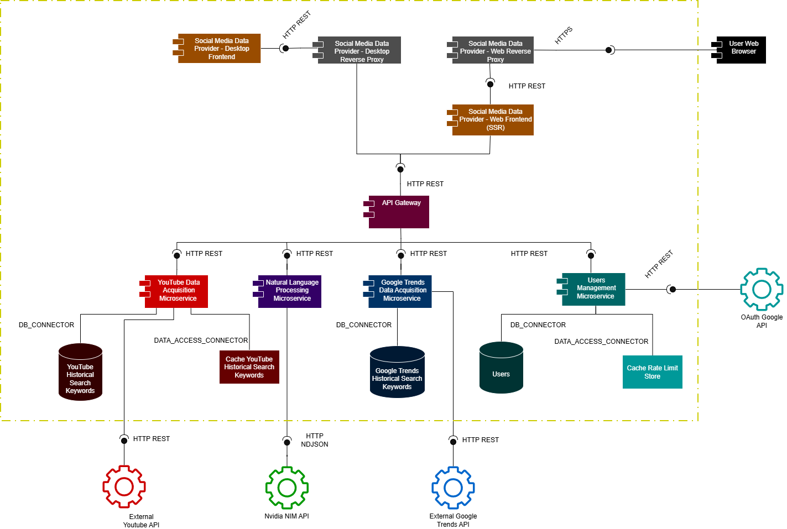
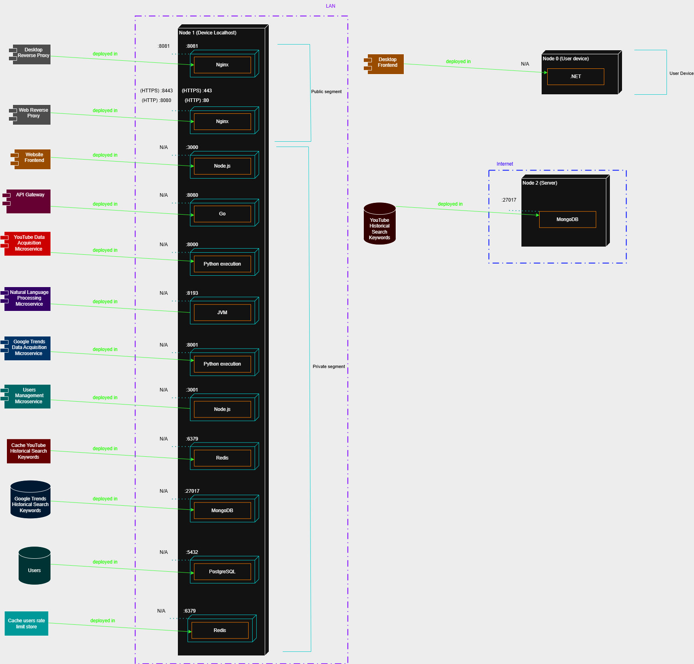
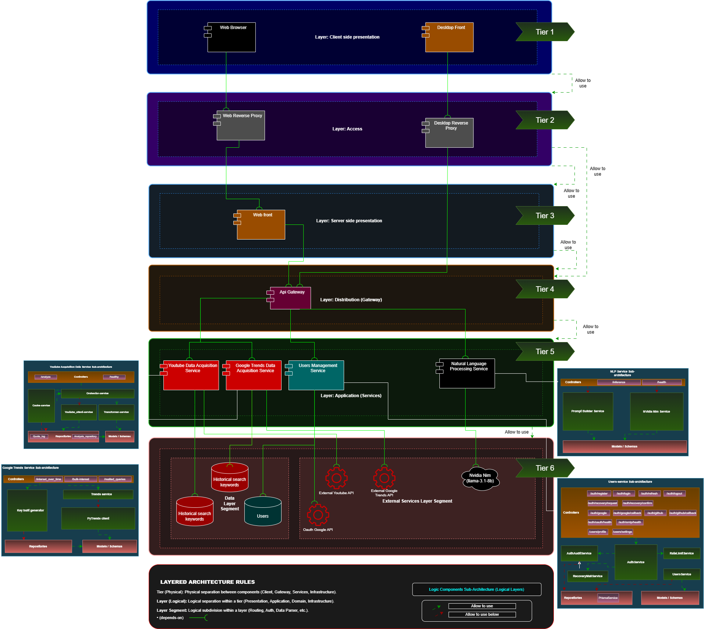
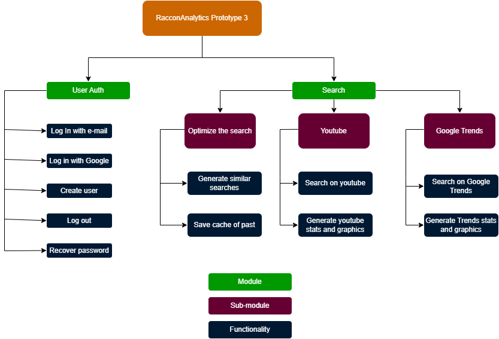
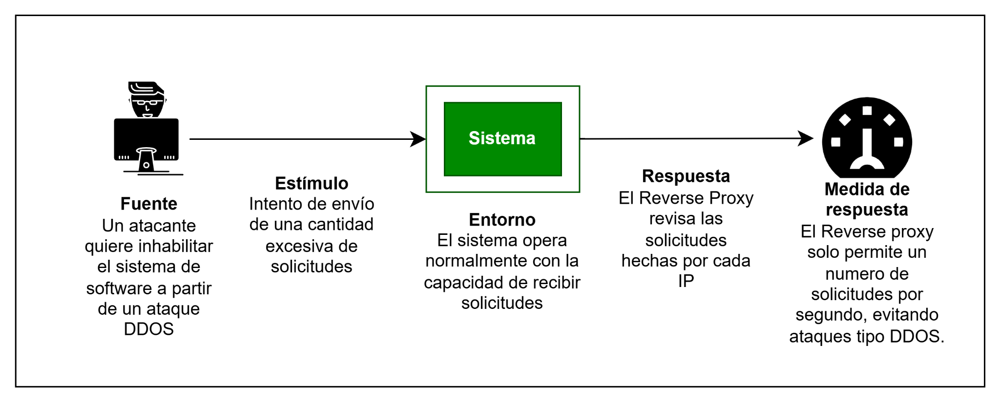
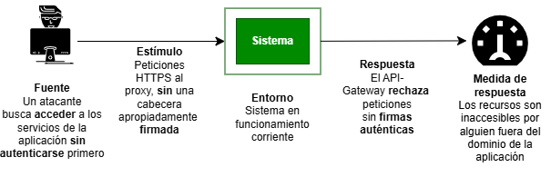
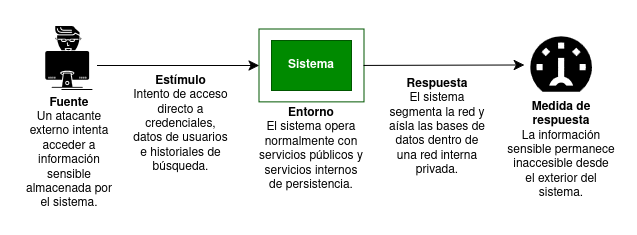
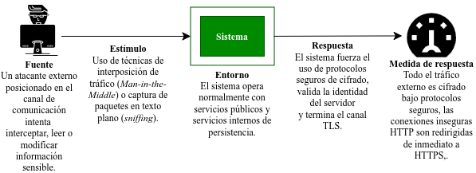
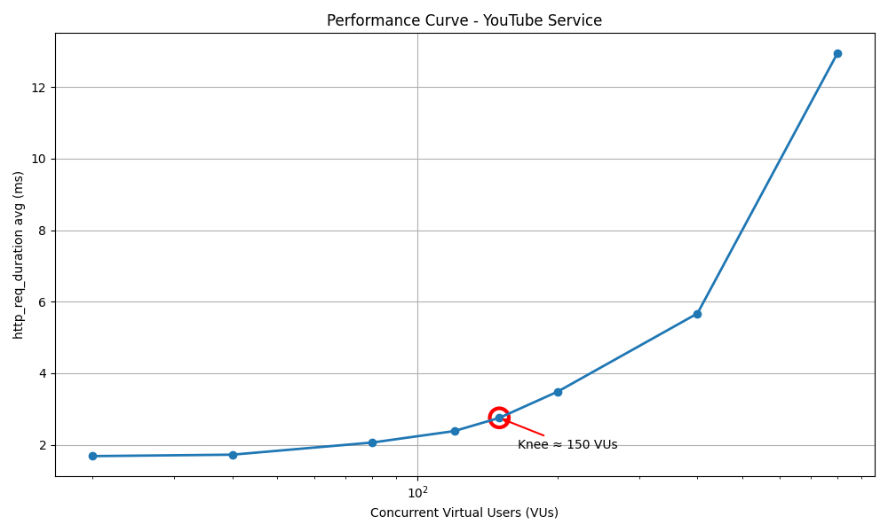

# **Tercer prototipo del sistema de software "Raccon Analytics"**

**Grupo 2F**

- Juan David Buitrago Salazar
- Luis David Garzon Morales
- Juan David Serrano Ruiz
- Federico Hernández Montaño
- Miguel Angel Citarella
- Daniela Ariadna Rueda Hernández
- David Felipe Chaparro Perez
- Johan Stiven Sarmiento Torres
- Andrés Felipe León Sánchez

## Índice

- [1 Software System](#1-software-system)
- [2 Architectural Structures](#2-architectural-structures)
  - [2.1 Component-and Connector (C&C) Structure](#21-component-and-connector-cc-structure)
    - [2.1.1 Architectural Elements and Relations](#211-architectural-elements-and-relations)
    - [2.1.2 Architectural pattern](#212-architectural-pattern)
  - [2.2 Deployment Structure](#22-deployment-structure)
  - [2.3 Layered Structure](#23-layered-structure)
  - [2.4 Decomposition Structure](#24-decomposition-structure)
- [3 Quality Attributes](#3-quality-attributes)
  - [3.1 Security](#31-security)
    - [3.1.1 First Scenario: Protecting Availability Through Reverse Proxy](#311-first-scenario-protecting-availability-through-reverse-proxy)
      - [3.1.1.1 Scenario description](#3111-scenario-description)
      - [3.1.1.2 Key security concepts](#3112-key-security-concepts)
      - [3.1.1.3 Implemented pattern: Reverse Proxy](#3113-implemented-pattern-reverse-proxy)
        - [3.1.1.3.1 Implementation](#31131-implementation)
        - [3.1.1.3.2 Functional test](#31132-functional-test)
    - [3.1.2 Second Scenario: Protecting the System against Unauthorized Users](#312-second-scenario-protecting-the-system-against-unauthorized-users)
      - [3.1.2.1 Scenario Description](#3121-scenario-description)
      - [3.1.2.2 Key Security Concepts](#3122-key-security-concepts)
      - [3.1.2.3 Implemented Pattern: Token Based Authorization](#3123-implemented-pattern-token-based-authorization)
        - [3.1.2.3.1 Implementation](#31231-implementation)
        - [3.1.2.3.2 Functional Tests](#31232-functional-tests)
    - [3.1.3 Third Scenario: Protecting Confidentiality Through Network Segmentation](#313-third-scenario-protecting-confidentiality-through-network-segmentation)
      - [3.1.3.1 Scenario description](#3131-scenario-description)
      - [3.1.3.2 Key security concepts](#3132-key-security-concepts)
      - [3.1.3.3 Implemented pattern: Network segmentation](#3133-implemented-pattern-network-segmentation)
        - [3.1.3.3.1 Implementation](#31331-implementation)
        - [3.1.3.3.2 Functional Tests](#31332-functional-tests)
    - [3.1.4 Fourth Scenario: Ensuring Confidentiality and Integrity Through Secure Channel](#314-fourth-scenario-ensuring-confidentiality-and-integrity-through-secure-channel)
      - [3.1.4.1 Scenario description](#3141-scenario-description)
      - [3.1.4.2 Key security concepts](#3142-key-security-concepts)
      - [3.1.4.3 Implemented pattern: Secure Channel (Reverse Proxy TLS Termination)](#3143-implemented-pattern-secure-channel-reverse-proxy-tls-termination)
        - [3.1.4.3.1 Implementation](#31431-implementation)
        - [3.1.4.3.2 Functional Tests](#31432-functional-tests)
  - [3.2 Performance Testing](#32-performance-testing)
    - [3.2.1 Test Scenario](#321-test-scenario)
    - [3.2.2 Test Configuration and Execution](#322-test-configuration-and-execution)
    - [3.2.3 Results and Analysis](#323-results-and-analysis)

# 1 Software System

El proyecto consiste en el desarrollo de una aplicación web llamada
**Raccon Analytics**, orientada al análisis de tendencias de contenido
en plataformas digitales. El sistema permitirá a los usuarios realizar
búsquedas sobre temas específicos y visualizar indicadores que reflejen
el nivel de actividad, popularidad y relevancia de dichos temas en
distintas plataformas sociales, como YouTube y Google Trends, con el fin
de identificar tendencias en contenidos digitales.

**Figura 1**

*Isotipo del proyecto “Raccon Analytics”*

El sistema está implementado bajo una arquitectura distribuida basada en
microservicios, desarrollada previamente en los prototipos 1 y 2. Para
su desarrollo se utilizaron los lenguajes de programación Python,
TypeScript, Java, Go y C#.

Para esta tercera iteración, se identificaron diferentes escenarios de
seguridad, para los cuales se definieron tácticas arquitectónicas
mediante patrones arquitectónicos que respondieran a los eventos de
seguridad detectados. Asimismo, se realizó una prueba de rendimiento con
el objetivo de identificar la rodilla de rendimiento del sistema,
determinando así la cantidad de usuarios concurrentes que este puede
soportar.

# 2 Architectural Structures

## 2.1 Component-and Connector (C&C) Structure

La arquitectura implementa un modelo distribuido basado en
microservicios, favoreciendo el desacoplamiento funcional, la autonomía
de despliegue y la escalabilidad independiente de los componentes. El
acceso externo se realiza exclusivamente mediante dos proxies inversos:
uno para clientes web con terminación TLS/HTTPS (8443) y otro para
clientes de escritorio (8081), actuando como únicos puntos públicos de
entrada. Internamente, un API Gateway centraliza la autenticación, el
enrutamiento y la orquestación de solicitudes hacia microservicios
especializados que se comunican mediante conectores ligeros HTTP/REST.
Adicionalmente, algunos servicios consumen APIs externas (YouTube,
Google Trends, Nvidia NIM y Google OAuth) para adquisición de datos,
procesamiento NLP y autenticación federada.

**Figura 2**

*Diagrama de Componentes y Conectores del Sistema de Software*

### 2.1.1 Architectural Elements and Relations

La arquitectura general del sistema se compone de los siguientes
elementos principales, organizados de acuerdo con sus responsabilidades
dentro de la solución:

- **Componentes de Presentación**

  - ***Frontend Web:*** Aplicación desarrollada en Next.js encargada de
    renderizar dashboards, KPIs y visualizaciones analíticas.

  - ***Frontend Desktop:*** Aplicación desarrollada en C# para acceso
    desde el entorno de escritorio.

- **Componentes Lógicos**

  - ***API Gateway:*** Orquesta y enruta solicitudes, valida
    autenticación JWT y desacopla a los clientes de los microservicios
    internos.

  - ***Users Management Service:*** Gestiona autenticación y ciclo de
    vida de usuarios.

  - ***YouTube Data Acquisition Service:*** Extrae y procesa información
    desde la API de YouTube.

  - ***Google Trends Data Acquisition Service:*** Obtiene tendencias de
    búsqueda desde Google Trends.

  - ***Natural Language Processing Service:*** Expande semánticamente
    las consultas mediante modelos NLP.

  - ***Proxies inversos:*** Puntos de entrada únicos al sistema que se
    encargan de la terminación TLS/HTTPS, la redirección y el
    enrutamiento de tráfico, el aislamiento de la red interna y la
    protección de servicios internos no expuestos públicamente.

- **Componentes de Datos**

  - ***User:*** Es una base de datos relacional que almacena información
    y credenciales de usuarios.

  - ***Historical Search keywords:*** Son bases de Datos NoSQL que
    persisten datos históricos de YouTube y Google Trends.

  - ***Sistema de Caché (Redis):*** Almacenamiento temporal duplicado de
    las bases de datos NoSQL para reducir la latencia de respuesta.

- **Componentes Externos**

  - Navegador web, Google OAuth API, YouTube Data API, Google Trends
    API, Nvidia NIM API.

### 2.1.2 Architectural pattern

Se implementó el patrón arquitectónico Orquestador por medio de un API
Gateway que enruta las peticiones entrantes hacia microservicios,
validando su autenticación y autorización por medio de un JWT (JSON web
token). Las solicitudes externas llegan primero a los proxies inversos,
que terminan el canal seguro (TLS/HTTPS) y reenvían el tráfico hacia la
red interna. La responsabilidad del API Gateway evita la sobrecarga de
responsabilidades de sincronización de respuestas de los servicios por
los componentes de presentación.

## 2.2 Deployment Structure

El sistema se despliega sobre dos nodos distribuidos entre una red local
(LAN) y una red externa (Internet), separando los componentes públicos,
los servicios internos y los servicios de persistencia para garantizar
un mayor aislamiento y control de acceso.

- **Node 1 - Localhost (LAN):** contiene la totalidad de los componentes
  principales de la aplicación, organizados mediante redes segmentadas
  internas. Únicamente los reverse proxies poseen exposición pública,
  actuando como puntos de entrada controlados al sistema. El Web Reverse
  Proxy (Nginx) expone el frontend mediante HTTPS/TLS en el puerto 8443
  y realiza la redirección HTTP → HTTPS, mientras que el Desktop Reverse
  Proxy (Nginx) expone el acceso para clientes desktop mediante el
  puerto 8081. El resto de microservicios y servicios internos
  permanecen aislados dentro de redes privadas y no publican puertos
  hacia el host ni hacia Internet.

- **Node 2 - Remote Server (Internet):** corresponde al servicio externo
  MongoDB Atlas, utilizado para el almacenamiento persistente remoto
  asociado al componente de adquisición de datos de YouTube.

El despliegue general implementa aislamiento de servicios mediante
segmentación de red, separando los componentes públicos de los servicios
internos y de persistencia. Adicionalmente, los reverse proxies
funcionan como únicos puntos de entrada externos hacia la plataforma.

**Figura 3**

*Diagrama de Despliegue del Sistema de Software*

## 2.3 Layered Structure

El sistema se organiza mediante una separación clara de
responsabilidades que agrupa los componentes en capas físicas,
estableciendo desacoplamiento entre componentes y una comunicación
jerárquica entre capas mediante relaciones Allowed-to-use.
Adicionalmente, cada componente implementa su propia organización
interna mediante capas lógicas. La arquitectura física del sistema se
compone de seis capas principales.

**Figura 4**

*Diagrama de la estructura de capas del Sistema de Software*

- **Tier 1 - Client Side Presentation Layer:** Corresponde a los
  clientes encargados de consumir los servicios de la plataforma. Esta
  capa incluye el navegador web (Web Browser), que accede al sistema
  mediante HTTPS, y el cliente de escritorio (Desktop Frontend),
  desarrollado en WPF/.NET.

- **Tier 2 - Entry Point Layer:** Implementa los puntos de entrada
  externos al sistema mediante reverse proxies. El Web Reverse Proxy
  expone el frontend web públicamente utilizando HTTPS/TLS, mientras que
  el Desktop Reverse Proxy expone el acceso utilizado por los clientes
  desktop.

- **Tier 3 - Server Side Presentation Layer:** Agrupa el componente de
  presentación del lado del servidor correspondiente al frontend web
  desarrollado con Next.js SSR. Este componente renderiza las interfaces
  web y consume recursos internos a través del API Gateway.

- **Tier 4 - Gateway / Distribution Layer:** Contiene el API Gateway,
  encargado de centralizar la distribución de solicitudes internas
  mediante validación JWT, control de acceso y enrutamiento hacia los
  diferentes microservicios del sistema.

- **Tier 5 - Application Services Layer:** Contiene los microservicios
  especializados e independientes de la lógica de negocio: YouTube Data
  Acquisition Service, Google Trends Acquisition Service, Users
  Management Service y Natural Language Processing Service.

- **Tier 6 - Data & External Services Layer:** Agrupa los servicios de
  persistencia y las integraciones externas del sistema. Los componentes
  de datos corresponden a las bases de datos de usuarios, búsquedas
  históricas y caché. Los servicios externos incluyen YouTube Data API
  v3, Google Trends API, Nvidia NIM API y OAuth Google API.

## 2.4 Decomposition Structure

La aplicación fue dividida en dos módulos principales y 3 sub-módulos,
con un total de 11 funcionalidades:

- **User Auth:** Es el módulo que contiene todas las funciones que
  permiten al usuario ingresar, crear su cuenta, salir de la sesión,
  recuperar contraseña y autorizarse como usuario.

- **Search:** Es el módulo que contiene todo lo relacionado a búsqueda,
  en este caso 3 sub-módulos que nos indican cómo se dividen estas
  funcionalidades:

  - ***Sub-módulo Optimized Search:*** Es el que contiene tanto la
    generación de búsquedas relacionadas por parte de nuestro modelo LLM
    como el guardado de las búsquedas previas usando un caché.

  - ***Sub-módulo Youtube:*** Contiene tanto la funcionalidad de la
    búsqueda en youtube como la funcionalidad de la generación de stats
    y gráficas para Youtube.

  - ***Submódulo Google Trends:*** Al igual que el sub-módulo de Youtube
    contiene las funcionalidades de la generación de stats y gráficas
    pero para google trends.

**Figura 5**

*Diagrama de Descomposición del Sistema de Software*

# 3 Quality Attributes

## 3.1 Security

### 3.1.1 First Scenario: Protecting Availability Through Reverse Proxy

Para permitir el correcto funcionamiento de nuestro sistema debemos
admitir solicitudes por parte de los usuarios, dado que sin ellas
nuestro sistema de software no cumpliría con su función. En este
escenario un atacante oculto como un usuario, envía varias o miles de
solicitudes seguidas a un sistema, afectando su **Disponibilidad**, por
lo cual es necesaria una contramedida.

#### 3.1.1.1 Scenario description

**Figura 6**

*Diagrama del primer escenario de seguridad (reverse proxy)*

- **Fuente:** Un atacante externo desea inhabilitar parcial o
  completamente el sistema de software.

- **Estímulo:** El atacante envía una cantidad excesiva de solicitudes
  al sistema generando agotamiento en los recursos.

- **Ambiente:** El sistema opera con normalidad y soporta la cantidad de
  usuarios usual y sus solicitudes

- **Respuesta:** El sistema restringe el número de solicitudes por
  segundo enviadas desde una misma IP, utilizando un reverse proxy a la
  entrada de cada frontend del que disponemos con el fin de verificar la
  identidad del usuario y la cantidad de solicitudes que genera por
  segundo, las cuales en caso de superar cierto número son bloqueadas
  durante un periodo de tiempo.

- **Medición de respuesta:** Los puertos proxys revisan las IPs y
  solicitudes enviadas por los usuarios constantemente y si son
  demasiadas las bloquean.

#### 3.1.1.2 Key security concepts

- **Weakness:** Se deben admitir diversas solicitudes de los usuarios,
  dado que si se restringen de forma abrupta ellos no podrán hacer uso
  correcto del sistema de software. Esto aumenta la exposición del
  sistema públicamente.

- **Threat:** Atacantes externos buscan inhabilitar el uso de la página
  mediante el envío de múltiples solicitudes que el sistema no puede
  soportar.

- **Attack:** Un atacante realiza múltiples solicitudes de forma
  excesiva buscando que el sistema colapse por falta de recursos y
  respuesta ante un ataque de tipo DDoS.

- **Risk:** La inhabilitación de los servicios del sistema y la caída o
  pérdida de capacidades de nuestra página.

- **Vulnerability:** La falta de revisión por parte del sistema con
  respecto al número de solicitudes por segundo y la respectiva IP que
  las hace. Permitiendo el exceso de solicitudes por una sola IP.

- **Countermeasure:** Se hizo uso del patrón de seguridad Reverse Proxy,
  ya que sirve como “Puerta de Seguridad” a la entrada de los frontend,
  cuando hacen esto revisan la cantidad de solicitudes hechas por una
  misma IP y en caso de exceder ese límite bloquea las siguientes por un
  plazo que se determina según nuestras necesidades generales.

#### 3.1.1.3 Implemented pattern: Reverse Proxy

El patrón de seguridad que se implementó para limitar la cantidad de
peticiones por usuario fue el Reverse Proxy, este es un servidor
intermedio que actúa como única puerta de entrada al sistema, recibiendo
solicitudes en puertos públicos y redirigiendo a puertos privados del
API Gateway. Se implementó dos instancias: una para el frontend web (con
TLS Termination) y otra para el frontend de escritorio. Oculta la
infraestructura backend, centraliza políticas de seguridad, implementa
rate limiting y permite el cifrado del canal.

##### 3.1.1.3.1 Implementation

Se implementaron dos reverse proxies independientes con Nginx, cada uno
adaptado a su canal de acceso. El **reverse-proxy,** para el desktop,
escucha en el puerto 8081 y centraliza tanto el frontend Next.js
(location/) como las rutas de API hacia el API gateway (location/api/),
con rate limiting de 20 req/s por IP, ocultamiento de headers CORS
internos mediante proxy_hyde_header y health checks que consultan
directamente al gateway. El **reverse-proxy-web**, en la parte web,
expone los puertos 80 y 443 con terminacion TLS, fuerza la redirección
HTTP a HTTPS, sirve exclusivamente el frontend SSR (web-page:3000),
donde las llamadas API pasan por el route handler interno de Next.js, no
por el proxy, e incluye headers de seguridad (HSTS,
X-Content-Type-Options, X-Frame-Options, Referrer-Policy), ademas del
rate limiting. Ambos proxies comparten la táctica limit access: aíslan
los servicios internos en redes Docker separadas
(public_desktop/public_web y private_services), usan bloques upstream
nombrados para ocultar la topología, y no exponen puertos de backend al
host.

##### 3.1.1.3.2 Functional test

Se ejecutaron tres suites de pruebas funcionales. El
test_confidenciality.py (reverse-proxy desktop, 43 pruebas) verifica:
que el frontend solo sea accesible a través del proxy y no directamente
por el puerto 3000, que todos los puertos backend (8080, 8000, 8193,
5432, 27017, 6379) rechacen conexiones directas, que nginx.conf use
bloques upstream nombrados para ocultar la topología, que los endpoints
de salud respondan sin filtrar hostnames internos, que las rutas
públicas de autenticación funcionen sin token y las protegidas lo
exijan, que el rate limiting retorne HTTP 429 tras exceder el burst, y
que en Docker solo el reverse-proxy tenga binding externo. El
test_availability.py envía solicitudes rápidas a /health y confirma que
el rate limiting se activa con HTTP 429. El test_security_rp_web.py
(reverse-proxy web, 50 pruebas) valida la terminación TLS en el puerto
8443 con protocolos 1.2/1.3, la redirección HTTP a HTTPS en el puerto
8080, los headers de seguridad, el rate limiting con requests
concurrentes, el aislamiento del frontend, la configuración del upstream
nombrado, la segmentación de redes Docker (public_web, private services,
internal) y que los callbacks OAuth usen HTTPS.

### 3.1.2 Second Scenario: Protecting the System against Unauthorized Users

En prototipos iniciales de prueba, el sistema de Racoon Analytics
realizaba peticiones, desde el front-end, hasta el back-end, en busca de
la información que los usuarios requerían. Sin embargo, las peticiones
no se podían trazar, con certeza, a algún usuario específico. Para ello,
se implementó el patrón de seguridad de autenticación por token.

Esta autenticación se realiza mediante tokens JWT, con los que se
verifica la identidad del usuario, la vigencia de su sesión y la
integridad del contenido que emite.

#### 3.1.2.1 Scenario Description

**Figura 7**

*Diagrama del segundo escenario de seguridad (Token-based
authentication)*

- **Fuente:** Un atacante externo busca acceder a los recursos
  protegidos del sistema, sin iniciar sesión o autorización.

- **Estímulo:** El atacante envía peticiones HTTP sin tokens
  autenticados por el sistema, en la cabecera.

- **Ambiente:** El sistema, en operación normal, recibirá esta petición,
  y la enrutará al API-Gateway.

- **Respuesta:** El API-Gateway verificará la autenticidad de la
  petición, evaluando el token de acceso en la cabecera, mediante una
  llave secreta a los recursos privados del sistema. Como el atacante no
  la conoce, sus peticiones serán rechazadas.

- **Medición de Respuesta:** Los servicios de back-end quedan protegidos
  ante los usuarios aceptados en el dominio del sistema.

#### 3.1.2.2 Key Security Concepts

- **Weakness:** El sistema debe exponer recursos y endpoints accesibles
  mediante solicitudes HTTP provenientes de clientes externos, lo que
  requiere mecanismos de validación de identidad antes de permitir el
  acceso a funcionalidades protegidas.

- **Threat:** Atacantes que busquen explorar los recursos privados de la
  aplicación, sin una identidad auténtica.

- **Attack:** Peticiones HTTP sin un token de acceso legítimo, que
  implican que el usuario no posee una cuenta en el dominio del sistema.

- **Risk:** Suplantación de identidad, accesos a recursos restringidos o
  robo de datos sensibles.

- **Vulnerability:** Sin la autenticación, cualquier usuario podría
  enviar peticiones sin una cabecera legítima o mal formada, accediendo
  a los microservicios del sistema, sin haber sido verificado por la
  lógica del sistema.

- **Countermeasure:** El API Gateway implementa autenticación basada en
  tokens JWT, validando el access token en cada solicitud dirigida a
  recursos protegidos. Solo las peticiones asociadas a sesiones
  autenticadas y tokens válidos son reenviadas a los microservicios
  internos.

#### 3.1.2.3 Implemented Pattern: Token Based Authorization

La autenticación por token es un mecanismo de seguridad con el objetivo
de **autenticar usuario**s y **mantener la confidencialidad** de
servicios privados. Se logra mediante la capacidad del servicio de
usuarios de emitir un token firmado criptográficamente que el cliente
guarda al iniciar sesión y presenta en cada solicitud posterior al
back-end. El API-Gateway solo necesita verificar la firma del token para
saber quién es el usuario y cuál es el estado de su sesión, sin
consultar ninguna base de datos orientada a este propósito.

##### 3.1.2.3.1 Implementation

La implementación de este patrón no requiere nuevos componentes en el
sistema, pero la adición de procedimientos durante el flujo principal.

El **users-service**, aparte de administrar los usuarios de la
aplicación, es el único componente autorizado a **emitir** y **rotar
tokens**. Este genera el *refresh token* y *access token*, con el
*JWT_SECRET* (generado con Node.js, OpenSSL o Python) y el algoritmo
HMAC-SHA256.

El **frontend** usa el patrón estado en memoria + persistencia en Web
Storage. Después de que el usuario realice el login, **guarda** el
*access token* y administra el refresh token. Adicionalmente, el primero
lo **inyecta** a cada petición HTTP al back-end.

Finalmente, el **API-Gateway** será el encargado de **verificar** que el
*header* y el *payload* de todas las peticiones, concuerden con la firma
que llevan. Esto se logra volviendo a aplicar el algoritmo HMAC-SHA256 a
aquellos dos componentes, con el *JWT_SECRET*, y comparando el resultado
con la firma recibida.

##### 3.1.2.3.2 Functional Tests

Inicialmente, el sistema no discriminaba peticiones al back-end. Tras
aplicar el patrón de autenticación basada en tokens, se evalúa que cada
petición tenga una cabecera firmada apropiadamente. Por esto, las
pruebas buscan poner a prueba la capacidad del API-Gateway de
**identificar peticiones de usuarios autenticados**. Esto se realiza
enviado peticiones que violan cada política de verificación que impone
el patrón. A continuación se encuentran los detalles de las principales:

- **token_format (A) - Contrato Bearer:** el gateway debe rechazar
  cualquier petición que presente un **token Bearer formado
  incorrectamente**: sin cabecera, cabecera vacía, esquema incorrecto
  (Basic, Token), string aleatorio, o JWT con solo dos segmentos.

- **token_integrity (B) - Integridad criptográfica:** el gateway debe
  rechazar **tokens firmados con una clave incorrecta**; tokens con
  alg:none; tokens con el payload modificado pero firma original; tokens
  sin claim sub; y, peticiones que inyectan X-User-Id sin token.

- **token_lifecycle (C) - Ciclo de vida:** los **access tokens
  expirados** son rechazados sin esperar 15 minutos reales; los refresh
  tokens son de un solo uso; el logout invalida el refresh token en el
  servidor; un refresh token inventado es rechazado.

### 3.1.3 Third Scenario: Protecting Confidentiality Through Network Segmentation

En versiones previas del sistema, los servicios de persistencia
(MongoDB, PostgreSQL y Redis) exponían sus puertos directamente al host
mediante configuraciones de Docker Compose. Esta situación comprometía
la **confidencialidad** de la información almacenada, ya que un atacante
externo con acceso a la red podía intentar conexiones directas hacia las
bases de datos sin atravesar mecanismos intermedios de control. Como
consecuencia, datos sensibles del sistema podían ser consultados,
extraídos o manipulados de forma no autorizada. Para mitigar este
problema, se implementó el patrón de segmentación de red, aislando los
servicios de persistencia dentro de una subred privada inaccesible desde
el exterior.

#### 3.1.3.1 Scenario description

**Figura 8**

*Diagrama del tercer escenario de seguridad (segmentación de red)*

- **Fuente:** un atacante externo intenta acceder a la información
  sensible almacenada por el sistema, incluyendo credenciales de
  usuarios, información de autenticación e historiales de búsquedas
  realizadas dentro de la plataforma.

- **Estímulo:** el atacante realiza intentos de acceso directo a los
  servicios de persistencia con el objetivo de consultar, extraer o
  manipular información sensible perteneciente a los usuarios del
  sistema.

- **Ambiente:** el sistema opera normalmente con múltiples servicios
  encargados de autenticación, procesamiento de consultas y
  almacenamiento de información relacionada con usuarios y búsquedas
  realizadas dentro de la aplicación.

- **Respuesta:** el sistema implementa segmentación de red para aislar
  los servicios de persistencia dentro de una red interna privada,
  restringiendo el acceso únicamente a los componentes autorizados y
  bloqueando cualquier acceso directo desde el exterior.

- **Medición de respuesta:** la información sensible de usuarios y
  búsquedas no puede ser accedida directamente desde fuera de la red
  interna del sistema y todos los intentos de acceso no autorizado son
  bloqueados.

#### 3.1.3.2 Key security concepts

- **Weakness:** El sistema requiere comunicación entre múltiples
  servicios distribuidos y componentes de persistencia, lo que
  incrementa la complejidad del control de acceso interno y la
  superficie potencial de exposición de la infraestructura.

- **Threat:** Atacantes externos buscan acceder, extraer o manipular
  información sensible almacenada en las bases de datos del sistema.
  Estos actores maliciosos aprovechan la exposición de los servicios de
  persistencia para comprometer la confidencialidad de los datos de los
  usuarios.

- **Attack:** Un atacante realiza intentos de conexión directa hacia los
  servicios de persistencia utilizando herramientas de reconocimiento,
  escaneo de servicios o conexiones remotas. Una vez establece la
  conexión, consulta, extrae o modifica información sensible almacenada
  por el sistema.

- **Risk:** La exposición de los servicios de persistencia compromete la
  ***confidencialidad*** de la información almacenada, permitiendo
  accesos no autorizados a credenciales, datos personales e historiales
  de búsqueda de los usuarios. Además, la manipulación de la información
  afecta la integridad de los datos y el funcionamiento normal de la
  plataforma.

- **Vulnerability:** La ausencia de aislamiento y segmentación interna
  entre los servicios internos de persistencia y los componentes
  expuestos al exterior permite que las bases de datos sean alcanzables
  por actores no autorizados. Esta falta de separación facilita que un
  atacante intente acceder directamente a información sensible del
  sistema.

- **Countermeasure:** El sistema implementa segmentación de red para
  separar los servicios públicos de los servicios internos de
  persistencia. Las bases de datos se ubican dentro de una red privada
  aislada y únicamente los microservicios autorizados pueden comunicarse
  con ellas, evitando accesos directos desde el exterior y protegiendo
  la confidencialidad de la información almacenada.

#### 3.1.3.3 Implemented pattern: Network segmentation

El sistema implementa el patrón arquitectónico **Network Segmentation**
bajo la táctica de seguridad **Limit Access** perteneciente a la
categoría **Resist Attack**. La infraestructura se divide en redes
públicas y privadas para aislar los servicios internos de persistencia
de los componentes expuestos al exterior. De esta manera, únicamente los
microservicios autorizados pueden acceder a las bases de datos,
protegiendo la confidencialidad de credenciales, datos de usuarios e
historiales de búsqueda almacenados por el sistema.

##### 3.1.3.3.1 Implementation

La implementación se realiza mediante las redes *raccon_public_web*,
*raccon_public_desktop*, *raccon_private_services* y
*raccon_private_internal*. Los reverse proxies se ubican en las redes
públicas, mientras que MongoDB, PostgreSQL y Redis permanecen dentro de
la red privada *raccon_private_internal*, configurada con *internal:
true*.

Adicionalmente, las bases de datos no publican puertos hacia el host y
únicamente los microservicios autorizados pertenecen a la red interna.
El frontend tampoco comparte la red de persistencia, evitando conexiones
directas hacia la información sensible almacenada por el sistema.

##### 3.1.3.3.2 Functional Tests

En la arquitectura inicial, los servicios de persistencia podían ser
accedidos directamente desde el exterior, permitiendo conexiones hacia
información sensible almacenada por la plataforma.

Tras implementar la segmentación de red, las pruebas verifican que los
servicios internos de persistencia permanecen aislados dentro de la red
privada y que los intentos de acceso externo son rechazados
correctamente. Asimismo, se valida que únicamente los reverse proxies
permanecen expuestos al exterior y que el frontend no puede conectarse
directamente a las bases de datos.

Los resultados obtenidos confirman que la segmentación de red reduce la
superficie de ataque y protege la confidencialidad de la información
almacenada por el sistema.

### 3.1.4 Fourth Scenario: Ensuring Confidentiality and Integrity Through Secure Channel

En versiones anteriores de la arquitectura del sistema, el tráfico de
red entre el navegador web del usuario y los servicios de presentación
del lado del servidor se transmitía en texto plano a través del
protocolo HTTP. Esta situación comprometía severamente la
confidencialidad y la integridad de la información en tránsito, ya que
un atacante externo posicionado en la red de comunicación podía realizar
la interceptación del tráfico mediante técnicas de escucha activa
(*sniffing*). Como consecuencia, datos de sesión, credenciales de
acceso, tokens de autenticación y consultas analíticas dinámicas
quedaban expuestos a capturas o modificaciones maliciosas. Para mitigar
este riesgo, se implementó la táctica de canal seguro mediante la
centralización y terminación de TLS/HTTPS en el proxy inverso web,
actuando como la única puerta de entrada pública al sistema.

#### 3.1.4.1 Scenario description

**Figura 9**

*Diagrama del cuarto escenario de seguridad (Secure Channel)*

- **Fuente:** Un atacante externo posicionado en el canal de
  comunicación entre el cliente y el servidor intenta interceptar, leer
  o modificar la información sensible transmitida durante las peticiones
  web.

- **Estímulo:** El atacante realiza técnicas de interposición de tráfico
  (Man-in-the-Middle) o captura de paquetes en texto plano (sniffing)
  mientras el usuario interactúa con la plataforma.

- **Ambiente:** el sistema opera normalmente con múltiples servicios
  encargados de autenticación, procesamiento de consultas y
  almacenamiento de información relacionada con usuarios y búsquedas
  realizadas dentro de la aplicación.

- **Respuesta:** El proxy inverso web intercepta la solicitud, fuerza el
  uso de protocolos seguros de cifrado, valida la identidad del servidor
  mediante un certificado digital, termina el canal TLS y delega la
  petición cifrada a la red interna dockerizada de forma segura.

- **Medición de respuesta:** Todo el tráfico externo sin excepción es
  cifrado bajo protocolos seguros, las conexiones inseguras HTTP son
  redirigidas de inmediato a HTTPS, y las cabeceras de seguridad impiden
  ataques de degradación de protocolo (downgrade), manteniendo la
  información ininteligible para el atacante.

#### 3.1.4.2 Key security concepts

- **Weakness:** La transmisión original de datos mediante el protocolo
  HTTP permite que el canal de comunicación exterior no cuente con
  mecanismos de cifrado ni de autenticación de identidad del servidor,
  exponiendo el flujo de datos sensibles a cualquier entidad con acceso
  al medio de transmisión de red.

- **Threat:** Atacantes en red con capacidades de interposición de
  tráfico que buscan capturar credenciales de usuarios, tokens de
  autenticación JWT o alterar de manera maliciosa los datos de las
  respuestas HTTP antes de que lleguen al navegador.

- **Attack:** Un atacante ejecuta un ataque de tipo Man-in-the-Middle o
  un rastreo de red (sniffing) aprovechando conexiones inalámbricas
  inseguras, capturando las tramas de datos del usuario en texto plano o
  inyectando scripts maliciosos en las respuestas del servidor.

- **Risk:** La ausencia de un canal cifrado genera el riesgo de
  secuestro de sesiones, robo de identidad mediante la extracción de
  credenciales/tokens, y la pérdida de integridad en la visualización de
  los tableros analíticos debido a la manipulación del tráfico.

- **Vulnerability:** La ausencia de cifrado y autenticación del canal de
  comunicación mediante HTTPS/TLS permitiría la transmisión de datos
  sensibles en texto plano a través de la red que pueden ser
  interceptados.

- **Countermeasure:** Implementación de un canal seguro perimetral
  mediante Nginx configurado para la terminación de TLS, la redirección
  forzada de tráfico HTTP a HTTPS, y la inyección de cabeceras de
  seguridad estrictas.

#### 3.1.4.3 Implemented pattern: Secure Channel (Reverse Proxy TLS Termination)

El sistema implementa el patrón arquitectónico Reverse Proxy combinado
con la táctica de seguridad Encrypt Data / Secure Channel. El proxy
inverso actúa como un escudo e intermediario único en el borde de la red
pública. Este componente asume la carga computacional de los procesos
criptográficos de la suite de cifrado TLS, garantizando que el servidor
Next.js SSR no se exponga directamente a internet y procese peticiones
dentro de un entorno de red interna de total confianza.

##### 3.1.4.3.1 Implementation

La implementación del canal seguro se consolida en el archivo de
configuración nginx.conf y se empaqueta mediante entornos de
contenedores Docker.

- **Terminación TLS y Protocolos Modernos:** El bloque de servidor
  configurado en el puerto 443 utiliza las directivas ssl_certificate y
  ssl_certificate_key para validar la identidad criptográfica del sitio.
  Se restringe explícitamente el uso de protocolos obsoletos e
  inseguros, permitiendo únicamente conexiones de alta seguridad
  mediante la directiva.

- **Redirección Forzada:** Para evitar descuidos por parte del usuario
  al ingresar direcciones sin cifrar, el servidor escucha en el puerto
  80 y responde de manera inmediata con un código de redirección
  persistente.

- **Cabeceras de Seguridad Robustas:** Con el fin de mitigar ataques
  complementarios de degradación, suplantación de identidad o sniffeo de
  tipos MIME, se inyectan cabeceras HTTP directamente en el proxy.

##### 3.1.4.3.2 Functional Tests

Se realizaron solicitudes directas al puerto expuesto no cifrado (HTTP
8080) utilizando la herramienta curl. El sistema respondió de forma
correcta con un estado HTTP 301 Moved Permanently apuntando al esquema
https://.

Mediante escaneos de negociación TLS con herramientas automatizadas, se
verificó que los intentos de conexión utilizando SSLv3, TLS 1.0 y TLS
1.1 fueran rechazados tajantemente por el proxy inverso web, permitiendo
el acceso únicamente bajo las especificaciones de TLS 1.2 y TLS 1.3.

Al ejecutar un healthcheck mediante curl -k
https://localhost:8443/health, se validó en la cabecera de la respuesta
la existencia de Strict-Transport-Security con un ciclo de expiración
prolongado, asegurando que los navegadores modernos recuerden forzar la
conexión segura de forma nativa.

**Resultados:** Los resultados confirman de manera robusta la mitigación
de los ataques de escucha activa de red en el perímetro público del
sistema, resguardando la confidencialidad de la información analítica y
las sesiones activas de los usuarios.

## 3.2 Performance Testing

### 3.2.1 Test Scenario

La prueba de rendimiento mide cómo responde el sistema cuando aumenta la
cantidad de usuarios virtuales, e identifica hasta qué punto el servicio
mantiene un comportamiento estable por medio de la rodilla de
rendimiento. Para la prueba se seleccionaron los componentes:
Web-fronted, el API Gateway, el servicio Youtube Acquisition Data y el
servicio de Caché Redis, probando así el flujo del sistema para una
búsqueda de Youtube, y donde se enviaba en cada solicitud una misma
query o búsqueda en texto. El servicio de YouTube se apoyó en Redis y en
la configuración de MongoDB Atlas para el almacenamiento externo.

### 3.2.2 Test Configuration and Execution

Esta prueba de rendimiento se realizó utilizando la herramienta de
pruebas de carga **k6**, programada mediante un script en JavaScript. La
herramienta permitió definir usuarios virtuales, carga progresiva,
validaciones automáticas y umbrales de aceptación para evaluar la
capacidad del sistema bajo distintos niveles de concurrencia.

La prueba se enfocó en el endpoint *POST /api/youtube/analyze/sync*,
midiendo tiempos de respuesta, porcentaje de fallos y comportamiento
general del sistema bajo carga. Adicionalmente, se validó que las
respuestas HTTP retornaran código *200 OK* y que el cuerpo de respuesta
existiera correctamente. También se implementó una fase inicial de
calentamiento para evitar que la medición principal iniciara con el
sistema y el caché en estado “frío”.

La ejecución se realizó utilizando dos equipos dentro de la misma red
LAN. El primer nodo correspondió a un equipo con Windows donde se
desplegó el sistema completo mediante Docker Compose. El segundo nodo
correspondió a un equipo con Arch Linux encargado de ejecutar k6 como
generador de carga, enviando solicitudes concurrentes hacia la IP del
nodo donde se encontraba desplegado el sistema.

Las pruebas se ejecutaron múltiples veces utilizando diferentes niveles
de concurrencia y tiempos de simulación, permitiendo obtener métricas de
rendimiento para construir la curva de comportamiento del sistema e
identificar el punto donde la capacidad de respuesta comenzaba a
degradarse significativamente.

Debido a que el sistema implementa un componente de caché para optimizar
el consumo de la YouTube Data API v3, las pruebas se ajustaron para
representar un escenario más cercano al comportamiento real de
producción. Inicialmente se ejecutó una consulta completa sin caché,
obteniendo tiempos de respuesta aproximados entre 1.3 y 1.7 segundos
debido al consumo de la API externa. Posteriormente, las solicitudes
atendidas desde caché añadieron un retardo artificial aleatorio dentro
de este mismo intervalo para simular una latencia realista sin consumir
excesivamente la cuota de la API externa durante las pruebas
concurrentes.

### 3.2.3 Results and Analysis

**Figura 10**

*Gráfica de rendimiento del sistema de software frente a múltiples
usuarios concurrentes*

La gráfica de rendimiento evidencia que el sistema mantiene una
respuesta estable bajo cargas bajas y medias, pero comienza a degradarse
al incrementar significativamente el número de usuarios concurrentes. El
tiempo inicial de respuesta durante el calentamiento fue de
aproximadamente 2.08 s, mientras que las iteraciones posteriores
mostraron menor latencia gracias al uso de caché. La curva presenta un
punto de quiebre cercano a los *<u>150 virtuales usuarios
concurrentes</u>*, donde el tiempo de respuesta aumenta de forma
acelerada, identificando la rodilla de rendimiento del servicio.
