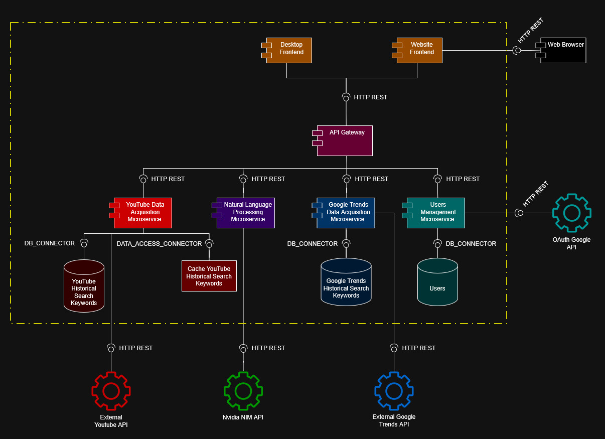

# Artifact - Prototipo 2 - RacconAnalytics

## Grupo 2F

- Juan David Buitrago Salazar
- Juan David Serrano Ruiz
- Federico Hernández Montaño
- Johan Stiven Sarmiento Torres
- Daniela Ariadna Rueda Hernández
- Luis David Garzón Morales
- Miguel Angel Citarella Camargo
- David Felipe Chaparro Pérez
- Andrés Felipe León Sánchez

## Software system
### Name

Raccon Analytics

### Logo


### Description

El proyecto consiste en el desarrollo de una aplicación web orientada al análisis de tendencias de contenido en plataformas digitales. El sistema permitirá a los usuarios realizar búsquedas sobre temas específicos y visualizar indicadores que reflejen el nivel de actividad, popularidad y relevancia del tema dentro de distintas plataformas sociales. En el primer prototipo del sistema, el análisis se enfocó principalmente en contenido proveniente de YouTube. Para este segundo prototipo, el sistema integra dos nuevos componentes lógicos: un componente de consulta de Google Trends y un componente de Procesamiento de lenguaje natural, para expandir semánticamente la búsqueda del usuario y mostrar tendencias de búsqueda, complementando así el análisis proveniente de Youtube.

El funcionamiento general de la aplicación se basa en que el usuario ingresa una consulta relacionada con un tema de interés. A partir de esta consulta, el sistema realizará solicitudes a las APIs disponibles de las plataformas objetivo y recopilará información sobre contenido relacionado con dicha búsqueda. Posteriormente, la aplicación procesará los resultados obtenidos para generar estadísticas básicas que permitan evaluar la relevancia del tema dentro de cada plataforma.

El propósito de la plataforma no es únicamente mostrar resultados de búsqueda, sino ofrecer una visión agregada del comportamiento del contenido asociado a un tema. Esto permitirá identificar tendencias, evaluar la popularidad de ciertos tópicos y detectar contenido relevante dentro de comunidades digitales.

El alcance de este segundo prototipo del sistema está limitado a la recopilación y análisis de métricas básicas disponibles a través de las APIs públicas de las plataformas seleccionadas: Youtube y Google trends, complementando la búsqueda del usuario con su expandimiento en búsuqedas relacionadas por el Procesamiento de lenguaje natural. Debido a las restricciones propias de estas APIs, tales como límites diarios de consultas o disponibilidad limitada de ciertos tipos de información, el sistema priorizará la obtención de datos esenciales que permitan generar indicadores representativos del comportamiento del contenido.

### **Lenguajes de propósito general:**
Para el desarrolllo del sistema se usaron los siguientes lenguajes de programación de propósito general:
- Python
- Typescript
- Java
- Go
- C#

## **Architectural Structures**

### **Component-and Connector (C&C) Structure**

#### C&C View:



#### **Architectural styles**

La aplicación emplea un estilo arquitectónico de Microservicios, caracterizado por su naturaleza distribuida y el alto grado de autonomía de sus componentes. La comunicación externa se gestiona mediante el patrón API Gateway, que actúa como un punto de entrada único para los componentes de presentación (frontend Web y Desktop), desacoplando la capa de presentación de la lógica interna del sistema.

Este diseño permite la orquestación y el enrutamiento hacia servicios especializados que operan de manera independiente y poseen su propia persistencia de datos:

- *Servicio de Adquisición de Datos de YouTube:* Se encarga de capturar información en tiempo real (tendencias, videos registrados y mátricas de análisis de red social) mediante la integración con la API externa de YouTube V3. 

- *Servicio de Gestión de Usuarios:* Administra el ciclo de vida de las cuentas, permitiendo el registro y la autenticación de usuarios de forma aislada, garantizando que la lógica de identidad no interfiera con las funciones de búsqueda.

- *Servicio de Adquisión de Datos de Google Trends*: Captura información sobre la tendencia de la búsqueda del usuario, como el volumen de consulta de la temática a través del tiempo. 

- *Procesamiento de Lenguaje Natural*: Este componente se apoya sobre un servicio de API externo de Nvidia para realizar Procesamiento de Lenguaje Natural (NLP) sobre la búsqueda del usuario y expandir semánticamente la consulta hallando posibles búsquedas o entradas de usuario relacionadas. 

Los componentes son reutilizables, escalables independientemente y se comunican principalmente a través de protocolos ligeros (HTTP: REST y Streaming), lo que refuerza la agilidad y el bajo acoplamiento del sistema.

#### **Architectural elements and relations**

Nuestro sistema cuenta con:
- **2 Componentes de presentación: Presenta a través de KPIs, gráficos analíticos y métricas importantes, los datos retornados por los servicios lógicos.**
    - **Frontend web:** Desarrollado en Typescript usando el framework Next JS para implementar Server Side Rendering. Se limita a la interfaz web, cuya responsabilidad es renderizar la información suministrada por los servicios lógicos a través del API Gateway
    - **Frontend de escritorio:** Desarrollado en C#. Permite al usuario interactuar desde la app con interfaz de escritorio mostrando la infmración suministrada por los servicios lógicos a través del API-Gateway
    
- **5 Componentes lógicos:**   
   - **Orquestador (API Gateway):** Punto de entrada y enrutamiento. Actúa como mediador, manejando las peticiones hacia el servicio de adquisición de YouTube y el de gestión de usuarios. Provee una interfaz unificada para el frontend, ocultando la complejidad de la arquitectura distribuida. Desarrollado en el lenguaje de propósito general Go.
    - **Users Management Service**: Gestiona el ciclo de vida de los usuarios (registro e inicio de sesión), exponiendo recursos de autenticación. Desarrollado en TypeScript.
    - **Youtube Data Acquisition Service**: Orquesta la extracción de datos externos. Procesa la query del usuario, consulta la API de YouTube, cálcula métricas y estandarizada los datos para ser presentados en el front. Desarrollado en el lenguaje Python.
    - **Google Trends Data Acquisition Service**: Maneja la extracción de datos de tendecias de búsquedas, consultando la API externa de Google Trends, enriqueciendo la información retornada por el componente de Youtube. Desarrollado en lenguaje de propósito general Python.
    - **Natural Language Processing Service**:  Implementa la lógica de IA. Diseña prompts específicos para expandir la búsqueda del usuario a partir de hallazgo de posibles bbúsquedas relacionadas. Desarrollado en el lenguaje Java.
    
- **4 Componentes de Datos:**
    - *Base de datos relacional Users*: Repositorio centralizado para la información básica y credenciales de acceso de los usuarios.
    - 2 Bases de datos No SQL:
        - *Youtube Historical Search Keywords:* Almacenamiento persistente de los datos estandarizados y retornados por la API externa de Youtube.
        - *Google Trends Historical Search Keywords:* Almacena los datos retornador por la API externa de Google Trends
     - *Almacenamiento de datos Caché:* Componente de almacenamiento volátil que almacena los datos retornados por la API externa de Youtube para mejorar el rendimiento del componente lógico y el uso limitado de la API externa.
  
- **5 Componentes externos**
    - Web browser: Consume el contenido web para renderizar la interfaz web.
    - OAuth Google API
    - External Youtube API
    - External Google Trends API
    - Nvidia NIM API 

#### **Architectural pattern**
Se implementó un patrón arquitécnico con un componente orquestador que hace referencia al API-gateway, evitando que los componentes de presentación adquieran una responsabilidad de sincronización de lógica de negocio que no es responsabilidad natural en la capa de presentación. Este componente es el punto único de entrada el sistema de análisis de tendencias. Recibe las solicitudes del cliente, enruta las peticiones al microservicio correspondiente, gestionando autenticación, validación y contro de acceso. De esta manera, se desacopla al cliente de la arquitectura interna basada en microservicios y simplifica la comunicación.

---
## **Layered Structure**


## Tier 1 — Presentation

### Web Frontend
- **Stack:** Next.js 14, React 18, TailwindCSS 4, DaisyUI 5, Recharts, Framer Motion
- **Puerto:** 3000
- **Responsabilidades:**
  1. Renderizar UI de autenticación (login, registro, recuperación de contraseña, OAuth callback)
  2. Dashboard con gráficas interactivas de tendencias y análisis
  3. Comunicación con el API Gateway vía HTTP REST
- **Endpoints que consume:** `GET/POST /api/users/*`, `GET /api/youtube/*`, `GET /api/trends/*`
- **Dependencias:** api-gateway (HTTP REST)

### Desktop Frontend
- **Stack:** WPF, C# (.NET), XAML
- **Responsabilidades:**
  1. UI de escritorio para autenticación (SignIn, CreateAccount)
  2. Dashboard desktop con HomePage
  3. Comunicación con el API Gateway vía HTTP REST
- **Endpoints que consume:** Mismos que Web Frontend
- **Dependencias:** api-gateway (HTTP REST)

---

## Tier 2 — Distribution

### API Gateway
- **Stack:** Go, net/http, golang-jwt, godotenv
- **Puerto:** 8080
- **Responsabilidades:**
  1. JWT Authentication — valida Bearer tokens en rutas protegidas; inyecta X-User-Id y X-User-Email en headers downstream
  2. Reverse Proxy — reescribe rutas públicas (`/api/users/*` → users-service, `/api/youtube/*` → youtube-service)
  3. CORS + Logging middleware — maneja preflight OPTIONS, loguea método/ruta/status/latencia/IP
- **Endpoints públicos:** `/health`, `/health/dependencies`, `/api/users/auth/*`
- **Dependencias:** users-service (HTTP REST), youtube-service (HTTP REST), nlp-service (HTTP REST)

---

## Tier 3 — Business Logic

### Layer: Data Acquisition & Processing

#### YouTube Acquisition Service
- **Stack:** Python 3, FastAPI, Motor (MongoDB async), aio-pika (RabbitMQ), redis-py, google-api-python-client
- **Puerto:** 8000
- **Responsabilidades:**
  1. Scraping de YouTube Data API v3 — búsqueda y recolección de datos de videos/canales
  2. Gestión de cuota de API — tracking y rate limiting del YouTube API quota
  3. Orquestación asíncrona de análisis via RabbitMQ (producer/consumer de `analyses_queue` y `results_queue`)
- **Endpoints:** `GET/POST /api/analyze`, `GET /api/health`
- **DBs:** MongoDB (cache de análisis), Redis (cache de queries con TTL 5min), RabbitMQ (mensajería asíncrona)
- **Dependencias:** MongoDB, Redis, RabbitMQ, nlp-service (allowed-to-use-below), YouTube Data API (externa), users-service (validación)

#### Google Trends Acquisition Service
- **Stack:** Python 3, FastAPI, Motor (MongoDB async), pytrends
- **Puerto:** 8001
- **Responsabilidades:**
  1. Retrieval de datos de Google Trends — volumen de búsqueda histórica, queries relacionadas
  2. Cache en MongoDB con TTL 24h — minimiza llamadas a la API de Google Trends
  3. Delegación de NLP al servicio NLP para expansión de keywords
- **Endpoints:** `GET /api/v1/trends/*`, `GET /health`
- **DBs:** MongoDB (cache de tendencias)
- **Dependencias:** MongoDB, nlp-service (allowed-to-use-below), Google Trends API (externa), users-service (validación)

#### NLP Service
- **Stack:** Java 17, Spring Boot 3.2, Jackson
- **Puerto:** 8193
- **Responsabilidades:**
  1. Expansión de Keywords — genera keywords adicionales a partir de una query original
  2. Enrichment de queries — genera expanded_queries para mejorar búsquedas
  3. Detección de idioma del input
- **Endpoints:** `POST /inference`, `GET /inference/health`
- **Dependencias:** Nvidia NIM API (externa, HTTP REST)

### Layer: User Management

#### Users Management Service
- **Stack:** NestJS 11, Prisma ORM, PostgreSQL, Redis (ioredis), Passport (Google OAuth2, GitHub OAuth2, JWT), bcrypt, nodemailer
- **Puerto:** 3001
- **Responsabilidades:**
  1. Autenticación — Local (email/password con bcrypt), OAuth2 (Google, GitHub), JWT (access + refresh tokens)
  2. CRUD de Users — registro, actualización de perfil/settings, recovery de contraseña via email
  3. Rate Limiting de auth endpoints + audit de sesiones
- **Endpoints:** `POST /api/v1/auth/*`, `GET/PUT /api/v1/users/*`, `POST /api/v1/auth/recovery/*`
- **DBs:** PostgreSQL (users, sessions), Redis (rate limiting + session cache)
- **Dependencias:** PostgreSQL, Redis, OAuth Google API (externa)

---

## Tier 4 — Data

### PostgreSQL
- **Imagen:** postgres:15
- **Puerto:** 5432
- **Responsabilidades:** Almacenamiento relacional de usuarios, configuraciones y sesiones
- **Usado por:** users-service (vía Prisma ORM)

### MongoDB
- **Imagen:** mongo:6
- **Puerto:** 27017
- **Responsabilidades:** Almacenamiento documental de cache de análisis YouTube y tendencias Google
- **Usado por:** youtube-acquisition-service, google-trends-acquisition-service (vía Motor async)

### Redis
- **Imagen:** redis:7
- **Puerto:** 6379
- **Responsabilidades:** Cache de queries (YouTube: TTL 5min), rate limiting de auth (Users), session cache
- **Usado por:** youtube-acquisition-service, users-service (vía ioredis)

### RabbitMQ
- **Imagen:** rabbitmq:3-management
- **Puertos:** 5672 (AMQP), 15672 (Management UI)
- **Responsabilidades:** Mensajería asíncrona para orquestación de análisis (producer/consumer pattern)
- **Colas:** `analyses_queue`, `results_queue`
- **Usado por:** youtube-acquisition-service (vía aio-pika)

---

## External APIs

### YouTube Data API v3
- **Protocolo:** HTTP REST
- **Responsabilidades:** Provee datos de búsqueda, videos y canales de YouTube
- **Usado por:** youtube-acquisition-service

### Google Trends API (pytrends)
- **Protocolo:** HTTP (via pytrends library)
- **Responsabilidades:** Provee datos de volumen de búsqueda histórica y queries relacionadas
- **Usado por:** google-trends-acquisition-service

### Nvidia NIM API
- **Protocolo:** HTTP REST
- **Responsabilidades:** Inferencia LLM para expansión de keywords y enriquecimiento de queries
- **Usado por:** nlp-service-nvidia

### OAuth Google API
- **Protocolo:** OAuth 2.0 / HTTP REST
- **Responsabilidades:** Autenticación de usuarios via Google SSO
- **Usado por:** users-service (vía Passport Google OAuth2 strategy)

---

## Relations Summary

| Origen | Destino | Protocolo | Tipo |
|---|---|---|---|
| Web Frontend | API Gateway | HTTP REST | allowed-to-use |
| Desktop Frontend | API Gateway | HTTP REST | allowed-to-use |
| API Gateway | YouTube Acquisition | HTTP REST | allowed-to-use |
| API Gateway | Google Trends Acquisition | HTTP REST | allowed-to-use |
| API Gateway | Users Management | HTTP REST | allowed-to-use |
| YouTube Acquisition | MongoDB | DB_CONNECTOR | allowed-to-use |
| YouTube Acquisition | Redis | DB_CONNECTOR | allowed-to-use |
| YouTube Acquisition | RabbitMQ | AMQP | allowed-to-use |
| YouTube Acquisition | NLP Service | HTTP REST | allowed-to-use-below |
| YouTube Acquisition | YouTube Data API | HTTP REST | allowed-to-use |
| Google Trends Acquisition | MongoDB | DB_CONNECTOR | allowed-to-use |
| Google Trends Acquisition | NLP Service | HTTP REST | allowed-to-use-below |
| Google Trends Acquisition | Google Trends API | HTTP REST | allowed-to-use |
| NLP Service | Nvidia NIM API | HTTP REST | allowed-to-use |
| Users Management | PostgreSQL | DB_CONNECTOR | allowed-to-use |
| Users Management | Redis | DB_CONNECTOR | allowed-to-use |
| Users Management | OAuth Google API | HTTP REST | allowed-to-use |

---

### **Logic layers**
Para complementar la vista por capas de todo el sistema, se establecieron de igual forma la estructura de capas lógicas o subarquitectura de los componentes lógicos a continuación:


---

#### YouTube Acquisition Data Service Sub-architecture


Este componente implementa la lógica de adquisición, procesamiento y almacenamiento de datos provenientes de la API de YouTube.

- *Controllers* (/analyze, /healthy):
  Actúan como punto de entrada HTTP. Delegan la lógica al Orchestrator-service y al Cache-service.

- *Cache-service*:
  Gestiona la verificación de resultados previamente calculados.  
  - Flechas verdes: puede ser invocado por los controllers y el orquestador para evitar llamadas redundantes.
  - Flechas rojas: persiste información auxiliar como Quota_log en el repositorio.

- *Orchestrator-service*:
  Coordina el flujo principal del análisis.
  - Flechas verdes: invoca servicios permitidos como Transformer-service.
  - Flechas rojas: invoca hacia abajo a Youtube_client-service para consumir la API externa.

- *Youtube_client-service*:
  Encapsula las llamadas a la API de YouTube. Solo es invocado por el orquestador (flecha roja).

- *Transformer-service*:
  Se encarga de mapear y normalizar la respuesta de la API hacia los modelos internos.
  - Flechas verdes: interactúa con Models / Schemas.

- *Repositories* (Quota_log, Analysis_repository):
  Persisten datos en MongoDB.
  - Flechas rojas: indican escritura desde servicios superiores.
  - Flechas verdes: permiten acceso controlado a los modelos.

- *Models / Schemas*:
  Definen la estructura tipada de los datos del sistema. Son utilizados por el transformer y los repositorios.

---

#### Google Trends Service Sub-architecture


Este servicio obtiene y procesa tendencias desde Google Trends.

- *Controllers* (/interest_over_time, /bulk-interest, /related_queries):
  Exponen endpoints que delegan la lógica al Trends service.

- *Key build generator*:
  Genera claves normalizadas para consultas y almacenamiento.
  - Flechas verdes: puede ser invocado por controllers.
  - Flechas rojas: persiste información en Repositories.

- *Trends service*:
  Orquesta la lógica de negocio.
  - Flechas rojas: invoca a PyTrends client para consumir la API externa.

- *PyTrends client*:
  Cliente que encapsula la comunicación con Google Trends.
  - Flechas verdes: entrega datos hacia Models / Schemas.

- *Repositories*:
  Persisten resultados procesados.
  - Flechas verdes: interactúan con los modelos.

- *Models / Schemas*:
  Definen la estructura de datos utilizada en el servicio.

---

#### NLP Service Sub-architecture


Este servicio se encarga del procesamiento de lenguaje natural para enriquecer las consultas.

- *Controllers* (/inference, /health):
  Exponen endpoints para inferencia y monitoreo.

- *Prompt Builder Service*:
  Construye prompts estructurados para el modelo NLP.
  - Flechas verdes: interactúa con Models / Schemas.

- *Nvidia Nim Service*:
  Ejecuta la inferencia usando modelos de IA.
  - Flechas verdes: también utiliza los modelos definidos.

- *Models / Schemas*:
  Representan la estructura de entrada/salida del procesamiento NLP.

---

#### Users Service Sub-architecture


Gestiona autenticación, usuarios y servicios relacionados.

- *Controllers*:
  Contienen endpoints de autenticación, OAuth, recuperación de cuenta y perfil de usuario.

- *AuthService*:
  Núcleo de la lógica de autenticación.
  - Flechas verdes: interactúa con otros servicios como RateLimitService y UsersService.

- *AuthAuditService*:
  Registra eventos de autenticación.
  - Flechas rojas: persiste logs en Repositories.

- *RecoveryMailService*:
  Gestiona recuperación de cuentas vía correo.
  - Flechas rojas: escribe en repositorios.

- *RateLimitService*:
  Controla la tasa de solicitudes hacia el sistema.

- *UsersService*:
  Gestiona información de usuarios.
  - Flechas verdes: interactúa con Models / Schemas.

- *Repositories* (PrismaService):
  Acceso a la base de datos relacional.
  - Flechas rojas: reciben escritura desde servicios.

- *Models / Schemas*:
  Definen estructuras de datos para usuarios y autenticación.

---

### Decomposition View


La aplicación fue dividida en dos modulos principales y 3 sub-modulos, con un total de 11 funcionalidades

-User Auth: Es el modulo que contiene todas las funciones que permiten al usuario ingresar, crear su cuenta, salir de la sesión, recuperar contraseña y autorizarse como usuario
-Search: Es el modulo que contiene todo lo relacionado a busqueda, en este caso 3 sub-modulos que nos indican como se dividen estas funcionalidades
-Sub-modulo Optimize Search: Es el que contiene tanto la generación de busquedas relacionadas por parte de nuestro modelo LLM como el guardado de las busquedas previas usando un caché
-Sub-modulo Youtube: Contiene tanto la funcionalidad de la busqueda en youtube como la funcionalidad de la generación de stats y gráficas para youtube
-Sub_modulo Google Trends: Al igual que el sub-modulo de Youtube contiene las funcionalidades de la generación de stats y graficas pero para google trends
---

### Deployment View


## Arquitectura de Despliegue del Sistema

El diagrama de despliegue ilustra la distribución física y lógica de los componentes del sistema, dividiendo la arquitectura en dos zonas de red principales: una red de área local (LAN) y una red externa (Internet). El sistema se distribuye a través de dos nodos físicos o virtuales que alojan múltiples entornos de ejecución y microservicios.

1. Zona LAN: Node 1 (Device Localhost)
Este nodo actúa como el entorno principal de alojamiento local y contiene la mayoría de los microservicios, interfaces y bases de datos operativas. La configuración de despliegue en este nodo es la siguiente:
Interfaces de Usuario y Gateway:
•Website Frontend: Se encuentra desplegado en un entorno de ejecución Node.js y se expone a través del puerto 3000.
•Desktop Frontend: Está desplegado bajo el marco de trabajo .NET (no se especifica un puerto de red aplicable).
•API Gateway: Actúa como punto de entrada y está desplegado en un entorno Go, operando en el puerto 8080.

Microservicios de Procesamiento y Adquisición:

•YouTube Data Acquisition Microservice: Desplegado mediante ejecución de Python en el puerto 8000.
•Natural Language Processing Microservice: Se ejecuta sobre una máquina virtual de Java (JVM) utilizando el puerto 8193.
•Google Trends Data Acquisition Microservice: Desplegado mediante ejecución de Python en el puerto 8001.
•Users Management Microservice: Se encuentra alojado en un entorno Node.js, configurado en el puerto 3001.

Almacenamiento en Caché y Bases de Datos Locales:
•Cache YouTube Historical Search Keywords: Utiliza Redis como entorno de ejecución y opera en el puerto 6379.
•Google Trends Historical Search Keywords: Base de datos alojada en un motor MongoDB sobre el puerto 27017.
•Users: Base de datos relacional administrada mediante PostgreSQL, exponiendo el puerto 5432.

2. Zona Internet: Node 2 (Server)
Este nodo representa un servidor remoto accesible a través de Internet, dedicado específicamente al almacenamiento persistente externo.
Almacenamiento Remoto:
•YouTube Historical Search Keywords: Base de datos desplegada en un motor MongoDB, operando en el puerto estándar 27017.
___
## **Prototype**
### Intructions

*Prerrequisitos:* 
- El despliegue de este sistema está orientado a contenedores, usando Docker y docker compose.
Por tanto, si se desea hacer el despliegue orientado a contenedores solo se necesita tener Docker en el equipo.

- Si se desea hacer el despliegue de forma local sin contenedroes, Se deben tener las siguientes aplicaciones instaladas en el sistema:
    - API Gateway (Go)
        - Go 1.22 (según api-gateway/go.mod)
        - Variables de entorno de servicios dependientes (URLs a users/youtube/etc.) en .env (api-gateway/README.md)
      
    - Google Trends Acquisition Service
        - Python 3.11+ y pip
        - FastAPI + Uvicorn + Pytrends + Motor/PyMongo (requirements en google-trends-acquisition-service/requirements.txt)
        - MongoDB (cache y TTL, ver app/db/cache_repository.py)
        - Variables de entorno .env (ver google-trends-acquisition-service/README.md)

    - YouTube Acquisition Service
        - Python 3.11+ y pip
        - FastAPI + Uvicorn + Motor/PyMongo + Redis client (ver youtube-acquisition-service/requirements.txt)
        - MongoDB (persistencia) y Redis (cache)
YouTube Data API v3 key (configuración en .env)

    - NLP Service (NVIDIA NIM)
        - Java 17 (maven compiler 17) + Maven (ver nlp-service-nvidia/pom.xml)
        - Spring Boot
        - API key de NVIDIA NIM (nvidia.nim.api.key) en variables de entorno o properties (application.properties)

     - Users Service
        - Node.js + npm
        - NestJS + TypeScript (ver users-service/package.json)
        - PostgreSQL (usado por Prisma)
        - Redis (sesiones/cache)
        - Variables de entorno .env (ver users-service/README.md)
Web Frontend (Next.js)

        - Node.js + npm/yarn/pnpm
        - Next.js + React (ver web-page/package.json)
        
    - Desktop Frontend (WPF)
        - Windows
        - .NET SDK 10 (target net10.0-windows) + WPF (ver desktop-frontend/desktop-frontend.csproj)

___
**Pasos para despliegue:**
El sistema se distribuye utilizando una estrategia de repositorio tipo umbrella, donde un repositorio principal actúa como orquestador y contiene referencias a los distintos microservicios mediante submódulos de Git.

Este enfoque permite mantener cada componente desacoplado, pero coordinado desde un único punto de entrada para facilitar el despliegue.

1. Clonar el repositorio principal: El repositorio prototype-2 actá como orquestador y punto de entrada para despliegue al tener punteros que referencian cada uno de los repositorios de cada componente del sistema. Se clonan de forma recursiva los repositorios apuntados desde prototype-2 con el comando a continuación.

```bash
git clone --recurse-submodules https://github.com/RacconAnalytics/prototype-2.git
```


*Notas:*
- *Si ya clonó antes el repositorio ejecute el siguiente comando para sincronizar todos los subrepositorios bajo prototype-2*
```bash
git submodule update --init --recursive
```

- *Para evitar problemas de despliegue por contenedores ya existentes en el equipo de despliegue que puedan tener el mismo nombre que los contenedores referenciacos aquí, o porqué ya hay contenedores corriendo en puertos a ser usados, se opta por ejecutar los siguiente comandos:*

```bash
docker stop $(docker ps -a -q)
docker rm $(docker ps -a -q)
```

2. Ejecutar el docker compose: Este comando permite levantar todos los contenedores por cada uno de los componentes del sistema a partir de un docker compose que actua como orquestador de despliegue desde el repositorio principal prototype-2.

```bash
docker compose up -d --build
```

Con todos los contenedores activos, teniendo los componentes en ejecución, ya es posible acceder y probar sistema desde la interfaz web, ingresando al puerto 3000 en localhost:
**http://localhost:3000**


