# Artifact - Prototipo 3 - RacconAnalytics

## Tabla de Contenidos

- [1. Grupo 2F](#1-grupo-2f)
- [2. Software System](#2-software-system)
  - [2.1. Name](#21-name)
  - [2.2. Logo](#22-logo)
  - [2.3. Description](#23-description)
  - [2.4. Lenguajes de propósito general](#24-lenguajes-de-proposito-general)
- [3. Architectural Structures](#3-architectural-structures)
  - [3.1. Component-and Connector (C&C) Structure](#31-component-and-connector-cc-structure)
    - [3.1.1. C&C View](#311-cc-view)
    - [3.1.2. Architectural Styles](#312-architectural-styles)
    - [3.1.3. Architectural Elements and Relations](#313-architectural-elements-and-relations)
    - [3.1.4. Architectural Pattern](#314-architectural-pattern)
  - [3.2. Layered Structure](#32-layered-structure)
    - [3.2.1. Tier 1 — Presentation](#321-tier-1--presentation)
    - [3.2.2. Tier 2 — Distribution](#322-tier-2--distribution)
    - [3.2.3. Tier 3 — Business Logic](#323-tier-3--business-logic)
    - [3.2.4. Tier 4 — Data](#324-tier-4--data)
    - [3.2.5. External APIs](#325-external-apis)
    - [3.2.6. Relations Summary](#326-relations-summary)
    - [3.2.7. Logic Layers](#327-logic-layers)
  - [3.3. Decomposition View](#33-decomposition-view)
  - [3.4. Deployment View](#34-deployment-view)
    - [3.4.1. Deployment Architecture](#341-deployment-architecture)
- [4. Atributos de Calidad — Seguridad y Rendimiento](#4-atributos-de-calidad--seguridad-y-rendimiento)
  - [4.1. Patrón Network Segmentation (Limitar Acceso — Resistir Ataque)](#41-patron-network-segmentation-limitar-acceso--resistir-ataque)
    - [4.1.1. Táctica arquitectónica aplicada](#411-tactica-arquitectonica-aplicada)
    - [4.1.2. Patrón arquitectónico aplicado](#412-patron-arquitectonico-aplicado)
    - [4.1.3. Escenarios de seguridad](#413-escenarios-de-seguridad)
      - [4.1.3.1. Escenario 1 — Aislamiento de bases de datos frente a acceso externo](#4131-escenario-1--aislamiento-de-bases-de-datos-frente-a-acceso-externo)
      - [4.1.3.2. Escenario 2 — Frontend aislado de bases de datos](#4132-escenario-2--frontend-aislado-de-bases-de-datos)
      - [4.1.3.3. Escenario 3 — Reverse Proxy como único punto de entrada](#4133-escenario-3--reverse-proxy-como-unico-punto-de-entrada)
    - [4.1.4. Implementación](#414-implementacion)
    - [4.1.5. Pruebas](#415-pruebas)
  - [4.2. Secure Channel](#42-secure-channel)
    - [4.2.1. reverse-proxy-web](#421-reverse-proxy-web)
    - [4.2.2. System Overview](#422-system-overview)
    - [4.2.3. Architecture Views](#423-architecture-views)
      - [4.2.3.1. Component & Connector View](#4231-component--connector-view)
      - [4.2.3.2. HTTPS Flow Diagram](#4232-https-flow-diagram)
      - [4.2.3.3. Deployment View](#4233-deployment-view)
    - [4.2.4. Technical Guide](#424-technical-guide)
      - [4.2.4.1. TLS Termination](#4241-tls-termination)
      - [4.2.4.2. Rate Limiting](#4242-rate-limiting)
    - [4.2.5. Prerequisites](#425-prerequisites)
    - [4.2.6. Configuration](#426-configuration)
    - [4.2.7. How to Run](#427-how-to-run)
    - [4.2.8. How to Verify](#428-how-to-verify)
    - [4.2.9. Troubleshooting](#429-troubleshooting)
    - [4.2.10. Laboratorio de interceptacion con mitmproxy para el canal seguro web](#4210-laboratorio-de-interceptacion-con-mitmproxy-para-el-canal-seguro-web)
      - [4.2.10.1. Descripcion](#42101-descripcion)
      - [4.2.10.2. Objetivo](#42102-objetivo)
      - [4.2.10.3. Supuestos](#42103-supuestos)
      - [4.2.10.4. Herramientas](#42104-herramientas)
      - [4.2.10.5. Preparacion del navegador](#42105-preparacion-del-navegador)
      - [4.2.10.6. Procedimiento A: prototype-2 sin canal seguro](#42106-procedimiento-a-prototype-2-sin-canal-seguro)
      - [4.2.10.7. Procedimiento B: prototype-3 con canal seguro y reverse-proxy-web](#42107-procedimiento-b-prototype-3-con-canal-seguro-y-reverse-proxy-web)
      - [4.2.10.8. Resultados obtenidos](#42108-resultados-obtenidos)
      - [4.2.10.9. Analisis de resultados](#42109-analisis-de-resultados)
  - [4.3. Reverse Proxy](#43-reverse-proxy)
    - [4.3.1. Atributos de calidad: Disponibilidad, Confidencialidad e Integridad](#431-atributos-de-calidad-disponibilidad-confidencialidad-e-integridad)
      - [4.3.1.1. Problema #1: Limitación de tráfico bajo ataque DDOS](#4311-problema-1-limitacion-de-trafico-bajo-ataque-ddos)
      - [4.3.1.2. Problema #2: Acceso no intencionado a recursos del sistema](#4312-problema-2-acceso-no-intencionado-a-recursos-del-sistema)
      - [4.3.1.3. Problema #3: Ataques tipo man-in-the-middle](#4313-problema-3-ataques-tipo-man-in-the-middle)
    - [4.3.2. Pasos para la implementación](#432-pasos-para-la-implementacion)
      - [4.3.2.1. Paso 1: Despliegue del contenedor del proxy inverso Nginx](#4321-paso-1-despliegue-del-contenedor-del-proxy-inverso-nginx)
      - [4.3.2.2. Paso 2: Configurar nginx.conf](#4322-paso-2-configurar-nginxconf)
      - [4.3.2.3. Paso 3: Agregar los servicios en docker-compose.yml](#4323-paso-3-agregar-los-servicios-en-docker-composeyml)
    - [4.3.3. Conjuntos de pruebas de confidencialidad, disponibilidad y comparación con el prototipo 2](#433-conjuntos-de-pruebas-de-confidencialidad-disponibilidad-y-comparacion-con-el-prototipo-2)
      - [4.3.3.1. Grupos de Pruebas](#4331-grupos-de-pruebas)
      - [4.3.3.2. Ejecución de Pruebas](#4332-ejecucion-de-pruebas)
      - [4.3.3.3. Snippets de Código de las Pruebas](#4333-snippets-de-codigo-de-las-pruebas)
        - [4.3.3.3.1. Aislamiento de puertos backend (Grupo 2)](#43331-aislamiento-de-puertos-backend-grupo-2)
        - [4.3.3.3.2. Verificación de upstreams en nginx.conf (Grupo 3)](#43332-verificacion-de-upstreams-en-nginxconf-grupo-3)
        - [4.3.3.3.3. Rate limiting burst (Grupo 8 — Limit Access {Resist Attack})](#43333-rate-limiting-burst-grupo-8--limit-access-resist-attack)
        - [4.3.3.3.4. Sin fugas de rutas internas (Grupo 9)](#43334-sin-fugas-de-rutas-internas-grupo-9)
        - [4.3.3.3.5. Bindings de puertos en Docker (Grupo 10)](#43335-bindings-de-puertos-en-docker-grupo-10)
      - [4.3.3.4. Resultados (test_confidenciality.py)](#4334-resultados-test_confidencialitypy)
      - [4.3.3.5. Resultados (test_availability.py — Rate Limiting Burst)](#4335-resultados-test_availabilitypy--rate-limiting-burst)
      - [4.3.3.6. Resultados (test_security_comparison.py en prototype-2)](#4336-resultados-test_security_comparisonpy-en-prototype-2)
      - [4.3.3.7. Resultados (test_security_comparison.py en prototype-3)](#4337-resultados-test_security_comparisonpy-en-prototype-3)
      - [4.3.3.8. Resultados (test_security_rp_web.py en prototype-2)](#4338-resultados-test_security_rp_webpy-en-prototype-2)
      - [4.3.3.9. Resultados (test_security_rp_web.py en prototype-3)](#4339-resultados-test_security_rp_webpy-en-prototype-3)
    - [4.3.4. Análisis de Resultados](#434-analisis-de-resultados)
      - [4.3.4.1. Aislamiento de servicios](#4341-aislamiento-de-servicios)
      - [4.3.4.2. Configuración de upstreams](#4342-configuracion-de-upstreams)
      - [4.3.4.3. Rate limiting](#4343-rate-limiting)
      - [4.3.4.4. Bindings de puertos en Docker](#4344-bindings-de-puertos-en-docker)
    - [4.3.5. Conclusiones](#435-conclusiones)
    - [4.3.6. Recomendaciones](#436-recomendaciones)
  - [4.4. Token Authentication](#44-token-authentication)
    - [4.4.1. Prerequisitos](#441-prerequisitos)
    - [4.4.2. Introducción al patrón de autenticación por token](#442-introduccion-al-patron-de-autenticacion-por-token)
    - [4.4.3. Cómo funcionan JWT y JWT_SECRET](#443-como-funcionan-jwt-y-jwt_secret)
    - [4.4.4. Cómo está implementado en el patrón de seguridad](#444-como-esta-implementado-en-el-patron-de-seguridad)
      - [4.4.4.1. ¿Qué introduce el `users-service`?](#4441-que-introduce-el-users-service)
      - [4.4.4.2. Qué requieren el reverse proxy y el api-gateway](#4442-que-requieren-el-reverse-proxy-y-el-api-gateway)
      - [4.4.4.3. Ciclo de vida del token JWT en el frontend](#4443-ciclo-de-vida-del-token-jwt-en-el-frontend)
      - [4.4.4.4. Login o registro](#4444-login-o-registro)
      - [4.4.4.5. AuthContext escribe los tokens en el almacenamiento](#4445-authcontext-escribe-los-tokens-en-el-almacenamiento)
      - [4.4.4.6. Cada petición HTTP inyecta el token automáticamente](#4446-cada-peticion-http-inyecta-el-token-automaticamente)
      - [4.4.4.7. Recarga de página — refresco silencioso del token](#4447-recarga-de-pagina--refresco-silencioso-del-token)
      - [4.4.4.8. Logout](#4448-logout)
      - [4.4.4.9. Flujo completo del sistema con JWT](#4449-flujo-completo-del-sistema-con-jwt)
    - [4.4.5. Tests](#445-tests)
      - [4.4.5.1. Estructura de los tests de integración](#4451-estructura-de-los-tests-de-integracion)
      - [4.4.5.2. Prerrequisitos](#4452-prerrequisitos)
      - [4.4.5.3. Cómo ejecutar los tests](#4453-como-ejecutar-los-tests)
    - [4.4.6. Que NO cubren los tests](#446-que-no-cubren-los-tests)
  - [4.5. Pruebas de rendimiento](#45-pruebas-de-rendimiento)
    - [4.5.1. Objetivo de la prueba](#451-objetivo-de-la-prueba)
    - [4.5.2. Componentes que participaron en `docker-compose.k6.yml`](#452-componentes-que-participaron-en-docker-composek6yml)
    - [4.5.3. Herramienta usada: k6](#453-herramienta-usada-k6)
    - [4.5.4. Forma en que se realizó la prueba](#454-forma-en-que-se-realizo-la-prueba)
    - [4.5.5. Resumen del script de pruebas](#455-resumen-del-script-de-pruebas)
    - [4.5.6. Comando de ejecución](#456-comando-de-ejecucion)
    - [4.5.7. Resultados observados](#457-resultados-observados)
      - [4.5.7.1. Tabla de lectura de la curva](#4571-tabla-de-lectura-de-la-curva)
    - [4.5.8. Conclusiones](#458-conclusiones)
- [5. Prototype](#5-prototype)
  - [5.1. Instructions](#51-instructions)

---

## 1. Grupo 2F

- Juan David Buitrago Salazar
- Juan David Serrano Ruiz
- Federico Hernández Montaño
- Johan Stiven Sarmiento Torres
- Daniela Ariadna Rueda Hernández
- Luis David Garzón Morales
- Miguel Angel Citarella Camargo
- David Felipe Chaparro Pérez
- Andrés Felipe León Sánchez

## 2. Software System

### 2.1. Name

Raccon Analytics

### 2.2. Logo


### 2.3. Description

El proyecto consiste en el desarrollo de una aplicación web orientada al análisis de tendencias de contenido en plataformas digitales. El sistema permitirá a los usuarios realizar búsquedas sobre temas específicos y visualizar indicadores que reflejen el nivel de actividad, popularidad y relevancia del tema dentro de distintas plataformas sociales. En el primer prototipo del sistema, el análisis se enfocó principalmente en contenido proveniente de YouTube. Para este segundo prototipo, el sistema integra dos nuevos componentes lógicos: un componente de consulta de Google Trends y un componente de Procesamiento de lenguaje natural, para expandir semánticamente la búsqueda del usuario y mostrar tendencias de búsqueda, complementando así el análisis proveniente de Youtube.

El funcionamiento general de la aplicación se basa en que el usuario ingresa una consulta relacionada con un tema de interés. A partir de esta consulta, el sistema realizará solicitudes a las APIs disponibles de las plataformas objetivo y recopilará información sobre contenido relacionado con dicha búsqueda. Posteriormente, la aplicación procesará los resultados obtenidos para generar estadísticas básicas que permitan evaluar la relevancia del tema dentro de cada plataforma.

El propósito de la plataforma no es únicamente mostrar resultados de búsqueda, sino ofrecer una visión agregada del comportamiento del contenido asociado a un tema. Esto permitirá identificar tendencias, evaluar la popularidad de ciertos tópicos y detectar contenido relevante dentro de comunidades digitales.

El alcance de este segundo prototipo del sistema está limitado a la recopilación y análisis de métricas básicas disponibles a través de las APIs públicas de las plataformas seleccionadas: Youtube y Google trends, complementando la búsqueda del usuario con su expandimiento en búsuqedas relacionadas por el Procesamiento de lenguaje natural. Debido a las restricciones propias de estas APIs, tales como límites diarios de consultas o disponibilidad limitada de ciertos tipos de información, el sistema priorizará la obtención de datos esenciales que permitan generar indicadores representativos del comportamiento del contenido.

### 2.4. Lenguajes de propósito general

Para el desarrolllo del sistema se usaron los siguientes lenguajes de programación de propósito general:

- Python
- Typescript
- Java
- Go
- C#

## 3. Architectural Structures

### 3.1. Component-and Connector (C&C) Structure

#### 3.1.1. C&C View

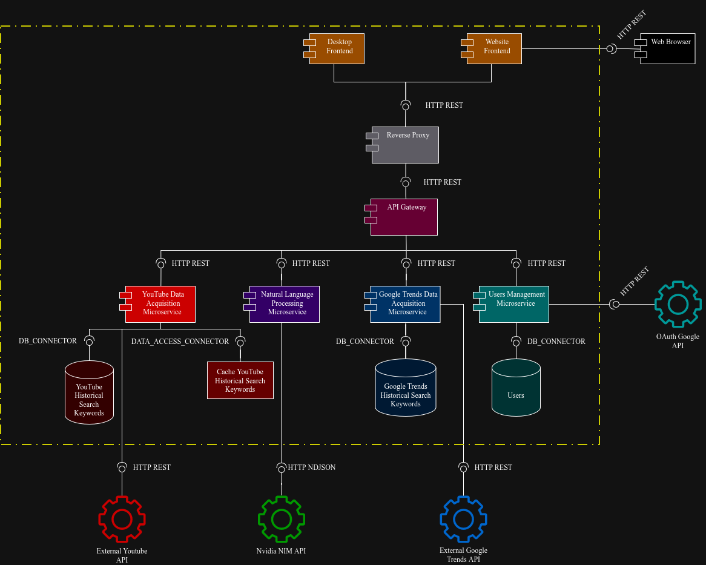

#### 3.1.2. Architectural Styles

La aplicación emplea un estilo arquitectónico de Microservicios, caracterizado por su naturaleza distribuida y el alto grado de autonomía de sus componentes. La comunicación externa se gestiona a través de dos proxies inversos que constituyen los únicos puntos de entrada públicos al sistema: uno orientado a clientes web, con terminación TLS (HTTPS en el puerto 8443), y otro para clientes de escritorio (puerto 8081). El tráfico entrante es enrutado hacia el frontend web interno o directamente al API Gateway, que actúa como orquestador interno desacoplando la lógica de negocio distribuida de los consumidores externos.

Este diseño permite la orquestación y el enrutamiento hacia servicios especializados que operan de manera independiente y poseen su propia persistencia de datos:

- _Servicio de Adquisición de Datos de YouTube:_ Se encarga de capturar información en tiempo real (tendencias, videos registrados y mátricas de análisis de red social) mediante la integración con la API externa de YouTube V3.

- _Servicio de Gestión de Usuarios:_ Administra el ciclo de vida de las cuentas, permitiendo el registro y la autenticación de usuarios de forma aislada, garantizando que la lógica de identidad no interfiera con las funciones de búsqueda.

- _Servicio de Adquisión de Datos de Google Trends_: Captura información sobre la tendencia de la búsqueda del usuario, como el volumen de consulta de la temática a través del tiempo.

- _Procesamiento de Lenguaje Natural_: Este componente se apoya sobre un servicio de API externo de Nvidia para realizar Procesamiento de Lenguaje Natural (NLP) sobre la búsqueda del usuario y expandir semánticamente la consulta hallando posibles búsquedas o entradas de usuario relacionadas.

Los componentes son reutilizables, escalables independientemente y se comunican principalmente a través de protocolos ligeros (HTTP: REST y Streaming), lo que refuerza la agilidad y el bajo acoplamiento del sistema.

#### 3.1.3. Architectural Elements and Relations

Nuestro sistema cuenta con:

- **2 Componentes de presentación: Presenta a través de KPIs, gráficos analíticos y métricas importantes, los datos retornados por los servicios lógicos.**
  - **Frontend web:** Desarrollado en Typescript usando el framework Next JS para implementar Server Side Rendering. Se limita a la interfaz web, cuya responsabilidad es renderizar la información suministrada por los servicios lógicos a través del API Gateway
  - **Frontend de escritorio:** Desarrollado en C#. Permite al usuario interactuar desde la app con interfaz de escritorio mostrando la infmración suministrada por los servicios lógicos a través del API-Gateway
- **5 Componentes lógicos:**
  - **Orquestador (API Gateway):** Componente interno de orquestación y enrutamiento. Recibe las solicitudes provenientes de los proxies inversos, valida la autenticación mediante tokens JWT y enruta las peticiones al microservicio correspondiente. Provee una interfaz unificada para el frontend, ocultando la complejidad de la arquitectura distribuida. No está expuesto públicamente. Desarrollado en el lenguaje de propósito general Go.
  - **Users Management Service**: Gestiona el ciclo de vida de los usuarios (registro e inicio de sesión), exponiendo recursos de autenticación. Desarrollado en TypeScript.
  - **Youtube Data Acquisition Service**: Orquesta la extracción de datos externos. Procesa la query del usuario, consulta la API de YouTube, cálcula métricas y estandarizada los datos para ser presentados en el front. Desarrollado en el lenguaje Python.
  - **Google Trends Data Acquisition Service**: Maneja la extracción de datos de tendecias de búsquedas, consultando la API externa de Google Trends, enriqueciendo la información retornada por el componente de Youtube. Desarrollado en lenguaje de propósito general Python.
  - **Natural Language Processing Service**: Implementa la lógica de IA. Diseña prompts específicos para expandir la búsqueda del usuario a partir de hallazgo de posibles bbúsquedas relacionadas. Desarrollado en el lenguaje Java.
- **4 Componentes de Datos:**
  - _Base de datos relacional Users_: Repositorio centralizado para la información básica y credenciales de acceso de los usuarios.
  - 2 Bases de datos No SQL:
    - _Youtube Historical Search Keywords:_ Almacenamiento persistente de los datos estandarizados y retornados por la API externa de Youtube.
    - _Google Trends Historical Search Keywords:_ Almacena los datos retornador por la API externa de Google Trends
  - _Almacenamiento de datos Caché:_ Componente de almacenamiento volátil que almacena los datos retornados por la API externa de Youtube para mejorar el rendimiento del componente lógico y el uso limitado de la API externa.
- **5 Componentes externos**
  - Web browser: Consume el contenido web para renderizar la interfaz web.
  - OAuth Google API
  - External Youtube API
  - External Google Trends API
  - Nvidia NIM API

#### 3.1.4. Architectural Pattern

Se implementó un patrón arquitectónico con un componente orquestador (API Gateway), evitando que los componentes de presentación adquieran una responsabilidad de sincronización de lógica de negocio que no es responsabilidad natural en la capa de presentación. Las solicitudes externas llegan primero a los proxies inversos, que terminan el canal seguro (TLS/HTTPS) y reenvían el tráfico hacia la red interna. El API Gateway, como orquestador interno, valida la autenticación mediante tokens JWT (*Bearer tokens*), enruta las peticiones al microservicio correspondiente y gestiona el control de acceso. De esta manera, se desacopla al cliente de la arquitectura interna basada en microservicios y ningún servicio interno queda expuesto directamente al exterior.

---

### 3.2. Layered Structure

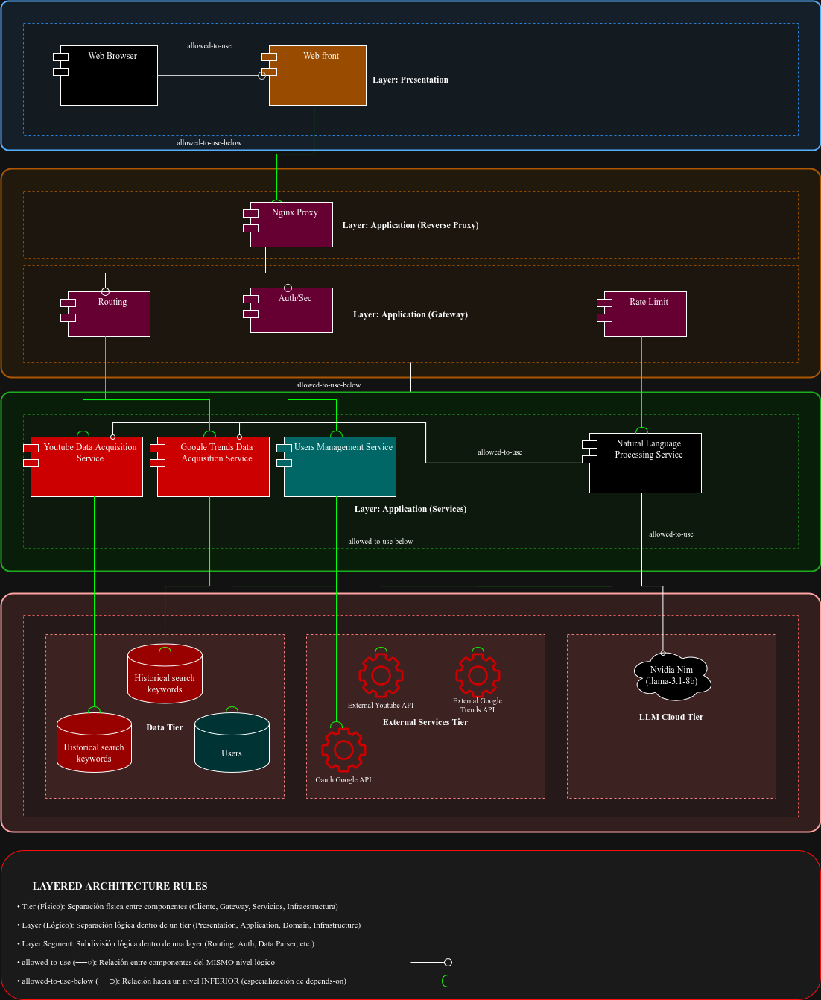

#### 3.2.1. Tier 1 — Presentation

##### 3.2.1.1. Web Frontend

- **Stack:** Next.js 14, React 18, TailwindCSS 4, DaisyUI 5, Recharts, Framer Motion
- **Puerto:** 3000 (privado, interno). Acceso publico via reverse-proxy-web en 8443.
- **Responsabilidades:**
  1. Renderizar UI de autenticación (login, registro, recuperación de contraseña, OAuth callback)
  2. Dashboard con gráficas interactivas de tendencias y análisis
  3. Comunicación con el API Gateway vía HTTP REST desde SSR
- **Endpoints que consume:** `GET/POST /api/users/*`, `GET /api/youtube/*`, `GET /api/trends/*`
- **Dependencias:** api-gateway (HTTP REST) via route handler interno

**Flujo de acceso (Web SSR):**

Navegador -> reverse-proxy-web (HTTPS 8443) -> web-page (SSR, privado) -> api-gateway (privado)

El navegador solo ve el reverse proxy. Las llamadas `/api/*` se resuelven en el servidor de Next.js y se reenvian por red interna al API Gateway.

##### 3.2.1.2. Desktop Frontend

- **Stack:** WPF, C# (.NET), XAML
- **Puerto de acceso público:** 8081 (vía reverse-proxy)
- **Responsabilidades:**
  1. UI de escritorio para autenticación (SignIn, CreateAccount)
  2. Dashboard desktop con HomePage
  3. Comunicación con el API Gateway a través del reverse-proxy en el puerto 8081
- **Endpoints que consume:** Mismos que Web Frontend
- **Dependencias:** reverse-proxy (8081) → api-gateway (HTTP REST)

**Flujo de acceso (Desktop):**

Cliente Desktop -> reverse-proxy (8081) -> api-gateway (privado)

---

#### 3.2.2. Tier 2 — Distribution

##### 3.2.2.1. API Gateway

- **Stack:** Go, net/http, golang-jwt, godotenv
- **Puerto:** 8080 (interno, no expuesto al host)
- **Responsabilidades:**
  1. JWT Authentication — valida Bearer tokens en rutas protegidas; inyecta X-User-Id y X-User-Email en headers downstream
  2. Reverse Proxy — reescribe rutas públicas (`/api/users/*` → users-service, `/api/youtube/*` → youtube-service)
  3. CORS + Logging middleware — maneja preflight OPTIONS, loguea método/ruta/status/latencia/IP
- **Endpoints públicos:** `/health`, `/health/dependencies`, `/api/users/auth/*`
- **Dependencias:** users-service (HTTP REST), youtube-service (HTTP REST), nlp-service (HTTP REST)

---

#### 3.2.3. Tier 3 — Business Logic

##### 3.2.3.1. YouTube Acquisition Service

- **Stack:** Python 3, FastAPI, Motor (MongoDB async), aio-pika (RabbitMQ), redis-py, google-api-python-client
- **Puerto:** 8000 (interno, no expuesto al host)
- **Responsabilidades:**
  1. Scraping de YouTube Data API v3 — búsqueda y recolección de datos de videos/canales
  2. Gestión de cuota de API — tracking y rate limiting del YouTube API quota
  3. Orquestación asíncrona de análisis via RabbitMQ (producer/consumer de `analyses_queue` y `results_queue`)
- **Endpoints:** `GET/POST /api/analyze`, `GET /api/health`
- **DBs:** MongoDB (cache de análisis), Redis (cache de queries con TTL 5min), RabbitMQ (mensajería asíncrona)
- **Dependencias:** MongoDB, Redis, RabbitMQ, nlp-service (allowed-to-use-below), YouTube Data API (externa), users-service (validación)

##### 3.2.3.2. Google Trends Acquisition Service

- **Stack:** Python 3, FastAPI, Motor (MongoDB async), pytrends
- **Puerto:** 8001 (interno, no expuesto al host)
- **Responsabilidades:**
  1. Retrieval de datos de Google Trends — volumen de búsqueda histórica, queries relacionadas
  2. Cache en MongoDB con TTL 24h — minimiza llamadas a la API de Google Trends
  3. Delegación de NLP al servicio NLP para expansión de keywords
- **Endpoints:** `GET /api/v1/trends/*`, `GET /health`
- **DBs:** MongoDB (cache de tendencias)
- **Dependencias:** MongoDB, nlp-service (allowed-to-use-below), Google Trends API (externa), users-service (validación)

##### 3.2.3.3. NLP Service

- **Stack:** Java 17, Spring Boot 3.2, Jackson
- **Puerto:** 8193 (interno, no expuesto al host)
- **Responsabilidades:**
  1. Expansión de Keywords — genera keywords adicionales a partir de una query original
  2. Enrichment de queries — genera expanded_queries para mejorar búsquedas
  3. Detección de idioma del input
- **Endpoints:** `POST /inference`, `GET /inference/health`
- **Dependencias:** Nvidia NIM API (externa, HTTP REST)

##### 3.2.3.4. Users Management Service

- **Stack:** NestJS 11, Prisma ORM, PostgreSQL, Redis (ioredis), Passport (Google OAuth2, GitHub OAuth2, JWT), bcrypt, nodemailer
- **Puerto:** 3001 (interno, no expuesto al host)
- **Responsabilidades:**
  1. Autenticación — Local (email/password con bcrypt), OAuth2 (Google, GitHub), JWT (access + refresh tokens)
  2. CRUD de Users — registro, actualización de perfil/settings, recovery de contraseña via email
  3. Rate Limiting de auth endpoints + audit de sesiones
- **Endpoints:** `POST /api/v1/auth/*`, `GET/PUT /api/v1/users/*`, `POST /api/v1/auth/recovery/*`
- **DBs:** PostgreSQL (users, sessions), Redis (rate limiting + session cache)
- **Dependencias:** PostgreSQL, Redis, OAuth Google API (externa)

---

#### 3.2.4. Tier 4 — Data

##### 3.2.4.1. PostgreSQL

- **Imagen:** postgres:15
- **Puerto:** 5432 (no publicado al host, solo accesible en red interna)
- **Responsabilidades:** Almacenamiento relacional de usuarios, configuraciones y sesiones
- **Usado por:** users-service (vía Prisma ORM)

##### 3.2.4.2. MongoDB

- **Imagen:** mongo:6
- **Puerto:** 27017 (no publicado al host, solo accesible en red interna)
- **Responsabilidades:** Almacenamiento documental de cache de análisis YouTube y tendencias Google
- **Usado por:** youtube-acquisition-service, google-trends-acquisition-service (vía Motor async)

##### 3.2.4.3. Redis

- **Imagen:** redis:7
- **Puerto:** 6379 (no publicado al host, solo accesible en red interna)
- **Responsabilidades:** Cache de queries (YouTube: TTL 5min), rate limiting de auth (Users), session cache
- **Usado por:** youtube-acquisition-service, users-service (vía ioredis)

##### 3.2.4.4. RabbitMQ

- **Imagen:** rabbitmq:3-management
- **Puertos:** 5672 (AMQP), 15672 (Management UI) — ninguno publicado al host, solo accesibles en red interna
- **Responsabilidades:** Mensajería asíncrona para orquestación de análisis (producer/consumer pattern)
- **Colas:** `analyses_queue`, `results_queue`
- **Usado por:** youtube-acquisition-service (vía aio-pika)

---

#### 3.2.5. External APIs

##### 3.2.5.1. YouTube Data API v3

- **Protocolo:** HTTP REST
- **Responsabilidades:** Provee datos de búsqueda, videos y canales de YouTube
- **Usado por:** youtube-acquisition-service

##### 3.2.5.2. Google Trends API (pytrends)

- **Protocolo:** HTTP (via pytrends library)
- **Responsabilidades:** Provee datos de volumen de búsqueda histórica y queries relacionadas
- **Usado por:** google-trends-acquisition-service

##### 3.2.5.3. Nvidia NIM API

- **Protocolo:** HTTP REST
- **Responsabilidades:** Inferencia LLM para expansión de keywords y enriquecimiento de queries
- **Usado por:** nlp-service-nvidia

##### 3.2.5.4. OAuth Google API

- **Protocolo:** OAuth 2.0 / HTTP REST
- **Responsabilidades:** Autenticación de usuarios via Google SSO
- **Usado por:** users-service (vía Passport Google OAuth2 strategy)

---

#### 3.2.6. Relations Summary

| Origen                    | Destino                   | Protocolo    | Tipo                 |
| ------------------------- | ------------------------- | ------------ | -------------------- |
| Web Frontend              | API Gateway               | HTTP REST    | allowed-to-use       |
| Desktop Frontend          | API Gateway               | HTTP REST    | allowed-to-use       |
| API Gateway               | YouTube Acquisition       | HTTP REST    | allowed-to-use       |
| API Gateway               | Google Trends Acquisition | HTTP REST    | allowed-to-use       |
| API Gateway               | Users Management          | HTTP REST    | allowed-to-use       |
| YouTube Acquisition       | MongoDB                   | DB_CONNECTOR | allowed-to-use       |
| YouTube Acquisition       | Redis                     | DB_CONNECTOR | allowed-to-use       |
| YouTube Acquisition       | RabbitMQ                  | AMQP         | allowed-to-use       |
| YouTube Acquisition       | NLP Service               | HTTP REST    | allowed-to-use-below |
| YouTube Acquisition       | YouTube Data API          | HTTP REST    | allowed-to-use       |
| Google Trends Acquisition | MongoDB                   | DB_CONNECTOR | allowed-to-use       |
| Google Trends Acquisition | NLP Service               | HTTP REST    | allowed-to-use-below |
| Google Trends Acquisition | Google Trends API         | HTTP REST    | allowed-to-use       |
| NLP Service               | Nvidia NIM API            | HTTP REST    | allowed-to-use       |
| Users Management          | PostgreSQL                | DB_CONNECTOR | allowed-to-use       |
| Users Management          | Redis                     | DB_CONNECTOR | allowed-to-use       |
| Users Management          | OAuth Google API          | HTTP REST    | allowed-to-use       |

---

#### 3.2.7. Logic Layers

Para complementar la vista por capas de todo el sistema, se establecieron de igual forma la estructura de capas lógicas o subarquitectura de los componentes lógicos a continuación:

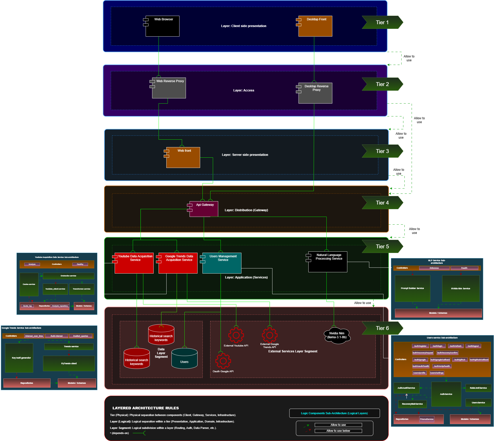

---

##### 3.2.7.1. YouTube Acquisition Data Service


Este componente implementa la lógica de adquisición, procesamiento y almacenamiento de datos provenientes de la API de YouTube.

- _Controllers_ (/analyze, /healthy):
  Actúan como punto de entrada HTTP. Delegan la lógica al Orchestrator-service y al Cache-service.

- _Cache-service_:
  Gestiona la verificación de resultados previamente calculados.
  - Flechas verdes: puede ser invocado por los controllers y el orquestador para evitar llamadas redundantes.
  - Flechas rojas: persiste información auxiliar como Quota_log en el repositorio.

- _Orchestrator-service_:
  Coordina el flujo principal del análisis.
  - Flechas verdes: invoca servicios permitidos como Transformer-service.
  - Flechas rojas: invoca hacia abajo a Youtube_client-service para consumir la API externa.

- _Youtube_client-service_:
  Encapsula las llamadas a la API de YouTube. Solo es invocado por el orquestador (flecha roja).

- _Transformer-service_:
  Se encarga de mapear y normalizar la respuesta de la API hacia los modelos internos.
  - Flechas verdes: interactúa con Models / Schemas.

- _Repositories_ (Quota_log, Analysis_repository):
  Persisten datos en MongoDB.
  - Flechas rojas: indican escritura desde servicios superiores.
  - Flechas verdes: permiten acceso controlado a los modelos.

- _Models / Schemas_:
  Definen la estructura tipada de los datos del sistema. Son utilizados por el transformer y los repositorios.

---

##### 3.2.7.2. Google Trends Service


Este servicio obtiene y procesa tendencias desde Google Trends.

- _Controllers_ (/interest_over_time, /bulk-interest, /related_queries):
  Exponen endpoints que delegan la lógica al Trends service.

- _Key build generator_:
  Genera claves normalizadas para consultas y almacenamiento.
  - Flechas verdes: puede ser invocado por controllers.
  - Flechas rojas: persiste información en Repositories.

- _Trends service_:
  Orquesta la lógica de negocio.
  - Flechas rojas: invoca a PyTrends client para consumir la API externa.

- _PyTrends client_:
  Cliente que encapsula la comunicación con Google Trends.
  - Flechas verdes: entrega datos hacia Models / Schemas.

- _Repositories_:
  Persisten resultados procesados.
  - Flechas verdes: interactúan con los modelos.

- _Models / Schemas_:
  Definen la estructura de datos utilizada en el servicio.

---

##### 3.2.7.3. NLP Service

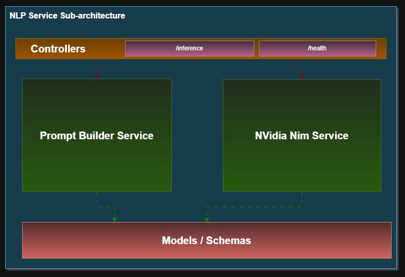

Este servicio se encarga del procesamiento de lenguaje natural para enriquecer las consultas.

- _Controllers_ (/inference, /health):
  Exponen endpoints para inferencia y monitoreo.

- _Prompt Builder Service_:
  Construye prompts estructurados para el modelo NLP.
  - Flechas verdes: interactúa con Models / Schemas.

- _Nvidia Nim Service_:
  Ejecuta la inferencia usando modelos de IA.
  - Flechas verdes: también utiliza los modelos definidos.

- _Models / Schemas_:
  Representan la estructura de entrada/salida del procesamiento NLP.

---

##### 3.2.7.4. Users Service


Gestiona autenticación, usuarios y servicios relacionados.

- _Controllers_:
  Contienen endpoints de autenticación, OAuth, recuperación de cuenta y perfil de usuario.

- _AuthService_:
  Núcleo de la lógica de autenticación.
  - Flechas verdes: interactúa con otros servicios como RateLimitService y UsersService.

- _AuthAuditService_:
  Registra eventos de autenticación.
  - Flechas rojas: persiste logs en Repositories.

- _RecoveryMailService_:
  Gestiona recuperación de cuentas vía correo.
  - Flechas rojas: escribe en repositorios.

- _RateLimitService_:
  Controla la tasa de solicitudes hacia el sistema.

- _UsersService_:
  Gestiona información de usuarios.
  - Flechas verdes: interactúa con Models / Schemas.

- _Repositories_ (PrismaService):
  Acceso a la base de datos relacional.
  - Flechas rojas: reciben escritura desde servicios.

- _Models / Schemas_:
  Definen estructuras de datos para usuarios y autenticación.

---

### 3.3. Decomposition View

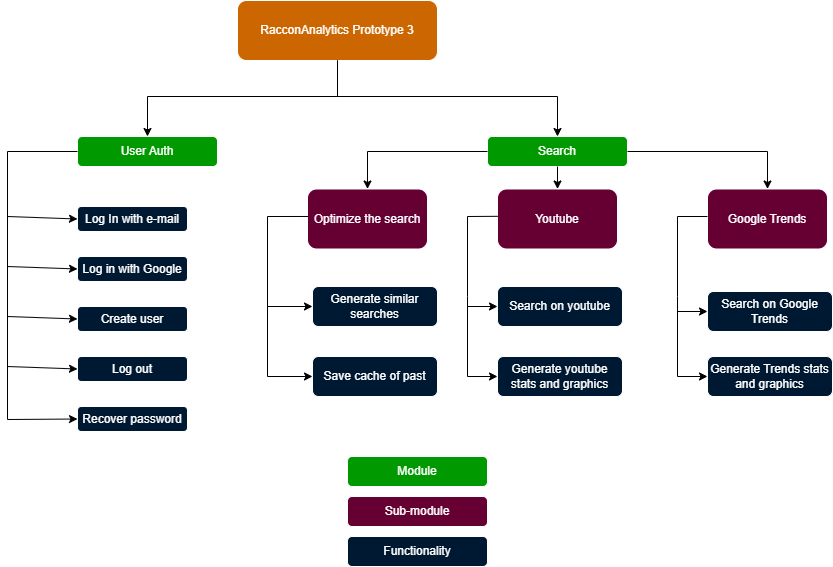

La aplicación fue dividida en dos modulos principales y 3 sub-modulos, con un total de 11 funcionalidades

-User Auth: Es el modulo que contiene todas las funciones que permiten al usuario ingresar, crear su cuenta, salir de la sesión, recuperar contraseña y autorizarse como usuario
-Search: Es el modulo que contiene todo lo relacionado a busqueda, en este caso 3 sub-modulos que nos indican como se dividen estas funcionalidades
-Sub-modulo Optimize Search: Es el que contiene tanto la generación de busquedas relacionadas por parte de nuestro modelo LLM como el guardado de las busquedas previas usando un caché
-Sub-modulo Youtube: Contiene tanto la funcionalidad de la busqueda en youtube como la funcionalidad de la generación de stats y gráficas para youtube
-Sub_modulo Google Trends: Al igual que el sub-modulo de Youtube contiene las funcionalidades de la generación de stats y graficas pero para google trends

---

### 3.4. Deployment View

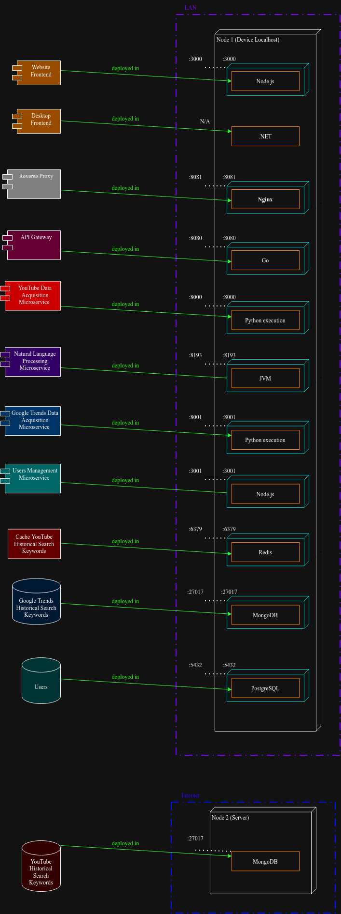

#### 3.4.1. Deployment Architecture

El diagrama de despliegue ilustra la distribución física y lógica de los componentes del sistema, dividiendo la arquitectura en dos zonas de red principales: una red de área local (LAN) y una red externa (Internet). El sistema se distribuye a través de dos nodos físicos o virtuales que alojan múltiples entornos de ejecución y microservicios.

1. Zona LAN: Node 1 (Device Localhost)
   Este nodo actúa como el entorno principal de alojamiento local y contiene todos los microservicios, interfaces y bases de datos del sistema. El acceso externo al nodo está restringido a dos únicos puntos de entrada públicos (proxies inversos); todos los demás servicios operan en redes privadas internas sin exposición directa al host ni a internet.

   **Puntos de entrada públicos:**
   - **Reverse Proxy Web** (nginx): Termina el canal TLS (HTTPS) en el puerto 8443, redirige HTTP (puerto 8080) a HTTPS, y enruta el tráfico hacia el frontend web interno. Aplica rate limiting y cabeceras de seguridad (HSTS, X-Frame-Options).
   - **Reverse Proxy Desktop** (nginx): Recibe conexiones de clientes de escritorio en el puerto 8081 y las enruta al API Gateway interno. Aplica rate limiting.

   **Interfaces de usuario y orquestación (red privada de servicios):**
   - **Website Frontend**: Desplegado en Node.js (puerto 3000, privado). No expuesto directamente; accesible únicamente a través del Reverse Proxy Web vía HTTPS.
   - **Desktop Frontend**: Desplegado bajo el marco de trabajo .NET. Se comunica con el sistema a través del Reverse Proxy Desktop (puerto 8081).
   - **API Gateway**: Desplegado en Go (puerto 8080, privado). Orquesta y enruta las solicitudes internas; valida tokens JWT antes de reenviar peticiones a los microservicios.

   **Microservicios de procesamiento y adquisición (red privada de servicios):**
   - **YouTube Data Acquisition Microservice**: Desplegado en Python (puerto 8000, privado).
   - **Natural Language Processing Microservice**: Ejecutado sobre JVM (puerto 8193, privado).
   - **Google Trends Data Acquisition Microservice**: Desplegado en Python (puerto 8001, privado).
   - **Users Management Microservice**: Alojado en Node.js (puerto 3001, privado).

   **Almacenamiento en caché y bases de datos locales (red interna aislada, sin acceso externo):**
   - **Cache YouTube Historical Search Keywords**: Redis (puerto 6379, no publicado al host).
   - **Google Trends Historical Search Keywords**: MongoDB (puerto 27017, no publicado al host).
   - **Users**: PostgreSQL (puerto 5432, no publicado al host).

2. Zona Internet: Node 2 (Server)
   Este nodo representa un servidor remoto accesible a través de Internet, dedicado específicamente al almacenamiento persistente externo.
   Almacenamiento Remoto:
   - **YouTube Historical Search Keywords**: Base de datos desplegada en MongoDB (puerto 27017).

---

## 4. Atributos de Calidad — Seguridad y Rendimiento

### 4.1. Patrón Network Segmentation (Limitar Acceso — Resistir Ataque)

#### 4.1.1. Táctica arquitectónica aplicada

La táctica aplicada es **Limitar acceso** (*Limit Access*), perteneciente a la categoría **Resistir ataque** (*Resist Attack*) del atributo de calidad de Seguridad. Esta táctica restringe los puntos de acceso a los recursos del sistema y el tipo de tráfico permitido, con el objetivo de reducir la superficie de ataque expuesta. Se implementa mediante la creación de zonas de red diferenciadas con distintos niveles de confianza y visibilidad, análogas a una zona desmilitarizada (DMZ) reforzada con cortafuegos.

#### 4.1.2. Patrón arquitectónico aplicado

El patrón aplicado es **Network Segmentation**, que consiste en dividir la red del sistema en segmentos aislados entre sí, limitando la propagación de ataques y el movimiento lateral entre componentes. El patrón distingue dos tipos de subred:

- **Subred pública (*Public Subnet*):** segmentos de red accesibles desde el exterior, que contienen únicamente los componentes de frontera que deben recibir tráfico externo (proxies inversos). En este sistema corresponde a las redes `raccon_public_web` y `raccon_public_desktop`.
- **Subred privada (*Private Subnet*):** segmentos de red con espacios de direcciones IP privadas, sin acceso desde el exterior. Contienen los microservicios internos, las bases de datos y la mensajería. Corresponde a las redes `raccon_private_services` y `raccon_private_internal`.

Un atacante que comprometa un componente de la subred de presentación (por ejemplo, mediante XSS avanzado en el frontend SSR) no puede alcanzar directamente las bases de datos ni los microservicios internos, ya que la segmentación de red actúa como barrera técnica independiente de la lógica de aplicación.

#### 4.1.3. Escenarios de seguridad

##### 4.1.3.1. Escenario 1 — Aislamiento de bases de datos frente a acceso externo

En el estado previo del sistema (Prototype 2), los contenedores de bases de datos publicaban sus puertos directamente al host mediante la directiva `ports` en `docker-compose.yml`. Esto permitía que cualquier proceso en la máquina anfitriona o en la red local se conectara directamente a MongoDB, PostgreSQL o Redis sin atravesar ninguna capa de seguridad intermedia. Este escenario valida que, tras aplicar el patrón de segmentación de red, las bases de datos quedan completamente inaccesibles desde el exterior: ningún puerto de base de datos está expuesto al host y la red interna en la que residen bloquea todo enrutamiento externo. La verificación se realiza tanto desde la máquina anfitriona (mediante `Test-NetConnection`) como desde un contenedor externo ajeno a la red interna del sistema.

| Campo | Descripción |
|---|---|
| **Fuente del estímulo** | Atacante externo (desde el host o desde internet) |
| **Estímulo** | Intento de conexión directa a MongoDB (27017), PostgreSQL (5432) o Redis (6379) mediante escaneo de puertos, cliente CLI o conexión manual |
| **Entorno** | Sistema en operación normal con todos los contenedores activos |
| **Artefacto** | Contenedores de bases de datos: `mongo`, `postgres`, `redis` |
| **Respuesta** | La conexión es rechazada inmediatamente. Los puertos de las bases de datos no están publicados al host. La red `raccon_private_internal` tiene `internal: true`, lo que bloquea todo tráfico externo hacia ella |
| **Medida de respuesta** | 0 puertos de bases de datos accesibles desde el host. Rechazo inmediato (*Connection refused*). La red interna no enruta tráfico hacia el exterior ni recibe tráfico desde el exterior |

**Contramedida implementada:** configuración de la red `raccon_private_internal` con `internal: true` en `docker-compose.yml`, sin publicación de puertos (`ports`) en los contenedores de base de datos.

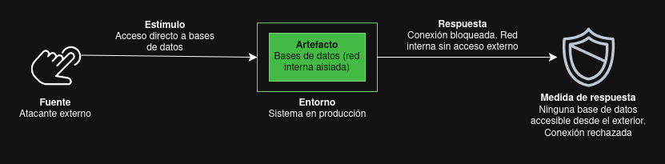

**Evidencia comparativa — Prototype 2 (antes) vs. Prototype 3 (después):**

*Acceso a MongoDB desde el host:*

| Antes | Después |
|---|---|
| 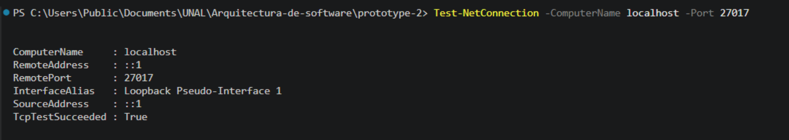 | 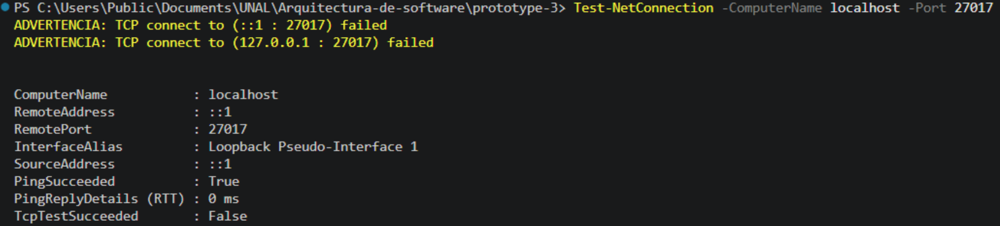 |

*Acceso a Redis desde el host:*

| Antes | Después |
|---|---|
| 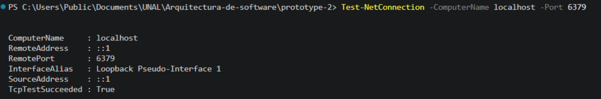 | 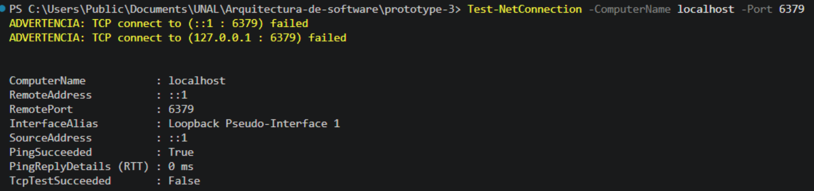 |

*Acceso a MongoDB desde un contenedor externo:*

| Antes | Después |
|---|---|
| 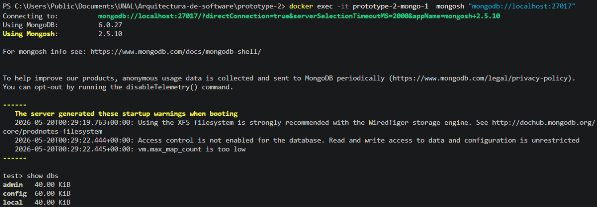 | 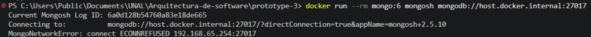 |

*Acceso a Redis desde un contenedor externo:*

| Antes | Después |
|---|---|
| 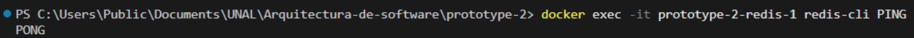 | 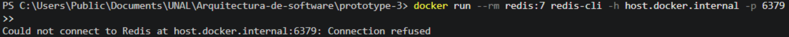 |

##### 4.1.3.2. Escenario 2 — Frontend aislado de bases de datos

Este escenario aborda el riesgo de movimiento lateral desde el frontend hacia las bases de datos. En Prototype 2, el contenedor `web-page` compartía red con los contenedores de base de datos, por lo que un atacante con ejecución de código en el proceso SSR del frontend podía resolver y alcanzar directamente los servicios de datos mediante `ping` o conexiones TCP directas. La contramedida consiste en restringir el contenedor `web-page` a una red de servicios separada, sin membresía en la red interna donde residen las bases de datos. Como consecuencia, el DNS embebido de Docker no resuelve los nombres de host `mongo`, `redis` ni `postgres` desde el interior del contenedor del frontend, haciendo imposible cualquier conexión directa a datos sensibles incluso si el proceso del frontend es comprometido.

| Campo | Descripción |
|---|---|
| **Fuente del estímulo** | Atacante que ha comprometido el contenedor del frontend (SSR comprometido o XSS con ejecución en servidor) |
| **Estímulo** | Intento de conexión directa a `mongo` (27017), `redis` (6379) o `postgres` (5432) desde dentro del contenedor `web-page` |
| **Entorno** | Sistema en operación normal |
| **Artefacto** | Contenedor `web-page`, redes Docker `raccon_private_services` y `raccon_private_internal` |
| **Respuesta** | La conexión falla en resolución de nombre de host. El contenedor `web-page` pertenece únicamente a `raccon_private_services` y no tiene visibilidad de los contenedores en `raccon_private_internal`. La resolución DNS de Docker para `mongo`, `postgres` y `redis` no existe en la red de `web-page` |
| **Medida de respuesta** | Fallo inmediato con error *bad address* al intentar resolver los hostnames de bases de datos. El movimiento lateral desde el frontend hacia datos sensibles es imposible por diseño de red |

**Contramedida implementada:** asignación del contenedor `web-page` exclusivamente a la red `raccon_private_services`, sin membresía en `raccon_private_internal` donde residen las bases de datos.

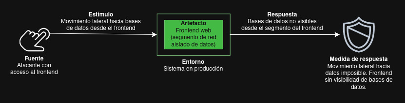

**Evidencia comparativa — Prototype 2 (antes) vs. Prototype 3 (después):**

*Resolución del hostname `mongo` desde el contenedor `web-page` (ping):*

| Antes | Después |
|---|---|
| 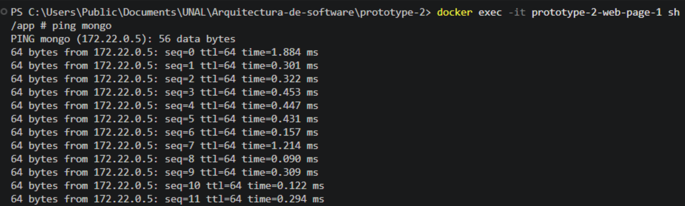 | 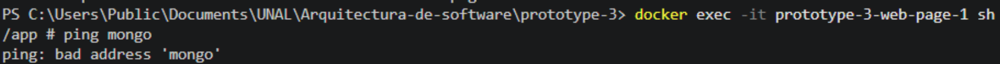 |

*Conexión TCP a MongoDB desde el contenedor `web-page` (netcat):*

| Antes | Después |
|---|---|
| 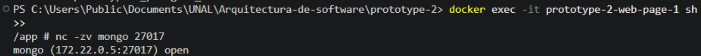 | 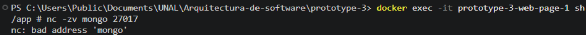 |

##### 4.1.3.3. Escenario 3 — Reverse Proxy como único punto de entrada

En Prototype 2, múltiples servicios internos publicaban puertos directamente al host: el API Gateway en el puerto 8080, el servicio de adquisición de YouTube en el puerto 8000 y el frontend web en el puerto 3000. Esto permitía a cualquier cliente saltarse el proxy inverso y acceder directamente a los servicios internos, eludiendo controles como la terminación TLS, la limitación de tasa y la inyección de cabeceras de autenticación. Este escenario valida que, en Prototype 3, ningún servicio interno tiene puertos publicados al host: el único acceso externo válido es a través de los proxies inversos, que actúan como única puerta de entrada controlada al sistema.

| Campo | Descripción |
|---|---|
| **Fuente del estímulo** | Atacante externo |
| **Estímulo** | Intento de acceso directo al API Gateway (8080), microservicios internos (8000, 8001, 8193, 3001) o bases de datos (27017, 5432, 6379) desde el host o internet |
| **Entorno** | Sistema en operación normal |
| **Artefacto** | Todos los contenedores internos: `api-gateway`, `users-service`, `youtube-service`, `google-trends-service`, `nlp-service`, `mongo`, `postgres`, `redis`, `rabbitmq`, `web-page` |
| **Respuesta** | Todos los intentos de conexión directa a puertos internos son rechazados. Únicamente los reverse proxies (`reverse-proxy` en puerto 8081 y `reverse-proxy-web` en puertos 8443/8080) tienen puertos publicados al host |
| **Medida de respuesta** | 10 de 10 puertos internos inaccesibles desde el host. Dos únicos puntos de entrada externamente accesibles. La topología interna no es visible ni deducible desde el exterior |

**Contramedida implementada:** ningún contenedor interno tiene la directiva `ports` con binding a `0.0.0.0` en `docker-compose.yml`. Únicamente `reverse-proxy` y `reverse-proxy-web` publican puertos.

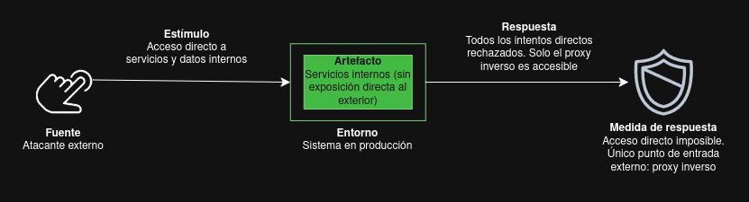

**Evidencia comparativa — Prototype 2 (antes) vs. Prototype 3 (después):**

*Acceso directo al API Gateway y servicio YouTube desde el host (antes):*

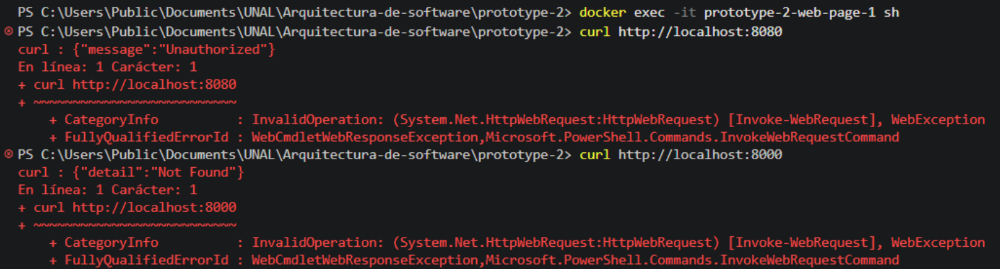

*Acceso directo al frontend web desde el host (antes):*

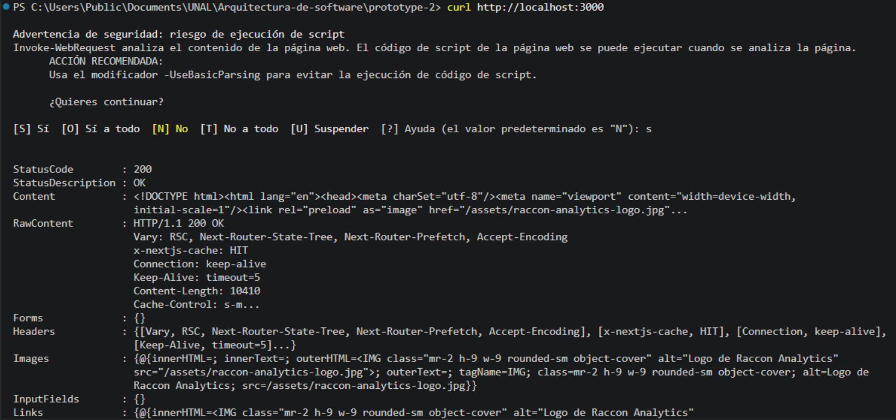

*Todos los servicios internos inaccesibles desde el host (después):*

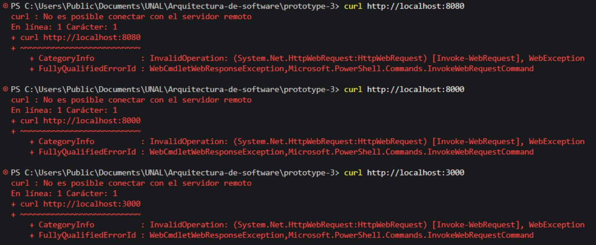

#### 4.1.4. Implementación

La implementación se realiza mediante cuatro redes Docker definidas en el `docker-compose.yml` de la raíz del repositorio:

```yaml
networks:
  public_web:
    driver: bridge
    name: raccon_public_web

  public_desktop:
    driver: bridge
    name: raccon_public_desktop

  private_services:
    driver: bridge
    name: raccon_private_services

  private_internal:
    driver: bridge
    name: raccon_private_internal
    internal: true    # sin acceso a internet; solo comunicación intra-red
```

La directiva `internal: true` en `raccon_private_internal` es el mecanismo central del patrón: Docker bloquea cualquier enrutamiento de tráfico entre esa red y el exterior (host o internet), independientemente de las reglas de la aplicación.

**Asignación de contenedores a redes y puertos publicados al host:**

| Contenedor | Redes asignadas | Puertos publicados |
|---|---|---|
| `reverse-proxy-web` | `public_web`, `private_services` | 8443 (HTTPS), 8080 (HTTP → 301 HTTPS) |
| `reverse-proxy` | `public_desktop`, `private_services` | 8081 |
| `web-page` | `private_services` | ninguno |
| `api-gateway` | `private_services`, `private_internal` | ninguno |
| `users-service` | `private_services`, `private_internal` | ninguno |
| `youtube-service` | `private_services`, `private_internal` | ninguno |
| `google-trends-service` | `private_services`, `private_internal` | ninguno |
| `nlp-service` | `private_services` | ninguno |
| `postgres` | `private_internal` | ninguno |
| `mongo` | `private_internal` | ninguno |
| `redis` | `private_internal` | ninguno |
| `rabbitmq` | `private_internal` | ninguno |

**Flujo de acceso con segmentación aplicada:**

```
Browser (web)                         Cliente desktop
      |                                      |
  (HTTPS 8443)                           (HTTP 8081)
      |                                      |
reverse-proxy-web                      reverse-proxy
[public_web + private_services]        [public_desktop + private_services]
      |                                      |
  web-page                                   |
  [private_services]                         |
      |                                      |
      +-------------> api-gateway <----------+
                   [private_services + private_internal]
                              |
          +----------+--------+---------+----------+
          |          |                  |          |
    users-service  youtube-service  trends-service  nlp-service
    [priv_svc +    [priv_svc +      [priv_svc +    [priv_svc]
     priv_int]      priv_int]        priv_int]
          |               |               |
    [postgres,      [mongo, redis,     [mongo]
     redis]          rabbitmq]
                          ↑
        raccon_private_internal (internal=true — sin acceso desde fuera)
```

La red `raccon_private_services` permite que los microservicios realicen llamadas salientes a APIs externas (YouTube Data API, Google Trends API, Nvidia NIM API). La red `raccon_private_internal` está completamente aislada del exterior y contiene únicamente las bases de datos y los servicios que necesitan accederlas directamente.

#### 4.1.5. Pruebas

Las pruebas del patrón se encuentran en el directorio `reverse-proxy/`. Los grupos más relevantes para Network Segmentation son los **Grupos 1, 5 y 6** de `test_security_comparison.py`:

- **Grupo 1 — Aislamiento de servicios:** verifica que los puertos 8080, 3001, 8000, 8001, 8193, 5432, 27017 y 6379 son inaccesibles desde el host (connection refused).
- **Grupo 5 — Port bindings de Docker:** verifica mediante `docker compose ps` que solo `reverse-proxy` y `reverse-proxy-web` tienen puertos publicados (`0.0.0.0`) y que todos los demás contenedores son internos.
- **Grupo 6 — Aislamiento de red Docker:** verifica que `internal: true` está configurado en `docker-compose.yml` y que las redes públicas y privadas están correctamente separadas.

La prueba del Escenario 2 (frontend aislado de bases de datos) se ejecuta manualmente entrando al contenedor `web-page`:

```bash
docker exec -it arquisoft-web-page-1 sh
# Intentar alcanzar las bases de datos (deben fallar):
ping mongo          # → ping: bad address 'mongo'
nc -zv mongo 27017  # → nc: bad address 'mongo'
```

**Ejecución de la suite completa:**

```bash
# Desde la raíz del repositorio umbrella, con el sistema desplegado
python3 reverse-proxy/test_security_comparison.py
python3 reverse-proxy/test_confidenciality.py
bash   reverse-proxy/test_confidenciality.sh
```

**Resultados verificados con el sistema desplegado:**

```
SUMMARY: 32 passed, 0 failed, 28 protections confirmed

Protecciones confirmadas relevantes a Network Segmentation:
  ✓ Puerto 27017 (MongoDB)     — BLOQUEADO desde el host (connection refused)
  ✓ Puerto 5432  (PostgreSQL)  — BLOQUEADO desde el host (connection refused)
  ✓ Puerto 6379  (Redis)       — BLOQUEADO desde el host (connection refused)
  ✓ Puerto 8080  (API Gateway) — BLOQUEADO desde el host (connection refused)
  ✓ Puerto 3001  (Users Svc)   — BLOQUEADO desde el host (connection refused)
  ✓ Puerto 8000  (YouTube Svc) — BLOQUEADO desde el host (connection refused)
  ✓ Puerto 8001  (Trends Svc)  — BLOQUEADO desde el host (connection refused)
  ✓ Puerto 8193  (NLP Svc)     — BLOQUEADO desde el host (connection refused)
  ✓ web-page → mongo           — INALCANZABLE (bad address — sin DNS en private_internal)
  ✓ web-page → redis           — INALCANZABLE (bad address)
  ✓ web-page → postgres        — INALCANZABLE (bad address)
  ✓ internal=true configurado en raccon_private_internal
  ✓ Solo reverse-proxy (8081) y reverse-proxy-web (8443/8080) accesibles externamente
```

---

### 4.2. Secure Channel

#### 4.2.1. reverse-proxy-web

Reverse proxy para el frontend web SSR. Este proxy se ubica entre el navegador y el servicio Next.js `web-page`, permitiendo exponer un punto de entrada publico y mantener privado el servicio SSR dentro de la red interna.

#### 4.2.2. System Overview

Este componente aplica el patron Reverse Proxy para:

- Centralizar el acceso al frontend web
- Ocultar la topologia interna del servicio SSR
- Terminar TLS y proteger el canal con el navegador
- Implementar limitacion de velocidad en el borde

#### 4.2.3. Architecture Views

##### 4.2.3.1. Component & Connector View

El flujo de peticiones es:

```text
Navegador -> reverse-proxy-web (TLS) -> web-page (Next.js SSR) -> api-gateway (privado)
```

El navegador solo conoce el proxy. El servicio `web-page` no se expone a internet.

##### 4.2.3.2. HTTPS Flow Diagram

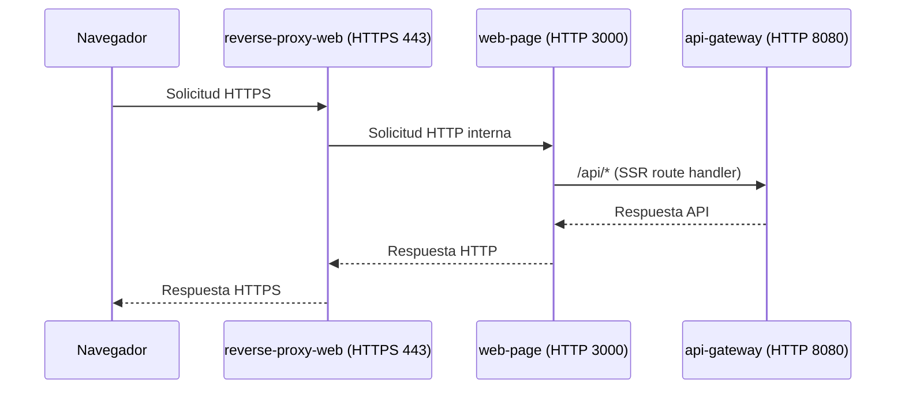
```mermaid
sequenceDiagram
  participant Browser as Navegador
  participant Proxy as reverse-proxy-web (HTTPS 443)
  participant Web as web-page (HTTP 3000)
  participant Api as api-gateway (HTTP 8080)
  Browser->>Proxy: Solicitud HTTPS
  Proxy->>Web: Solicitud HTTP interna
  Web->>Api: /api/* (SSR route handler)
  Api-->>Web: Respuesta API
  Web-->>Proxy: Respuesta HTTP
  Proxy-->>Browser: Respuesta HTTPS
```

##### 4.2.3.3. Deployment View

El proxy expone los puertos 80 y 443. Todo el trafico HTTPS entra por 443 y se reenvia a `web-page:3000` dentro de la red de Docker. El SSR enruta `/api/*` hacia `api-gateway:8080` por red interna.

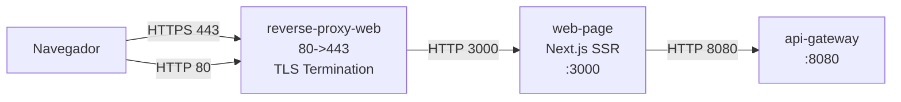
```mermaid
flowchart LR
  Browser[Navegador]
  Proxy[reverse-proxy-web\n80->443\nTLS Termination]
  Web[web-page\nNext.js SSR\n:3000]
  Api[api-gateway\n:8080]
  Browser -- HTTPS 443 --> Proxy
  Browser -- HTTP 80 --> Proxy
  Proxy -- HTTP 3000 --> Web
  Web -- HTTP 8080 --> Api
```

#### 4.2.4. Technical Guide

##### 4.2.4.1. TLS Termination

El canal seguro se implementa terminando TLS en Nginx. El proxy presenta un certificado valido, negocia TLS 1.2/1.3 y fuerza HTTPS con redireccion desde 80. Esto evita ataques de tipo man-in-the-middle al cifrar y autenticar el canal navegador -> proxy.

Configuracion clave en Nginx:

- `ssl_certificate` y `ssl_certificate_key` para el certificado
- `ssl_protocols TLSv1.2 TLSv1.3`
- `Strict-Transport-Security` para prevenir downgrade

**Para que funciona:** garantiza confidencialidad e integridad del trafico entre el navegador y el reverse proxy. El usuario se conecta a un punto unico con identidad verificada mediante certificado.

**Como se implementa:**

- TLS en el puerto 443 con certificado valido
- Redireccion HTTP -> HTTPS en el puerto 80
- HSTS para forzar HTTPS en conexiones futuras

**Problemas que soluciona:**

- Evita que terceros puedan leer credenciales, tokens o contenido sensible en transito
- Previene modificaciones de respuestas o inyeccion de contenido en la red
- Reduce el riesgo de secuestro de sesion por sniffing de cookies

**Ataques mitigados:**

- Man-in-the-middle en redes publicas o WiFi inseguro
- Sniffing de trafico en texto plano
- Downgrade a HTTP cuando el cliente intenta usar HTTPS

**Por que se debe implementar:**

- El frontend SSR transmite datos de sesion y contenido dinamico
- El proxy es el unico punto expuesto; cifrar aqui protege todo el canal publico
- Es un requisito basico de seguridad para exponer servicios web en internet

##### 4.2.4.2. Rate Limiting

Se limita el trafico por IP para proteger el frontend web contra abuso y ataques de capa 7.

#### 4.2.5. Prerequisites

- Docker y Docker Compose instalados
- Certificado TLS disponible
- Variables de entorno correctas para que el prototipo funcione en la maquina de pruebas

#### 4.2.6. Configuration

El servicio `reverse-proxy-web` expone puertos y monta certificados:

- Puertos: 8443 (HTTPS) y 8080 (HTTP -> HTTPS)
- Volumen TLS: `./reverse-proxy-web/certs:/etc/nginx/certs:ro`
- Healthcheck: `https://localhost/health`

El certificado de prueba puede ser self-signed para desarrollo local. Los navegadores mostraran advertencias si no pertenece a una CA confiable. No debe compartirse publicamente.

#### 4.2.7. How to Run

Desde la raiz del repositorio:

```bash
docker compose up --build
```

Chequeo de salud:

```bash
docker compose ps
```

El servicio `reverse-proxy-web` marcara `healthy` cuando HTTPS responda en `/health`.

El proxy web expone:

- HTTPS: 8443
- HTTP: 8080 (redirige a HTTPS)

#### 4.2.8. How to Verify

1. Certificados cargados:

```bash
ls -l reverse-proxy-web/certs
```

2. Healthcheck HTTPS:

```bash
curl -k https://localhost:8443/health
```

3. Redirect OAuth correcto:

```bash
curl -k -I https://localhost:8443/api/users/auth/google | sed -n '1,20p'
```

El `redirect_uri` debe apuntar al origen HTTPS publicado por `reverse-proxy-web`.

#### 4.2.9. Troubleshooting

**El navegador dice Not Secure**

- El certificado es self-signed. Importalo como confiable o usa uno emitido por CA.

**No abre https://localhost:8443**

- Verifica que existan `tls.crt` y `tls.key` en `reverse-proxy-web/certs`.
- Revisa logs: `docker compose logs --tail=200 reverse-proxy-web`.

**OAuth redirect_uri_mismatch**

- Confirma que la configuracion OAuth use el origen HTTPS publicado por `reverse-proxy-web`.

#### 4.2.10. Laboratorio de interceptacion con mitmproxy para el canal seguro web

##### 4.2.10.1. Descripcion

Este laboratorio evalua la efectividad del canal seguro implementado por `reverse-proxy-web` en `prototype-3`, comparandolo contra `prototype-2`, donde el frontend web y el API Gateway se exponen por HTTP.

El componente `reverse-proxy-web` actua como punto de entrada publico para el frontend SSR. Termina TLS, redirige HTTP a HTTPS y reenvia internamente hacia `web-page`. El flujo esperado en `prototype-3` es:

```text
Navegador -> reverse-proxy-web (HTTPS) -> web-page (Next.js SSR) -> api-gateway (privado)
```

El navegador solo debe conocer el reverse proxy. Los componentes `web-page` y `api-gateway` no deben aparecer como destinos publicos del browser.

##### 4.2.10.2. Objetivo

Validar que el patron de canal seguro entre el navegador y `reverse-proxy-web` mejora la proteccion frente a interceptacion de trafico, comparando:

1. Confidencialidad: si credenciales, tokens, payloads o terminos de busqueda pueden leerse desde una captura.
2. Integridad/autenticidad: si el navegador acepta o bloquea un intermediario no confiable.
3. Exposicion de topologia: si el navegador observa directamente componentes internos como `web-page` o `api-gateway`.

##### 4.2.10.3. Supuestos

- Ambos prototipos ya compilan y corren correctamente en la maquina de pruebas.
- Las variables de entorno, credenciales de desarrollo, certificados y dependencias externas ya estan configuradas.
- El certificado de desarrollo de `prototype-3` puede ser self-signed; esto es aceptable para el laboratorio.
- Se ejecuta un solo prototipo a la vez para evitar conflictos de puertos.
- Se usa un navegador o perfil dedicado para no contaminar la navegacion diaria con CAs de prueba.

##### 4.2.10.4. Herramientas

- Docker y Docker Compose.
- Navegador web, recomendado Firefox por su control explicito de proxy y certificados.
- `mitmproxy` o `mitmdump`.

Si `mitmproxy` no esta instalado localmente, puede usarse con Docker:

```bash
docker run --rm -it --network host \
  -v "$HOME/.mitmproxy-raccon-lab:/home/mitmproxy/.mitmproxy" \
  mitmproxy/mitmproxy \
  mitmproxy --listen-host 127.0.0.1 --listen-port 8088 --set ssl_insecure=true
```

Notas:

- `--network host` permite mantener URLs locales como `localhost` durante el laboratorio.
- `ssl_insecure=true` permite que mitmproxy acepte certificados self-signed del entorno de desarrollo.
- El volumen mantiene estable la CA de mitmproxy entre ejecuciones.

##### 4.2.10.5. Preparacion del navegador

Configurar proxy manual:

```text
HTTP proxy: 127.0.0.1
Puerto: 8088

HTTPS proxy: 127.0.0.1
Puerto: 8088
```

En Firefox:

- Dejar vacio el campo `No proxy for`.
- Si se prueba contra `localhost`, habilitar `network.proxy.allow_hijacking_localhost=true` en `about:config`.
- Para la prueba con CA instalada, abrir `http://mitm.it`, descargar la CA de mitmproxy e importarla en `Authorities`, marcando confianza para identificar sitios web.

##### 4.2.10.6. Procedimiento A: prototype-2 sin canal seguro

1. Levantar `prototype-2`.

```bash
docker compose up --build
```

2. Abrir el frontend web por HTTP.

```text
http://localhost:3000
```

3. Ejecutar acciones funcionales:

- Registro de usuario de prueba.
- Login.
- Navegacion dentro de la aplicacion.
- Busqueda o accion que invoque servicios de analisis, aunque alguno responda error por dependencias externas.

4. Observar en mitmproxy las solicitudes del navegador.

Flujos esperados:

```text
http://localhost:3000/...
http://localhost:8080/api/users/auth/login
http://localhost:8080/api/users/auth/register
http://localhost:8080/api/youtube/...
http://localhost:8080/api/trends/...
```

5. Evidencia esperada:

- Rutas HTTP visibles.
- Headers visibles.
- Bodies JSON visibles.
- Credenciales de login o registro visibles cuando se inspecciona la solicitud correspondiente.
- Tokens o header `Authorization: Bearer ...` visibles despues de autenticar, si la aplicacion los envia.
- Terminos de busqueda visibles en query params o payloads.

Resultado esperado:

```text
En prototype-2, mitmproxy puede inspeccionar el trafico de aplicacion sin instalar una CA ni romper TLS, porque el canal navegador -> sistema usa HTTP. Las rutas, headers y cuerpos de solicitud quedan disponibles para un intermediario con capacidad de proxy.
```

##### 4.2.10.7. Procedimiento B: prototype-3 con canal seguro y reverse-proxy-web

1. Levantar `prototype-3`.

```bash
docker compose up --build
```

2. Verificar el reverse proxy web.

```bash
curl -k https://localhost:8443/health
curl -I http://localhost:8080/health
```

Resultados esperados:

- HTTPS responde `ok` en `/health`.
- HTTP redirige a HTTPS.

3. Abrir el frontend web por HTTPS.

```text
https://localhost:8443
```

4. Prueba sin CA de mitmproxy instalada.

Mantener el navegador apuntando a mitmproxy, pero sin confiar en su CA. Intentar entrar a la aplicacion y ejecutar una accion.

Resultado esperado:

```text
El navegador bloquea la conexion o muestra advertencia de certificado. Un intermediario no autorizado no puede interceptar de forma transparente el canal HTTPS browser -> reverse-proxy-web.
```

5. Prueba con CA de mitmproxy instalada.

Instalar la CA desde `http://mitm.it` solo en el navegador/perfil de laboratorio. Repetir:

- Registro o login.
- Navegacion.
- Busqueda o invocacion funcional hacia servicios internos.

Resultado esperado:

```text
mitmproxy puede descifrar el trafico porque el navegador confia explicitamente en su CA. Esta es una inspeccion autorizada. Aun asi, el host observado por el navegador debe ser el reverse proxy HTTPS y no los componentes internos.
```

6. Observaciones esperadas con CA instalada:

- Solicitudes hacia `https://localhost:8443/...`.
- Rutas `/api/*` same-origin contra el reverse proxy.
- Ausencia de solicitudes del navegador hacia `web-page:3000`, `api-gateway:8080` o nombres internos de Docker.
- Redireccion HTTP -> HTTPS en el puerto publico de redireccion.
- Trafico interno `web-page -> api-gateway` no visible desde el proxy del navegador.

##### 4.2.10.8. Resultados obtenidos

###### Prototype-2: trafico HTTP legible

En `prototype-2` se observo que el navegador accede directamente al frontend por HTTP y que las llamadas de aplicacion hacia el API Gateway tambien viajan por HTTP. En mitmproxy se visualizaron rutas como `http://localhost:3000/...` y `http://localhost:8080/api/...`, lo cual evidencia que el intermediario puede reconocer la topologia publica usada por el browser.

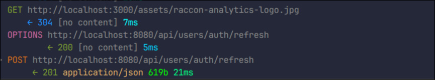

Al inspeccionar una solicitud funcional del aplicativo, mitmproxy mostro headers, token `Authorization: Bearer ...` y body JSON con el termino de busqueda enviado por el usuario. Esto confirma que, sin canal TLS entre el browser y el punto de entrada, un intermediario con capacidad de proxy puede leer contenido de aplicacion.

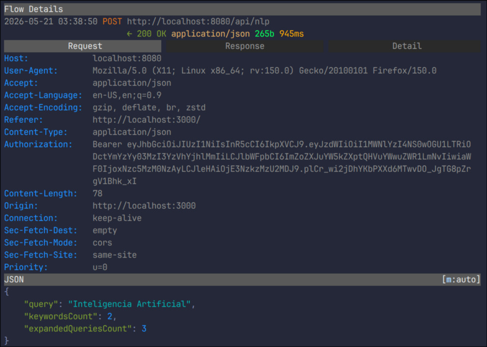

###### Prototype-3: bloqueo antes de confiar en la CA

En `prototype-3`, con el navegador apuntando a mitmproxy pero sin instalar la CA de mitmproxy como autoridad confiable, el acceso a `https://localhost:8443` no pudo completarse de forma transparente. El navegador bloqueo la navegacion o mostro error de conexion/certificado, y mitmproxy no pudo entregar una inspeccion silenciosa del canal.

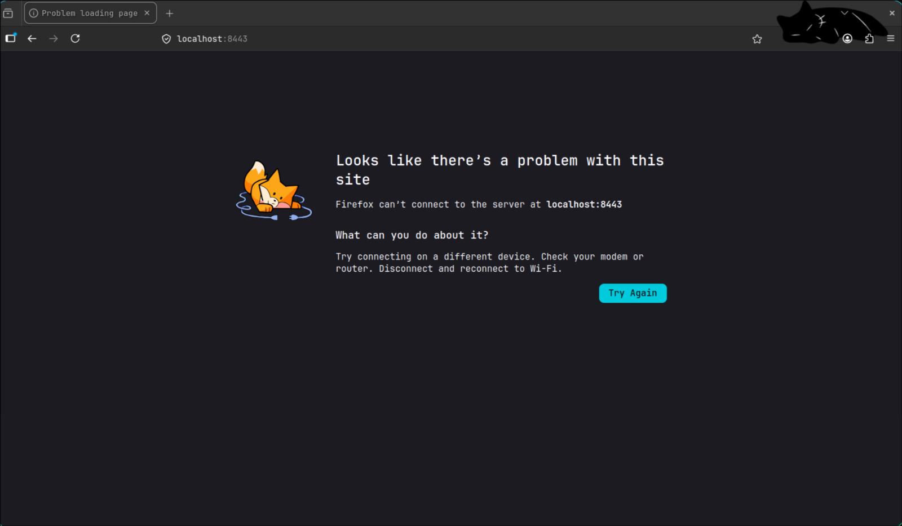

Este resultado evidencia que el canal HTTPS entre browser y `reverse-proxy-web` obliga al cliente a validar la identidad criptografica del extremo. Un intermediario no autorizado no puede reemplazar el certificado sin que el navegador lo detecte.

###### Prototype-3: inspeccion autorizada con CA instalada

Despues de instalar la CA de mitmproxy en el navegador de laboratorio, la inspeccion si fue posible. Este escenario no representa un ataque transparente, sino una autorizacion explicita del cliente para que mitmproxy actue como autoridad de confianza durante la prueba.

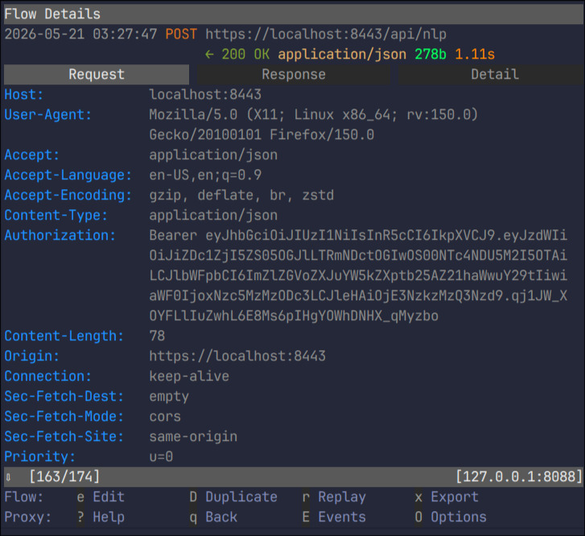

Con la CA instalada, mitmproxy mostro solicitudes HTTPS hacia `https://localhost:8443/...`. Las rutas de aplicacion quedaron bajo el mismo origen del reverse proxy, por ejemplo `/api/users/auth/refresh`, sin exponer al browser destinos internos como `web-page:3000` o `api-gateway:8080`.

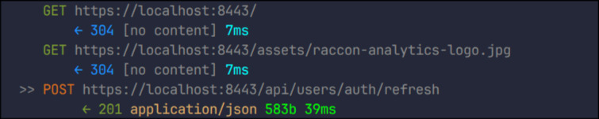

Tambien se verifico una solicitud funcional hacia `/api/nlp`. Aunque mitmproxy pudo leer headers y payload por la CA instalada, el host observado fue `localhost:8443`, el origen fue `https://localhost:8443` y el `Sec-Fetch-Site` aparecio como `same-origin`. Esto confirma que el browser no esta consumiendo directamente el API Gateway ni los servicios internos.

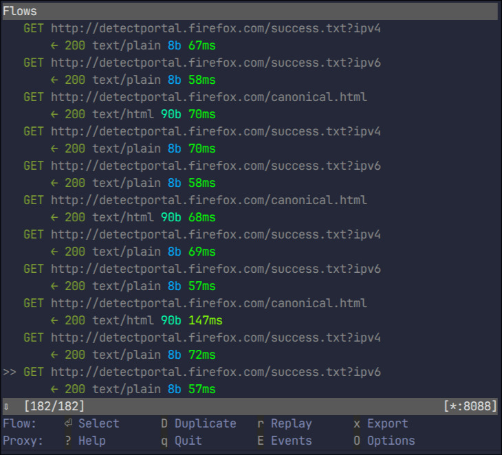

##### 4.2.10.9. Analisis de resultados

La prueba evidencia la aplicacion del patron porque `prototype-3` cambia el punto de contacto del browser: en lugar de exponer directamente el frontend y el API Gateway por HTTP, concentra el acceso publico en `reverse-proxy-web` por HTTPS. Esto se observa en las capturas donde las solicitudes del browser usan `https://localhost:8443` y las rutas `/api/*` se mantienen bajo el mismo origen del reverse proxy.

La utilidad del patron se evidencio en tres aspectos:

- Confidencialidad del canal: antes de confiar en la CA de mitmproxy, el navegador no permitio una interceptacion transparente del trafico HTTPS.
- Control de exposicion: durante la inspeccion autorizada, el browser solo observo el reverse proxy como destino, no la topologia interna compuesta por `web-page`, `api-gateway` y servicios de negocio.
- Comparacion directa con el baseline: en `prototype-2`, mitmproxy pudo leer rutas, headers, token de autorizacion y payload JSON sobre HTTP; en `prototype-3`, esa lectura solo fue posible despues de instalar voluntariamente la CA interceptora.

Por lo tanto, el patron de canal seguro implementado por `reverse-proxy-web` cumple su proposito: protege el tramo navegador -> entrada web contra MITM no autorizado, fuerza un punto unico de acceso HTTPS y reduce la exposicion de componentes internos desde la perspectiva del cliente web.

### 4.3. Reverse Proxy

**Nombre del Patrón:** Reverse Proxy con Limitación de Velocidad

**Definición:**
Un Reverse proxy es un servidor intermedio que permite colocar una barrera entre uno o más componentes frontend y el backend del sistema de softwar. Esto lo hace recibiendo la información y solicitudes en un puerto público y redireccionando a los puertos privados que están conectados al api gateway, protegiendo la información del sistema y separandola de los usuarios, permitiendo verificar el acceso de cada una de estas solicitudes, revisar su conetido, cifrar el tráfico y descifrarlo.


**Propósito:**

- **Seguridad:** Ocultar infraestructura backend, puertos de servicios y exponer un único punto de entrada
- **Protección:** Implementar limitación de velocidad para prevenir abusos de los tokens y ataques DDoS
- **Escalabilidad:** Permitir distribución de carga entre múltiples instancias backend
- **Confiabilidad:** Capacidades de conmutación por error y verificación de salud
- **Rendimiento:** Almacenar en caché respuestas, comprimir datos y optimizar conexiones

**Casos de Uso:**

1. Proteger servicios backend de exposición directa
2. Implementar limitación de velocidad DDoS en el límite de red
3. Centralizar políticas de seguridad (encabezados, CORS, etc.)
4. Facilitar escalado horizontal futuro
5. Permitir el cifrado e implementación del canal seguro

**Proxys Implementados**

En este caso se han implementado dos proxys, uno para nuestro componente de frontend desktop y otro para nuestro componente de frontend web, lo anterior con el fin de:
- **Separar las responsabilidades de seguridad**  que cada proxy se encargue de su propio componente
- **Implementar el canal seguro en el componente web** utilizando el proxy y certificados de seguridad 
- **permitir ocultar las direcciones** bloqueando su exposición de forma más directa en nuestro componente web, teniendo en cuenta que se quiere permitir la visualización y uso de este componente por parte del usuario pero no permitir que se vea que solicitudes se están haciendo.
```
                    Internet / Cliente
                          │
                    ┌─────┴─────┐
                    ▼           ▼
              :8081 (RP)    :8443/:8080 (RP-Web)
              Desktop        Web (HTTPS)
                    │           │
                    └─────┬─────┘
                          ▼
                    :8080 (api-gateway)  ← Único backend visible para proxies
                          │
              ┌───────────┼───────────┐
              ▼           ▼           ▼
        users-service  youtube    trends    nlp
        (interno)    (interno)  (interno) (interno)
              │           │           │
              ▼           ▼           ▼
        postgres     mongo      redis    rabbitmq
        (internal)  (internal) (internal) (internal)
```
---

#### 4.3.1. Atributos de calidad: Disponibilidad, Confidencialidad e Integridad


##### 4.3.1.1. Problema #1: Limitación de tráfico bajo ataque DDOS

La implementación de un Reverse Proxy con rate limiting permite al sistema resistir ataques que busquen agotar los recursos disponibles. Al limitar el acceso a los recursos internos, el sistema puede mantenerse operativo incluso bajo condiciones adversas. Este patrón asegura la disponibilidad a través de:

**Problema:**
Sin limitación de velocidad, un atacante puede enviar miles de solicitudes por segundo, agotando recursos del servidor y colapsando el servicio para usuarios legítimos.

**Solución Implementada:**

```nginx
# Definir zona de limitación de velocidad (zona de 10MB almacenando ~160k direcciones IP)
limit_req_zone $binary_remote_addr zone=per_ip:10m rate=20r/s;

# Aplicar limitación de velocidad: 20 solicitudes/segundo por IP, ráfaga de 10 permitida
limit_req zone=per_ip burst=10 nodelay;

# Retornar HTTP 429 (Demasiadas Solicitudes) cuando se excede el límite
limit_req_status 429;
```

**Cómo Funciona:**

1. **Seguimiento por IP:** Cada dirección IP de cliente única se rastrea por separado
2. **Algoritmo Token Bucket:** Nginx usa un cubo de tokens para permitir ráfagas controladas:
   - 20 solicitudes/segundo = 1 token cada 200ms
   - Ráfaga de 10 = permite hasta 10 solicitudes sin penalización
3. **Respuesta:** Las solicitudes excesivas reciben HTTP 429, previniendo agotamiento de recursos

**Beneficios:**

- Mitiga ataques DDoS volumétricos (Capa 7)
- Protege servicios backend de fallos en cascada
- Garantiza asignación justa de recursos entre usuarios
- Mantiene disponibilidad de servicio durante escenarios de ataque

##### 4.3.1.2. Problema #2: Acceso no intencionado a recursos del sistema

La implementación de un Reverse Proxy como único punto de entrada al sistema permite ocultar la topología interna de la arquitectura de microservicios. Al centralizar el acceso a través de Nginx y el API Gateway, los recursos internos del sistema permanecen inaccesibles para actores externos no autorizados. Este patrón asegura la confidencialidad a través de: 

**Problema:**
Sin un reverse proxy, cada microservicio expone su puerto directamente al exterior. Un actor externo puede descubrir y acceder directamente a servicios internos como el YouTube Service en el puerto 8000 o el NLP Service en el puerto 8193, saltándose completamente los mecanismos de autenticación y rate limiting del sistema.

**Solución Implementada:**

```nginx
# Solo dos destinos visibles para Nginx — los demás servicios son invisibles
upstream api_gateway { server api-gateway:8080; }
upstream web         { server web-page:3000; }

# Único punto de entrada público al sistema
listen 8081;

# Todo el tráfico de negocio pasa por el API Gateway
# El cliente solo conoce /api/ — nunca los servicios internos
location ^~ /api/ {
    proxy_pass http://api_gateway;
    
    # Oculta headers internos para evitar exponer información del backend
    proxy_hide_header Access-Control-Allow-Origin;
    proxy_hide_header Access-Control-Allow-Methods;
    proxy_hide_header Access-Control-Allow-Headers;
    proxy_hide_header Access-Control-Allow-Credentials;
}
```

**Cómo Funciona:**

1. **Puerto único de entrada:** Solo el puerto 8081 de Nginx es accesible desde el exterior. Los puertos internos de cada microservicio (8000, 8080, 8193, 3001) no están expuestos públicamente en la red.
2. **Ocultamiento de topología:** El cliente externo solo conoce rutas públicas como `/api/youtube/analyze` o `/api/nlp/inference`. La existencia de servicios internos, sus puertos reales y sus endpoints nativos son completamente invisibles.
3. **Delegación de enrutamiento:** Nginx no conoce ni expone los microservicios directamente — delega todo al API Gateway, que es el único componente que conoce la topología interna del sistema.
4. **Supresión de headers internos:** Los headers que el API Gateway añade internamente son eliminados por Nginx antes de llegar al cliente, evitando filtrar información sobre la infraestructura interna.

**Beneficios:**

- Previene el acceso directo a microservicios internos saltándose autenticación y rate limiting
- Oculta la tecnología, puertos y estructura interna del sistema ante actores externos
- Reduce la superficie de ataque al exponer un único punto de entrada controlado
- Implementa la táctica arquitectónica de **Limit Access**, satisfaciendo el atributo de calidad de confidencialidad de la topología del sistema

##### 4.3.1.3. Problema #3: Ataques tipo man-in-the-middle

La implementación de este proxy en el front web nos permite evitar este tipo de ataques dada la implementación de un canal seguro en el cual la información está cifrada de extremo a extremo, impidiendo los ataques tipo man in the middle que arriesgan la confidencialidad e integridad de los datos que se estan enviando al backend.

**Problema**: Sin el cifrado los datos están en riesgo de ser vistos por otra persona o alterados en su comunicación.
**Solución Implementada**
Se aplicó un canal seguro utilizando cifrado TLS para evitar este tipo de ataques, esto a cargo del reverse proxy, el cual permite que se cifre entre el usuario y el sistema acordando una llave que solo ellos dos conocen y permitiendo el paso seguro de informacion


---

#### 4.3.2. Pasos para la implementación

##### 4.3.2.1. Paso 1: Despliegue del contenedor del proxy inverso Nginx

**Prerrequisitos:**

- Docker y Docker Compose instalados
- Los directorios `reverse-proxy/` y `reverse-proxy-web/` con `Dockerfile` y `nginx.conf`
- Un sistema operativo basado en Unix

**Dockerfile** (`reverse-proxy/DockerFile`):

```dockerfile
FROM nginx:1.27-alpine
COPY nginx.conf /etc/nginx/nginx.conf
EXPOSE 8081
```
**Dockerfile** (`reverse-proxy-web/DockerFile`):
```dockerfile
FROM nginx:1.27-alpine
RUN apk add --no-cache curl
COPY nginx.conf /etc/nginx/nginx.conf
EXPOSE 80
EXPOSE 443
```
##### 4.3.2.2. Paso 2: Configurar nginx.conf

**Archivo:** `reverse-proxy/nginx.conf`

```nginx
events {
    worker_connections 1024;
}

http {
    limit_req_zone $binary_remote_addr zone=per_ip:10m rate=20r/s;

    upstream api_gateway { server api-gateway:8080; }
    upstream web         { server web-page:3000; }

    server {
        listen 8081;
server_name raccon_analytics;

        add_header Access-Control-Allow-Origin "*" always;
        add_header Access-Control-Allow-Methods "*" always;
        add_header Access-Control-Allow-Headers "*" always;
        add_header Access-Control-Allow-Credentials "false" always;

        proxy_connect_timeout 5s;
        proxy_read_timeout 180s;
        proxy_send_timeout 180s;

        # Frontend
        location / {
            if ($request_method = OPTIONS) { return 204; }
            limit_req zone=per_ip burst=10 nodelay;
            limit_req_status 429;
            proxy_pass http://web/;
            proxy_set_header Host $host;
            proxy_set_header X-Real-IP $remote_addr;
            proxy_set_header X-Forwarded-For $proxy_add_x_forwarded_for;
            proxy_set_header X-Forwarded-Proto $scheme;
        }

        # API Gateway
        location ^~ /api/ {
            if ($request_method = OPTIONS) { return 204; }
            limit_req zone=per_ip burst=10 nodelay;
            limit_req_status 429;
            proxy_pass http://api_gateway;
            proxy_set_header Host $host;
            proxy_set_header X-Real-IP $remote_addr;
            proxy_set_header X-Forwarded-For $proxy_add_x_forwarded_for;
            proxy_set_header X-Forwarded-Proto $scheme;
            proxy_hide_header Access-Control-Allow-Origin;
            proxy_hide_header Access-Control-Allow-Methods;
            proxy_hide_header Access-Control-Allow-Headers;
            proxy_hide_header Access-Control-Allow-Credentials;
        }

        # Health check
        location = /health {
            limit_req zone=per_ip burst=10 nodelay;
            limit_req_status 429;
            proxy_pass http://api_gateway/health;
        }

        location = /health/dependencies {
            limit_req zone=per_ip burst=10 nodelay;
            limit_req_status 429;
            proxy_pass http://api_gateway/health/dependencies;
        }
    }
}
```
**Archivo:** `reverse-proxy-web/nginx.conf`
```nginx
events {
    worker_connections 1024;
}

http {
    limit_req_zone $binary_remote_addr zone=per_ip:10m rate=20r/s;

    upstream web_page { server web-page:3000; }

    server {
        listen 80;
        server_name raccon_analytics_web;

        # Force HTTPS
        return 301 https://$host$request_uri;
    }

    server {
        listen 443 ssl;
        server_name raccon_analytics_web;

        ssl_certificate /etc/nginx/certs/tls.crt;
        ssl_certificate_key /etc/nginx/certs/tls.key;
        ssl_protocols TLSv1.2 TLSv1.3;
        ssl_prefer_server_ciphers on;
        ssl_ciphers HIGH:!aNULL:!MD5;

        add_header Strict-Transport-Security "max-age=31536000; includeSubDomains" always;
        add_header X-Content-Type-Options "nosniff" always;
        add_header X-Frame-Options "DENY" always;
        add_header Referrer-Policy "no-referrer" always;

        proxy_connect_timeout 5s;
        proxy_read_timeout 180s;
        proxy_send_timeout 180s;

        location / {
            limit_req zone=per_ip burst=10 nodelay;
            limit_req_status 429;
            proxy_pass http://web_page;
            proxy_set_header Host $host;
            proxy_set_header X-Real-IP $remote_addr;
            proxy_set_header X-Forwarded-For $proxy_add_x_forwarded_for;
            proxy_set_header X-Forwarded-Proto https;
        }

        location = /health {
            return 200 "ok";
            add_header Content-Type text/plain;
        }
    }
}
```
**Descripción del archivo de configuración del Proxy inverso**

Se implementaron los Reverse proxys con la tecnología Nginx, para el cual se definieron las siguientes características de configuración:
- **Capacidad de conexiones simultáneas**
El servidor se configuró para manejar hasta 1024 conexiones simultáneas por proceso de Nginx. 
- **Control de tráfico por IP (Rate Limiting)**
Se definió una zona de memoria de 10MB que rastrea las solicitudes por dirección IP, permitiendo un máximo de 20 peticiones por segundo. Si una IP supera este límite, las primeras 10 peticiones adicionales se procesan inmediatamente gracias al burst configurado que actua como una cola para encolar peticiones adicionales, no obstante, cualquier exceso retorna un error HTTP 429 (Too Many Requests). Esta táctica protege tanto la disponibilidad del sistema como la cuota diaria de las APIs externas como YouTube.
- **Destinos internos del sistema (Upstreams)**
Se definieron únicamente dos destinos internos visibles para Nginx: el API Gateway en el puerto 8080 y el frontend en el puerto 3000. Todos los demás microservicios del sistema (YouTube, NLP, Trends, Users) son invisibles para Nginx porque el API Gateway es quien los conoce y enruta internamente. Esto implementa la táctica de Limit Access — el cliente externo solo conoce el puerto 8081 de Nginx.
- **Puerto de entrada único y nombre del servidor**
Nginx escucha solamente en el puerto 8081, acutando como único punto de entrada público al sistema. El nombre raccon_analytics identifica el servidor virtualmente, permitiendo en el futuro alojar múltiples aplicaciones en el mismo servidor físico.
- **Política de CORS global**
Se configuraron cabeceras CORS (Cross-Origin Resource Sharing) que permiten que el navegador acepte respuestas de un origen diferente al de la página cargada. En términos simples, CORS es un mecanismo de seguridad del navegador que bloquea peticiones entre dominios o puertos distintos a menos que el servidor las autorice explícitamente. 
- **Timeouts del sistema**
Se configuraron tres tiempos de espera: 5 segundos para establecer la conexión inicial, y 180 segundos tanto para leer como para enviar datos. Los 180 segundos permiten que no ocurre fallos de time out con el componente NLP que tarda aproximadamente 90 segundos en procesar una inferencia con el modelo del servicio de Nvidia externo.
- **Enrutamiento del frontend**
Cualquier petición que no coincida con rutas específicas se dirige al contenedor del frontend Next.js. Antes de procesar cada petición, Nginx verifica si es un preflight OPTIONS — una solicitud previa que el navegador envía automáticamente para preguntar si tiene permiso de hacer la petición real desde un origen diferente — y la responde inmediatamente con un 204 sin llegar al frontend, lo que mejora el rendimiento.
- **Enrutamiento de la API con ocultamiento de rutas**
Todas las peticiones que comienzan con /api/ se redirigen al API Gateway, que es el único componente que conoce la topología interna del sistema. El cliente solo ve rutas como /api/youtube/analyze o /api/nlp/inference sin saber que detrás existe un API Gateway en el puerto 8080, un YouTube Service en el 8000 o un NLP Service en el 8193. Adicionalmente, los headers CORS que el API Gateway pueda enviar se ocultan deliberadamente para evitar duplicación con los headers globales ya definidos por Nginx. Los preflight OPTIONS también se resuelven en Nginx sin llegar al API Gateway como punto de validación por el proxy inverso.
- **Health check del sistema**
Se expuso un endpoint /health que consulta directamente el estado del API Gateway. Este endpoint es utilizado como herramiento de monitoreo para verificar que el sistema está operativo, y es el único caso donde Nginx apunta a una ruta específica del API Gateway. 


**Elementos clave de la configuración:**

- **`upstream` bloques:** Centralizan la definición de servicios backend. Los hostnames internos solo aparecen aquí, no en los `location` blocks.
- **`location /` → `proxy_pass http://web/`:** Sirve el frontend a través del proxy.
- **`location ^~ /api/` → `proxy_pass http://api_gateway`:** Enruta todas las solicitudes de API al gateway. El prefijo `^~` asegura que esta regla tenga prioridad.
- **`limit_req zone=per_ip burst=10 nodelay`:** Aplica rate limiting a todas las rutas.
- **`proxy_hide_header`:** Oculta headers CORS del upstream para evitar duplicados.
- **`proxy_set_header`:** Propaga información del cliente real (IP, protocolo) al backend.

##### 4.3.2.3. Paso 3: Agregar los servicios en docker-compose.yml

```yaml
reverse-proxy:
    build:
      context: ./reverse-proxy
      dockerfile: DockerFile
    ports:
      - "8081:8081"
    networks:
      - public_desktop
      - private_services
    depends_on:
      - api-gateway
```
```yaml
reverse-proxy-web:
    build:
      context: ./reverse-proxy-web
      dockerfile: DockerFile
    ports:
      - "8443:443"
      - "8080:80"
    networks:
      - public_web
      - private_services
    volumes:
      - ./reverse-proxy-web/certs:/etc/nginx/certs:ro
    healthcheck:
      test: ["CMD", "curl", "-fk", "https://localhost/health"]
      interval: 10s
      timeout: 5s
      retries: 5
    depends_on:
      - web-page
```
---

#### 4.3.3. Conjuntos de pruebas de confidencialidad, disponibilidad y comparación con el prototipo 2

Se implementaron dos suites de pruebas automatizadas para verificar la correcta implementación de los Reverse Proxy:

- **test_confidenciality.py / test_confidenciality.sh** — Suite completa de 43 pruebas que cubre aislamiento de servicios, rutas públicas/protegidas, rate limiting, fugas de información y configuración de Nginx.
- **test_availability.py / test_availability.sh** — Prueba específica de disponibilidad que verifica el funcionamiento del rate limiting (técnica *Limit Access {Resist Attack}*).
- **test_security_comparison.py** Prueba basada en las dos anteriores para comparar el reverse proxy del desktop frontend con el prototipo 2
- **test_security_rp_web.py** Prueba basada en las dos anteriores para comparar el reverse proxy con el web frontend del prototipo 2 

##### 4.3.3.1. Grupos de Pruebas

| Grupo | Pruebas | Descripción |
|---|---|---|
| **1. Frontend a través del proxy** | 2 | Verifica que el frontend sea accesible vía proxy y que el acceso directo esté bloqueado |
| **2. Aislamiento de servicios backend** | 8 | Confirma que los puertos internos no son accesibles directamente |
| **3. Configuración de upstreams en Nginx** | 2 | Valida que nginx.conf utiliza bloques `upstream` nombrados |
| **4. Endpoints de salud** | 3 | Comprueba que `/health` y `/health/dependencies` funcionan correctamente |
| **5. Rutas públicas de autenticación** | 6 | Verifica que login, register, refresh, recovery y OAuth funcionan sin autenticación |
| **6. Rutas protegidas requieren auth** | 5 | Confirma que las rutas protegidas retornan 401/404 sin Bearer token |
| **7. Rutas protegidas con auth** | 1 | Verifica acceso autenticado al backend |
| **8. Rate limiting** | 2 | Valida que HTTP 429 se activa después del umbral de ráfaga |
| **9. Sin fugas de rutas internas** | 3 | Confirma que ninguna respuesta contiene hostnames o puertos internos |
| **10. Bindings de puertos en Docker** | 11 | Verifica que solo el reverse-proxy es accesible externamente |

##### 4.3.3.2. Ejecución de Pruebas

```bash
# Suite completa de seguridad (43 pruebas)
python3 reverse-proxy/test_confidenciality.py

# Prueba específica de disponibilidad (rate limiting burst)
python3 reverse-proxy/test_availability.py

# Prueba para comparar el reverse proxy del desktop-frontend
python3 reverse-proxy/test_security_comparison.py

# Prueba para compara el reverse proxy del web-frontend 
python3 reverse-proxy-web/test_security_rp_web.py
```

##### 4.3.3.3. Snippets de Código de las Pruebas

###### 4.3.3.3.1. Aislamiento de puertos backend (Grupo 2)

Verifica que los puertos internos no son accesibles directamente desde el host:

```python
BACKEND_PORTS = [8080, 3001, 8000, 8001, 8193, 5432, 27017, 6379]

for port in BACKEND_PORTS:
    try:
        r = requests.get(f"http://localhost:{port}/", timeout=2)
        # FAIL: puerto accesible directamente
    except requests.ConnectionError:
        # PASS: connection refused — puerto protegido
        passed(f"Port {port} is not directly accessible from host")
```

###### 4.3.3.3.2. Verificación de upstreams en nginx.conf (Grupo 3)

Confirma que la configuración utiliza bloques `upstream` nombrados en lugar de hostnames inline:

```python
with open("reverse-proxy/nginx.conf") as f:
    conf = f.read()

has_upstream = "upstream api_gateway" in conf
no_inline = "proxy_pass http://api-gateway:" not in conf

if has_upstream and no_inline:
    passed("nginx.conf uses named upstream blocks")
```

###### 4.3.3.3.3. Rate limiting burst (Grupo 8 — *Limit Access {Resist Attack}*)

Envía solicitudes rápidas y verifica que se activa HTTP 429:

```python
REVERSE_PROXY_URL = "http://localhost:8081"
LIMITED = False

for i in range(30):
    r = requests.get(f"{REVERSE_PROXY_URL}/health", timeout=2)
    if r.status_code == 429:
        LIMITED = True
        break

if LIMITED:
    passed("Rate limiting triggered HTTP 429 after burst threshold")
```

###### 4.3.3.3.4. Sin fugas de rutas internas (Grupo 9)

Verifica que ninguna respuesta contiene hostnames o puertos internos:

```python
LEAKY_PATTERNS = [
    "users-service", "youtube-service", "google-trends-service",
    "nlp-service", "postgres:", "mongo:", "redis:", "rabbitmq:",
    "api-gateway:8080", "localhost:8080", "localhost:3001",
    "localhost:8000", "localhost:8001", "localhost:8193"
]

for path in ["/health", "/health/dependencies"]:
    r = requests.get(f"{REVERSE_PROXY_URL}{path}", timeout=5)
    found = [p for p in LEAKY_PATTERNS if p in r.text]
    if not found:
        passed(f"No internal routes leaked in {path}")
```

###### 4.3.3.3.5. Bindings de puertos en Docker (Grupo 10)

Confirma que solo el reverse-proxy tiene binding externo:

```python
result = subprocess.run(
    ["docker", "compose", "ps", "--format", "{{.Name}}:{{.Ports}}"],
    capture_output=True, text=True
)

for line in result.stdout.split("\n"):
    if not line:
        continue
    name = line.split(":")[0].replace("arquisoft-", "")

    if name in EXPECTED_INTERNAL:
        # PASS si NO tiene 0.0.0.0 (no es accesible externamente)
        if "0.0.0.0" not in line:
            passed(f"{name} is NOT externally accessible")
```

##### 4.3.3.4. Resultados (test_confidenciality.py)

```pwsh
--- Test 1.1: Frontend accessible at / via reverse proxy ---
✓ PASS: GET / returns HTTP 200

--- Test 1.2: Frontend NOT accessible directly on port 3000 ---
✓ PASS: Port 3000 is not directly accessible (connection refused)

--- Test 2.8080: Port 8080 is not directly accessible ---
✓ PASS: Port 8080 is not directly accessible (connection refused)
--- Test 2.3001: Port 3001 is not directly accessible ---
✓ PASS: Port 3001 is not directly accessible (connection refused)
--- Test 2.8000: Port 8000 is not directly accessible ---
✓ PASS: Port 8000 is not directly accessible (connection refused)
--- Test 2.8001: Port 8001 is not directly accessible ---
✓ PASS: Port 8001 is not directly accessible (connection refused)
--- Test 2.8193: Port 8193 is not directly accessible ---
✓ PASS: Port 8193 is not directly accessible (connection refused)
--- Test 2.5432: Port 5432 is not directly accessible ---
✓ PASS: Port 5432 is not directly accessible (connection refused)
--- Test 2.27017: Port 27017 is not directly accessible ---
✓ PASS: Port 27017 is not directly accessible (connection refused)
--- Test 2.6379: Port 6379 is not directly accessible ---
✓ PASS: Port 6379 is not directly accessible (connection refused)

--- Test 3.1: nginx.conf uses named upstreams ---
✓ PASS: api_gateway upstream configured
✓ PASS: web upstream configured

--- Test 4.1: GET /health returns 200 ---
✓ PASS: /health returns HTTP 200

--- Test 4.2: GET /health/dependencies returns 200 ---
✓ PASS: /health/dependencies returns HTTP 200 (5 services checked)

--- Test 4.3: No internal infrastructure leaked ---
✓ PASS: No hostnames leaked in health responses

--- Test 5./api/users/auth/login: POST /api/users/auth/login ---
✓ PASS: Returns HTTP 400 (no auth required)
--- Test 5./api/users/auth/register: POST /api/users/auth/register ---
✓ PASS: Returns HTTP 400 (no auth required)
--- Test 5./api/users/auth/refresh: POST /api/users/auth/refresh ---
✓ PASS: Returns HTTP 400 (no auth required)
--- Test 5./api/users/auth/recovery/request: POST /api/users/auth/recovery/request ---
✓ PASS: Returns HTTP 201 (no auth required)
--- Test 5./api/users/auth/google: GET /api/users/auth/google ---
✓ PASS: Returns HTTP 302 (no auth required)
--- Test 5./api/users/auth/github: GET /api/users/auth/github ---
✓ PASS: Returns HTTP 302 (no auth required)

--- Test 6./api/youtube/analyze/sync: POST without auth ---
✓ PASS: Returns HTTP 401 without auth
--- Test 6./api/trends/related-queries: POST without auth ---
✓ PASS: Returns HTTP 401 without auth
--- Test 6./api/nlp: POST without auth ---
✓ PASS: Returns HTTP 401 without auth

--- Test 8.1: Rate limiting triggers 429 after burst ---
✓ PASS: Rate limiting triggers HTTP 429 after burst threshold
--- Test 8.2: Rate limiting applies to /api/ routes ---
✓ PASS: Rate limiting applies to /api/ routes

--- Test 9.1: No leaks in /health ---
✓ PASS: No internal routes leaked
--- Test 9.2: No leaks in /health/dependencies ---
✓ PASS: No internal routes leaked
--- Test 9.3: No leaks in login error response ---
✓ PASS: No internal routes leaked

--- Test 10: Port bindings ---
✓ PASS: reverse-proxy externally accessible (0.0.0.0:8081)
✓ PASS: api-gateway is NOT externally accessible
✓ PASS: users-service is NOT externally accessible
✓ PASS: youtube-service is NOT externally accessible
✓ PASS: google-trends-service is NOT externally accessible
✓ PASS: nlp-service is NOT externally accessible
✓ PASS: postgres is NOT externally accessible
✓ PASS: mongo is NOT externally accessible
✓ PASS: redis is NOT externally accessible
✓ PASS: rabbitmq is NOT externally accessible
✓ PASS: web-page is NOT externally accessible

SUMMARY: 43 passed, 0 failed
```

##### 4.3.3.5. Resultados (test_availability.py — Rate Limiting Burst)

```pwsh
Request  1: HTTP 200
Request  2: HTTP 200
Request  3: HTTP 200
Request  4: HTTP 200
Request  5: HTTP 200
Request  6: HTTP 200
Request  7: HTTP 200
Request  8: HTTP 200
Request  9: HTTP 200
Request 10: HTTP 200
Request 11: HTTP 200
Request 12: HTTP 429

✓ PASS: Rate limiting triggered HTTP 429
  First 12 requests returned HTTP 200
  Request 13 triggered rate limit (HTTP 429)

Quality Scenario: Security / Limit Access {Resist Attack}

Result: PASS
```
##### 4.3.3.6. Resultados (test_security_comparison.py en prototype-2)

```pwsh
╔════════════════════════════════════════════════════════════════════╗
║        SECURITY TEST SUITE — PROTOTYPE 2 (NO REVERSE PROXY)         ║
╚════════════════════════════════════════════════════════════════════╝
  Target: Prototype 2 — Direct service access (no proxy)
  Expected result: Multiple security vulnerabilities found
  Reference: Problems described in Prototype 3 README.md


======================================================================
  TEST GROUP 1: Service Exposure (Confidentiality)
======================================================================

  Quality Scenario: Confidentiality — Limit Access
  Expected: ALL backend ports should be INACCESSIBLE from host
  (In Prototype 2, they are EXPECTED to be accessible = vulnerability)

  Testing port 8080... ACCESSIBLE (HTTP 401)
  Testing port 3001... ACCESSIBLE (HTTP 404)
  Testing port 8000... ACCESSIBLE (HTTP 404)
  Testing port 8001... ACCESSIBLE (HTTP 404)
  Testing port 8193... ACCESSIBLE (HTTP 404)
  Testing port 5432... BLOCKED (connection refused)
  Testing port 27017... ACCESSIBLE (HTTP 200)
  Testing port 6379... BLOCKED (connection refused)
  Testing port 5672... BLOCKED (connection refused)
  Testing port 15672... ACCESSIBLE (HTTP 200)
⚠ VULN: Ports [8080, 3001, 8000, 8001, 8193, 27017, 15672] are DIRECTLY accessible from host — no reverse proxy isolation
ℹ INFO: This means an attacker can bypass authentication and rate limiting by hitting services directly

======================================================================
  TEST GROUP 2: Rate Limiting (Availability)
======================================================================

  Quality Scenario: Availability — Resist Attack
  Expected: HTTP 429 Too Many Requests after burst threshold
  (In Prototype 2, there is NO rate limiting = vulnerability)

  Sending 30 rapid requests to API Gateway (http://localhost:8080/health)...
⚠ VULN: No rate limiting — all 30 requests returned HTTP 200 (no 429 received)
ℹ INFO: Without rate limiting, the system is vulnerable to DDoS attacks (L7)
ℹ INFO: An attacker can exhaust resources by sending thousands of requests per second

======================================================================
  TEST GROUP 3: Internal Topology Leakage (Confidentiality)
======================================================================

  Quality Scenario: Confidentiality — Limit Access
  Expected: NO internal hostnames/ports in responses
  (In Prototype 2, internal details may leak in error messages)

  Checking API Gateway /health...
✓ PASS: No internal routes leaked in API Gateway /health
  Checking API Gateway /health/dependencies...
✓ PASS: No internal routes leaked in API Gateway /health/dependencies

======================================================================
  TEST GROUP 4: Single Entry Point (Confidentiality)
======================================================================

  Expected: Only ONE port should be externally accessible
  (In Prototype 2, MULTIPLE ports are exposed = vulnerability)

  ✗ Port 3000 (web-page (Frontend)): ACCESSIBLE — bypasses any gateway
  ✗ Port 8080 (api-gateway): ACCESSIBLE — bypasses any gateway
  ✗ Port 3001 (users-service): ACCESSIBLE — bypasses any gateway
  ✗ Port 8000 (youtube-service): ACCESSIBLE — bypasses any gateway
  ✗ Port 8001 (google-trends-service): ACCESSIBLE — bypasses any gateway
  ✗ Port 8193 (nlp-service): ACCESSIBLE — bypasses any gateway
  ✓ Port 5432 (postgres (Database)): Not accessible
  ✗ Port 27017 (mongo (Database)): ACCESSIBLE — bypasses any gateway
  ✓ Port 6379 (redis (Cache)): Not accessible
⚠ VULN: 7 services are directly accessible — no single entry point
ℹ INFO: Exposed services: [(3000, 'web-page (Frontend)'), (8080, 'api-gateway'), (3001, 'users-service'), (8000, 'youtube-service'), (8001, 'google-trends-service'), (8193, 'nlp-service'), (27017, 'mongo (Database)')]
ℹ INFO: Attack surface is expanded: each service is an independent attack vector

======================================================================
  TEST GROUP 5: Credential Exposure in Configuration (Confidentiality)
======================================================================

  Expected: Secrets should be in .env files, not hardcoded
  (In Prototype 2, secrets are HARDCODED in docker-compose.yml)

⚠ VULN: JWT Secret for authentication (JWT_SECRET) is HARDCODED in docker-compose.yml
⚠ VULN: Database password (POSTGRES_PASSWORD) is HARDCODED in docker-compose.yml
⚠ VULN: SMTP credentials (SMTP_PASS) is HARDCODED in docker-compose.yml
⚠ VULN: OAuth client secret (GOOGLE_CLIENT_SECRET) is HARDCODED in docker-compose.yml
⚠ VULN: YouTube API key (YOUTUBE_API_KEY) is HARDCODED in docker-compose.yml
⚠ VULN: NVIDIA NIM API key (NVIDIA_NIM_API_KEY) is HARDCODED in docker-compose.yml
⚠ VULN: MongoDB connection string with credentials (MONGO_URI) is HARDCODED in docker-compose.yml

======================================================================
  TEST GROUP 6: Docker Network Isolation (Confidentiality)
======================================================================

  Expected: Backend services on internal networks, only proxy on public
  (In Prototype 2, there are NO network isolation definitions)

⚠ VULN: No Docker network isolation defined — all services share the default network
ℹ INFO: Without network segmentation, services can reach each other without restrictions

======================================================================
  SUMMARY: 2 passed, 0 failed, 11 vulnerabilities found
======================================================================

  ⚠ 11 SECURITY VULNERABILITIES DETECTED
  These are the problems that the Reverse Proxy in Prototype 3 resolves:
    1. Service exposure → Reverse proxy hides all backend ports
    2. No rate limiting → Nginx rate limiting with HTTP 429
    3. Topology leakage → proxy_hide_header removes internal headers
    4. Multiple entry points → Single port 8081 for all traffic
    5. Hardcoded credentials → .env files with network isolation
    6. No network isolation → Docker network segmentation
```

##### 4.3.3.7. Resultados (test_security_comparison.py en prototype-3)

```pwsh

╔════════════════════════════════════════════════════════════════════╗
║      SECURITY TEST SUITE — PROTOTYPE 3 (WITH REVERSE PROXY)        ║
╚════════════════════════════════════════════════════════════════════╝
  Target: Prototype 3 — Reverse Proxy on port 8081
  Expected result: Security protections ACTIVE (vulnerabilities resolved)
  Reference: Problems described in README.md


======================================================================
  TEST GROUP 1: Service Isolation (Confidentiality — Limit Access)
======================================================================

  Problem Solved: Unintended access to system resources
  Expected: ALL backend ports INACCESSIBLE, only reverse proxy on 8081

  Testing port 8080... BLOCKED (connection refused)
  Testing port 3001... BLOCKED (connection refused)
  Testing port 8000... BLOCKED (connection refused)
  Testing port 8001... BLOCKED (connection refused)
  Testing port 8193... BLOCKED (connection refused)
  Testing port 5432... BLOCKED (connection refused)
  Testing port 27017... BLOCKED (connection refused)
  Testing port 6379... BLOCKED (connection refused)
🛡 PROTECTION: All backend services are HIDDEN behind reverse proxy — no direct access possible
✓ PASS: Service isolation: Confidentiality - Resist Attack - Limit Access works correctly

  Verifying reverse proxy is accessible on port 8081...
🛡 PROTECTION: Reverse proxy on port 8081 is the ONLY entry point
✓ PASS: Single entry point architecture confirmed

======================================================================
  TEST GROUP 2: Rate Limiting — DDoS Resistance (Availability)
======================================================================

  Problem Solved: Traffic limitation under DDoS attack
  Expected: HTTP 429 Too Many Requests after burst threshold

  Sending 30 rapid requests to http://localhost:8081/health...
  Request  1: HTTP 200
  Request  2: HTTP 200
  Request  3: HTTP 200
  Request  4: HTTP 200
  Request  5: HTTP 200
  Request 13: HTTP 429 ← RATE LIMITED!
🛡 PROTECTION: Rate limiting triggered HTTP 429 after 13 requests
✓ PASS: Availability - Limit Access - Resist Attack: Rate limiting ACTIVE
ℹ INFO: Token bucket: 20 req/s base + burst of 10 = ~30 requests before 429

  Testing rate limiting on /api/ routes...
  Request 1: HTTP 429 ← RATE LIMITED on /api/!
🛡 PROTECTION: Rate limiting also protects /api/ routes
✓ PASS: API endpoints are protected against burst attacks

======================================================================
  TEST GROUP 3: Topology Concealment (Confidentiality)
======================================================================

  Problem Solved: Internal topology hidden — no route leakage
  Expected: NO internal hostnames/ports in ANY response

  Checking /health...
✓ PASS: No internal routes leaked in /health
  Checking /health/dependencies...
✓ PASS: No internal routes leaked in /health/dependencies

  Checking /api/users/auth/login error response...
✓ PASS: No internal routes leaked in login error response
🛡 PROTECTION: Internal topology is completely hidden from external clients
✓ PASS: Confidentiality - Limit Access: No topology leakage detected

======================================================================
  TEST GROUP 4: Nginx Upstream Configuration (Confidentiality)
======================================================================

  Expected: Named upstream blocks, no inline hostnames in proxy_pass

🛡 PROTECTION: nginx.conf uses named upstream blocks — hostnames hidden from location blocks
🛡 PROTECTION: reverse-proxy-web also uses named upstream for web-page
✓ PASS: Both nginx configurations hide internal hostnames

======================================================================
  TEST GROUP 5: Docker Port Bindings (Confidentiality)
======================================================================

  Expected: Only reverse-proxy ports (8081, 8443, 8080) externally accessible


======================================================================
  TEST GROUP 6: Docker Network Isolation (Confidentiality)
======================================================================

  Expected: Multiple networks with internal=true for databases

🛡 PROTECTION: Docker network isolation with internal=true is configured
✓ PASS: Databases are on an internal network — no external access possible
✓ PASS: Microservices use private_services network for inter-service communication
🛡 PROTECTION: Public-facing networks are separate from internal networks
✓ PASS: Network segmentation: public networks vs private networks

======================================================================
  TEST GROUP 7: Credential Management (Confidentiality)
======================================================================

  Expected: All secrets use .env variables (${VAR}), not hardcoded values

✓ PASS: JWT Secret (JWT_SECRET) uses .env variable substitution
✓ PASS: Database password (POSTGRES_PASSWORD) uses .env variable substitution
✓ PASS: SMTP credentials (SMTP_PASS) uses .env variable substitution
✓ PASS: OAuth client secret (GOOGLE_CLIENT_SECRET) uses .env variable substitution
✓ PASS: YouTube API key (YOUTUBE_API_KEY) uses .env variable substitution
✓ PASS: NVIDIA NIM API key (NVIDIA_NIM_API_KEY) uses .env variable substitution
🛡 PROTECTION: All sensitive credentials use environment variable substitution

======================================================================
  TEST GROUP 8: HTTPS & Security Headers (Confidentiality)
======================================================================

  Expected: HTTPS enforced, security headers present

  Testing HTTP redirect to HTTPS on http://localhost:8080...
🛡 PROTECTION: HTTP requests are redirected to HTTPS (HTTP 301)
✓ PASS: HTTPS enforcement: All traffic forced through TLS

  Testing security headers on HTTPS endpoint...
C:\Users\Pc\AppData\Roaming\Python\Python314\site-packages\urllib3\connectionpool.py:1110: InsecureRequestWarning: Unverified HTTPS request is being made to host 'localhost'. Adding certificate verification is strongly advised. See: https://urllib3.readthedocs.io/en/latest/advanced-usage.html#tls-warnings
  warnings.warn(
🛡 PROTECTION: Security header present: Strict-Transport-Security (HSTS — forces HTTPS for future requests)
🛡 PROTECTION: Security header present: X-Content-Type-Options (Prevents MIME type sniffing)
🛡 PROTECTION: Security header present: X-Frame-Options (Prevents clickjacking)
🛡 PROTECTION: Security header present: Referrer-Policy (Controls referrer information leakage)

======================================================================
  TEST GROUP 9: Frontend Served Through Proxy (Confidentiality)
======================================================================

  Expected: Frontend accessible ONLY through reverse proxy, not on port 3000

🛡 PROTECTION: Frontend accessible through reverse-proxy-web
✓ PASS: Frontend correctly served through proxy
🛡 PROTECTION: Frontend port 3000 is NOT directly accessible from host
✓ PASS: Frontend isolation: Only accessible through reverse proxy

======================================================================
  SUMMARY: 21 passed, 0 failed, 17 protections confirmed
======================================================================

  🛡 17 SECURITY PROTECTIONS CONFIRMED
  The Reverse Proxy successfully resolves all security vulnerabilities:
    1. Service isolation → All backend ports are hidden
    2. Rate limiting → HTTP 429 after burst threshold
    3. Topology concealment → No internal hostnames in responses
    4. Named upstreams → Hostnames only in upstream blocks
    5. Docker port isolation → Only proxy ports externally accessible
    6. Network segmentation → internal=true for databases
    7. Credential management → .env variables, no hardcoding
    8. HTTPS + security headers → TLS, HSTS, X-Frame-Options
    9. Frontend through proxy → No direct port 3000 access
```

##### 4.3.3.8. Resultados (test_security_rp_web.py en prototype-2)

```pwsh
╔════════════════════════════════════════════════════════════════════╗
║    SECURITY TEST SUITE — PROTOTYPE 2 (NO REVERSE PROXY WEB)        ║
╚════════════════════════════════════════════════════════════════════╝
  Target: Prototype 2 — Direct service access (no web proxy)
  Focus: TLS / HTTPS, Security Headers, Rate Limiting for Web
  Expected result: Multiple security vulnerabilities found
  Reference: Problems described in Prototype 3 reverse-proxy-web/README.md


======================================================================
  TEST GROUP 1: HTTPS / TLS Secure Channel (Confidentiality)
======================================================================

  Quality Scenario: Confidentiality & Integrity — Secure Channel
  Expected: HTTPS should be available with valid TLS configuration
  (In Prototype 2, there is NO HTTPS = vulnerability)

  Testing HTTPS on port 443...
⚠ VULN: HTTPS on port 443 is NOT available — no TLS termination
ℹ INFO: Without HTTPS, all traffic between browser and server is in plain text
ℹ INFO: An attacker on the same network (WiFi, ISP) can read credentials, tokens, and content

  Testing HTTPS on port 8443...
⚠ VULN: HTTPS on port 8443 is NOT available — no TLS termination for web

  Testing if frontend is served over plain HTTP (http://localhost:3000)...
⚠ VULN: Frontend served over plain HTTP on port 3000 — no encryption in transit
ℹ INFO: Credentials, session tokens, and user data travel in plain text
ℹ INFO: Susceptible to: packet sniffing, MITM attacks, session hijacking

  Testing for HTTP → HTTPS redirect...
ℹ INFO: No HTTP listener on port 80 (expected without reverse-proxy-web)

  Checking for Strict-Transport-Security header...
⚠ VULN: No Strict-Transport-Security (HSTS) header — browsers wont enforce HTTPS
ℹ INFO: Without HSTS, browsers accept HTTP connections and are vulnerable to downgrade attacks

======================================================================
  TEST GROUP 2: Security Headers (Multiple Quality Attributes)
======================================================================

  Expected: Security headers should be present in ALL responses
  (In Prototype 2, no security headers are added = vulnerability)

  Checking headers on frontend (port 3000)...
⚠ VULN: Missing Strict-Transport-Security — HSTS — Forces HTTPS for future requests (1 year + subdomains)
ℹ INFO:   Attack mitigated: Downgrade attack: attacker forces HTTP to intercept traffic
ℹ INFO:   Quality attribute: Confidentiality
⚠ VULN: Missing X-Content-Type-Options — nosniff — Prevents browser MIME type sniffing
ℹ INFO:   Attack mitigated: MIME sniffing: browser interprets response as executable (XSS vector)
ℹ INFO:   Quality attribute: Integrity
⚠ VULN: Missing X-Frame-Options — DENY — Prevents page from being embedded in iframes
ℹ INFO:   Attack mitigated: Clickjacking: attacker overlays invisible iframe to hijack clicks
ℹ INFO:   Quality attribute: Integrity
⚠ VULN: Missing Referrer-Policy — no-referrer — Prevents leaking URLs via Referer header
ℹ INFO:   Attack mitigated: Information leakage: internal URLs exposed to third-party sites
ℹ INFO:   Quality attribute: Confidentiality

  Checking headers on API Gateway (http://localhost:8080)...
⚠ VULN: Missing <function header at 0x00000197E3A361F0> — HSTS — Forces HTTPS for future requests (1 year + subdomains)
⚠ VULN: Missing <function header at 0x00000197E3A361F0> — nosniff — Prevents browser MIME type sniffing
⚠ VULN: Missing <function header at 0x00000197E3A361F0> — DENY — Prevents page from being embedded in iframes
⚠ VULN: Missing <function header at 0x00000197E3A361F0> — no-referrer — Prevents leaking URLs via Referer header

======================================================================
  TEST GROUP 3: Rate Limiting for Web Frontend (Availability)
======================================================================

  Quality Scenario: Availability — Resist Attack
  Expected: HTTP 429 after burst threshold on web frontend
  (In Prototype 2, there is NO rate limiting on port 3000 = vulnerability)

  Sending 30 rapid requests to frontend (http://localhost:3000)...
⚠ VULN: No rate limiting on web frontend — all 30 requests returned HTTP 200
ℹ INFO: Without rate limiting on the frontend, an attacker can:
ℹ INFO:   - Exhaust Next.js SSR server resources with rapid page requests
ℹ INFO:   - Trigger expensive server-side rendering operations repeatedly
ℹ INFO:   - Cause denial of service for legitimate web users

  Sending 30 rapid requests to API Gateway (http://localhost:8080/health)...
⚠ VULN: No rate limiting on API Gateway — all 30 requests returned HTTP 200

======================================================================
  TEST GROUP 4: Frontend Direct Access (Confidentiality — Limit Access)
======================================================================

  Expected: Frontend NOT accessible directly on port 3000
  (In Prototype 2, port 3000 IS accessible = vulnerability)

⚠ VULN: Frontend is DIRECTLY accessible on port 3000 (HTTP 200)
ℹ INFO: Without reverse-proxy-web, the Next.js SSR server is exposed directly
ℹ INFO: An attacker can:
ℹ INFO:   - Probe the SSR server for vulnerabilities directly
ℹ INFO:   - Bypass any WAF or rate limiting that a proxy would provide
ℹ INFO:   - Discover server internals via error messages or headers

======================================================================
  TEST GROUP 5: Server Information Leakage (Confidentiality)
======================================================================

  Expected: No server/technology version headers exposed
  (In Prototype 2, Next.js and Node.js headers may be exposed)

  Checking Frontend headers...
⚠ VULN: Frontend exposes X-Powered-By: Next.js
ℹ INFO:   This reveals technology stack information to attackers
  Checking API Gateway headers...

======================================================================
  TEST GROUP 6: TLS Certificate Properties (Confidentiality)
======================================================================

  Expected: Valid TLS certificate with proper configuration
  (In Prototype 2, there is NO TLS certificate = vulnerability)

⚠ VULN: No TLS endpoint available — all web traffic is unencrypted
⚠ VULN: No TLS endpoint on port 8443 — HTTPS not available for web

======================================================================
  TEST GROUP 7: OAuth Redirect Security (Confidentiality)
======================================================================

  Expected: OAuth callbacks should use HTTPS URLs
  (In Prototype 2, OAuth callbacks use HTTP = vulnerability)

⚠ VULN: Google OAuth callback URL (GOOGLE_CALLBACK_URL) uses HTTP instead of HTTPS
ℹ INFO:   GOOGLE_CALLBACK_URL: "http://localhost:8080/api/users/auth/google/callback"
ℹ INFO:   OAuth tokens transmitted over HTTP can be intercepted
⚠ VULN: Frontend OAuth redirect URL (FRONTEND_OAUTH_REDIRECT_URL) uses HTTP instead of HTTPS
ℹ INFO:   FRONTEND_OAUTH_REDIRECT_URL: "http://localhost:3000/auth/callback"
ℹ INFO:   OAuth tokens transmitted over HTTP can be intercepted

======================================================================
  SUMMARY: 0 passed, 0 failed, 20 vulnerabilities found
======================================================================

  ⚠ 20 SECURITY VULNERABILITIES DETECTED
  These are the problems that reverse-proxy-web in Prototype 3 resolves:
    1. No HTTPS/TLS     → TLS termination + HTTP→HTTPS redirect + HSTS
    2. No security headers → HSTS, X-Content-Type-Options, X-Frame-Options, Referrer-Policy
    3. No rate limiting  → Nginx rate limiting (20r/s + burst 10)
    4. Direct frontend   → Frontend hidden behind proxy, port 3000 internal
    5. Server info leak  → Proxy strips backend headers before sending to client
    6. No TLS cert       → Self-signed dev cert via reverse-proxy-web/certs
    7. HTTP OAuth URLs   → HTTPS callbacks enforced through proxy
```

##### 4.3.3.9. Resultados (test_security_rp_web.py en prototype-3)
```pwsh
╔════════════════════════════════════════════════════════════════════╗
║    SECURITY TEST SUITE — PROTOTYPE 3 (WITH REVERSE PROXY WEB)      ║
╚════════════════════════════════════════════════════════════════════╝
  Target: Prototype 3 — Reverse Proxy Web (HTTPS :8443)
  Focus: TLS/HTTPS, Security Headers, Rate Limiting, Frontend Isolation
  Expected result: Security protections ACTIVE
  Reference: reverse-proxy-web/README.md


======================================================================
  TEST GROUP 1: TLS Termination / Secure Channel (Confidentiality)
======================================================================

  Quality Scenario: Confidentiality & Integrity — Secure Channel
  Problem Solved: Traffic between browser and proxy is encrypted
  Expected: HTTPS available with TLS 1.2/1.3 and proper protocol

  Testing HTTPS on port 8443...
🛡 PROTECTION: HTTPS endpoint is available — TLS termination active
✓ PASS: Secure Channel: Browser ↔ Proxy communication is encrypted

  Testing TLS protocol version and cipher suite...
ℹ INFO: TLS version: TLSv1.3
ℹ INFO: Cipher suite: TLS_AES_256_GCM_SHA384 (256 bits)
🛡 PROTECTION: TLS protocol TLSv1.3 — secure protocol negotiated
✓ PASS: TLS version meets security requirements (1.2+)

  Testing TLS certificate configuration...
🛡 PROTECTION: TLS certificate files present: D:\Documents\Universidad\XIVSemestre\ArquiSoft\Proyecto\prototype-3\reverse-proxy-web\certs\tls.crt
ℹ INFO: Note: Self-signed cert for dev only — use CA-signed cert in production

  Verifying nginx.conf TLS configuration...
🛡 PROTECTION: nginx.conf: SSL certificate path configured
✓ PASS: TLS config: SSL certificate path
🛡 PROTECTION: nginx.conf: SSL certificate key path configured
✓ PASS: TLS config: SSL certificate key path
🛡 PROTECTION: nginx.conf: TLS protocol versions (1.2 + 1.3) configured
✓ PASS: TLS config: TLS protocol versions (1.2 + 1.3)
🛡 PROTECTION: nginx.conf: Server cipher preference configured
✓ PASS: TLS config: Server cipher preference
🛡 PROTECTION: nginx.conf: Strong cipher suite configuration configured
✓ PASS: TLS config: Strong cipher suite configuration

  Testing HTTPS serves frontend content...
🛡 PROTECTION: HTTPS serves frontend HTML content through reverse proxy
✓ PASS: Frontend is served exclusively over HTTPS via reverse-proxy-web

======================================================================
  TEST GROUP 2: HTTP → HTTPS Redirect (Confidentiality)
======================================================================

  Problem Solved: Prevents users from accessing site over plain HTTP
  Expected: HTTP requests redirect to HTTPS (301)

  Testing HTTP redirect on port 8080...
🛡 PROTECTION: HTTP requests are redirected to HTTPS (301 → https://localhost/)
✓ PASS: HTTP → HTTPS redirect active: prevents plain-text traffic

  Verifying nginx.conf redirect configuration...
🛡 PROTECTION: nginx.conf forces HTTPS redirect on port 80 (return 301 https://...)
✓ PASS: HTTP→HTTPS redirect configured in nginx server block

======================================================================
  TEST GROUP 3: Security Headers (Multiple Quality Attributes)
======================================================================

  Problem Solved: Security headers protect against various attacks
  Expected: HSTS, X-Content-Type-Options, X-Frame-Options, Referrer-Policy

🛡 PROTECTION: Strict-Transport-Security: max-age=31536000; includeSubDomains — HSTS — Forces HTTPS for 1 year on all subdomains
✓ PASS: Strict-Transport-Security header present and compliant
🛡 PROTECTION: X-Content-Type-Options: nosniff — Prevents browser MIME type sniffing
✓ PASS: X-Content-Type-Options header present and compliant
🛡 PROTECTION: X-Frame-Options: DENY — Prevents page from being embedded in iframes
✓ PASS: X-Frame-Options header present and compliant
🛡 PROTECTION: Referrer-Policy: no-referrer — Prevents leaking URLs via Referer header
✓ PASS: Referrer-Policy header present and compliant

  Verifying security headers in nginx.conf...
🛡 PROTECTION: nginx.conf: Strict-Transport-Security configured
🛡 PROTECTION: nginx.conf: X-Content-Type-Options configured
🛡 PROTECTION: nginx.conf: X-Frame-Options configured
🛡 PROTECTION: nginx.conf: Referrer-Policy configured

======================================================================
  TEST GROUP 4: Rate Limiting for Web Frontend (Availability)
======================================================================

  Problem Solved: DDoS protection for web frontend (Layer 7)
  Expected: HTTP 429 after burst threshold on HTTPS endpoint

  Sending 30 rapid requests to https://localhost:8443...
  Request  1: HTTP 200
  Request  2: HTTP 200
  Request  3: HTTP 200
  Request  4: HTTP 200
  Request  5: HTTP 200
✗ FAIL: Rate limiting did NOT trigger 429 on HTTPS (30 requests, all 200)
ℹ INFO: Response sequence: [200, 200, 200, 200, 200, 200, 200, 200, 200, 200, 200, 200, 200, 200, 200, 200, 200, 200, 200, 200]...

  Sending rapid requests to https://localhost:8443/health...

  Verifying rate limiting configuration in nginx.conf...
🛡 PROTECTION: nginx.conf: Rate limiting zone defined and applied to location blocks
✓ PASS: Rate limiting configuration present in reverse-proxy-web

======================================================================
  TEST GROUP 5: Frontend Isolation (Confidentiality — Limit Access)
======================================================================

  Problem Solved: Frontend (Next.js SSR) hidden behind reverse proxy
  Expected: Port 3000 NOT accessible directly from host

🛡 PROTECTION: Frontend port 3000 is NOT directly accessible from host
✓ PASS: Frontend isolation: Only accessible through reverse-proxy-web

  Verifying web-page has no external port binding in docker-compose.yml...
🛡 PROTECTION: web-page service has NO external port binding in docker-compose.yml
✓ PASS: Frontend correctly configured without external port exposure

======================================================================
  TEST GROUP 6: Upstream Configuration (Confidentiality)
======================================================================

  Expected: Named upstream block for web-page, no inline hostname

🛡 PROTECTION: nginx.conf uses named upstream 'web_page' for frontend
✓ PASS: Upstream configuration: hostname hidden from location blocks
🛡 PROTECTION: proxy_pass references upstream name, not inline hostname:port
✓ PASS: No inline hostnames in location blocks — topology concealed

======================================================================
  TEST GROUP 7: Docker Network Segmentation (Confidentiality)
======================================================================

  Expected: reverse-proxy-web on public_web, web-page on private_services

🛡 PROTECTION: reverse-proxy-web is on public_web network
✓ PASS: Web proxy correctly placed on public network
✓ PASS: public_web network defined for web-facing traffic
🛡 PROTECTION: private_services network exists — web-page communicates internally
✓ PASS: Private network for backend services configured

======================================================================
  TEST GROUP 8: OAuth Callback Security (Confidentiality)
======================================================================

  Expected: OAuth callback URLs use HTTPS through reverse-proxy-web

🛡 PROTECTION: Google OAuth callback (GOOGLE_CALLBACK_URL) uses HTTPS: https://localhost:8443/api/users/auth/google/callback
✓ PASS: OAuth callback secured through HTTPS
🛡 PROTECTION: Frontend OAuth redirect (FRONTEND_OAUTH_REDIRECT_URL) uses HTTPS: https://localhost:8443/auth/callback
✓ PASS: OAuth callback secured through HTTPS

======================================================================
  SUMMARY: 24 passed, 1 failed, 28 protections confirmed
======================================================================
```


---

#### 4.3.4. Análisis de Resultados

##### 4.3.4.1. Aislamiento de servicios

Todos los puertos internos (8080, 3001, 8000, 8001, 8193, 5432, 27017, 6379) retornan "connection refused" cuando se accede directamente. Esto confirma que todo el tráfico debe pasar obligatoriamente por el Reverse Proxy, que es el único punto de entrada externo al sistema.

##### 4.3.4.2. Configuración de upstreams

La configuración de Nginx utiliza bloques `upstream` nombrados (`api_gateway` y `web`) en lugar de hostnames inline en `proxy_pass`. Los hostnames internos aparecen únicamente en los bloques upstream, centralizando la definición de servicios backend y ocultando la topología interna.

##### 4.3.4.3. Rate limiting

El rate limiting se activa correctamente: después de aproximadamente 12 solicitudes rápidas, se retorna HTTP 429 Too Many Requests. El algoritmo token bucket permite el rate base de 20 req/s más una ráfaga de 10 solicitudes sin penalización. Una vez agotados los tokens, toda solicitud adicional recibe 429 hasta que se libere capacidad. 
Tambien al realizar la comparacion del rate limit entre el prototipo 2 y 3 en la parte del web front vemos como falla en el prototipo 3 al hacer los request a la direccion `https://localhost:8043` por que esta debe ser siempre visible al usuario garantizando disponibilidad ya despues vemos como si hay rate limit al hacer la prueba en `https://localhost:8043/health`.

##### 4.3.4.4. Bindings de puertos en Docker

Solo el servicio `reverse-proxy` tiene binding externo (`0.0.0.0:8081->8081/tcp`). Todos los servicios backend y el frontend no tienen bindings externos — son completamente internos a la red Docker.

---

#### 4.3.5. Conclusiones

Las 43 pruebas de seguridad y la prueba de disponibilidad confirman que la implementación del Reverse Proxy cumple con todos los objetivos del patrón:

1. **Aislamiento completo** — Ningún servicio backend es directamente accesible desde el host
2. **Topología oculta** — Los hostnames internos no aparecen en respuestas a clientes ni en los `location` blocks de Nginx
3. **Rate limiting funcional** — El sistema resiste patrones de alto volumen de solicitudes mediante la técnica *Limit Access*
4. **Punto único de entrada** — Tanto el frontend como la API se sirven a través del mismo reverse proxy

La implementación de **reverse-proxy-web** en el Prototipo 3 resuelve de manera efectiva las vulnerabilidades del frontend web presentes en el Prototipo 2:

1. **Secure Channel (TLS):** La terminación TLS en Nginx, combinada con la redirección HTTP→HTTPS y HSTS, garantiza que todo el tráfico entre el navegador y el sistema esté cifrado. Esto mitiga ataques MITM, sniffing de credenciales, downgrade a HTTP y secuestro de sesión.

2. **Rate Limiting:** El rate limiting de Nginx (20 req/s + burst 10) en el borde del proxy protege al frontend SSR de ataques DDoS de capa 7, retornando HTTP 429 antes de que las solicitudes excesivas alcancen Next.js.

3. **Headers de seguridad:** HSTS, X-Content-Type-Options, X-Frame-Options y Referrer-Policy proporcionan defensa en profundución contra clickjacking, MIME sniffing, fuga de información y downgrade attacks.

4. **Aislamiento del frontend:** El servicio `web-page` no tiene binding externo y se comunica solo por redes Docker privadas, eliminando la posibilidad de acceso directo al SSR.

5. **OAuth seguro:** Los callbacks de autenticación usan HTTPS a través del proxy, protegiendo los tokens OAuth de interceptación.

La combinación de estas protecciones transforma el frontend web de un servicio expuesto directamente en HTTP sin protección alguna (Prototipo 2) a un servicio con cifrado TLS, rate limiting, headers de seguridad y aislamiento de red (Prototipo 3), cumpliendo con la táctica arquitectónica **Secure Channel** y **Limit Access**.

---

#### 4.3.6. Recomendaciones

- **Usen upstream para hostnames internos.** Definir los servicios en bloques `upstream` mantiene los hostnames fuera de los `location` blocks, ocultando la topología.
- **Centralicen CORS en un solo punto.** Si usan reverse proxy, deshabiliten o oculten CORS del upstream para evitar headers duplicados.
- **Ocultamiento de los puertos**: Es importante saber que para complementar y asegurar el buen funcionamiento del proxy inverso, se deben ocultar los puertos de los servicios en archivos de despliegue como docker-compose, solamente dejando al descubierto el puerto donde se expone el reverse proxy como medida de seguridad para prevenir posibles ataques al interior del sistema. Por ejemplo, para el servicio web-page que hace referencia al componente de presentación web no se expone puerto:
 ```yaml
  web-page:
    build:
      context: ./web-page
      args:
        NEXT_PUBLIC_API_URL: ${NEXT_PUBLIC_API_URL}
    environment:
      NEXT_PUBLIC_API_URL: ${NEXT_PUBLIC_API_URL}
    depends_on:
      - api-gateway
 ```
- **Definan límites con burst realista.** Ajusten `rate` y `burst` según su tráfico esperado; prueben con scripts de ráfagas antes de ir a producción.
- **Excluyan rutas de salud si es necesario.** En monitoreo intensivo, consideren no limitar `/health` para evitar falsos negativos.
- **Usen timeouts y logs.** Activen logging y métricas de `429` para detectar abuso y ajustar reglas.
- **Despliegue gradual.** Hagan rollout por etapas (staging → producción) y verifiquen CORS, auth y 429 en cada paso.

### 4.4. Token Authentication

Suite de pruebas de integración de extremo a extremo (E2E) que verifica las propiedades de seguridad del patrón de autenticación por token implementado en Racoon Analytics.

#### 4.4.1. Prerequisitos

  

- Python 3.10+

- Stack the RacoonAnalytics corriendo en el contenedor de docker

- `JWT_SECRET` del sistema

  

---

#### 4.4.2. Introducción al patrón de autenticación por token

La autenticación por token es un mecanismo de seguridad en el que el servidor no almacena el estado de la sesión del usuario. En su lugar, cuando un usuario inicia sesión, el servidor emite un **token firmado criptográficamente** que el cliente guarda y presenta en cada solicitud posterior. El servidor solo necesita verificar la firma del token para saber quién es el usuario, sin consultar ninguna base de datos de sesiones.


Este patrón contrasta con la autenticación tradicional por cookies o sesiones, en la que el servidor mantiene un registro activo de cada sesión abierta. Las ventajas principales contemplan:

  

- **Escalabilidad horizontal**: cualquier instancia del servidor puede verificar un token sin compartir estado.

- **Separación de responsabilidades**: el servicio que emite tokens puede ser distinto del que los verifica.

- **Alcance controlado**: el token puede incluir en su interior los permisos y la identidad del usuario, evitando consultas adicionales a la base de datos en cada petición.

  

El patrón se compone de dos tipos de tokens con roles distintos:

  

| Token | Duración | Propósito |
|---|---|---|
| **Access token** (JWT) | Corta (15 min) | Autorizar peticiones a rutas protegidas |
| **Refresh token** (UUID opaco) | Larga (días) | Obtener un nuevo par de tokens sin volver a pedir contraseña |

  

Esta separación limita el daño en caso de robo: si un access token es interceptado, expira en minutos. El refresh token, de mayor duración, nunca viaja en cada petición, sino que solo se usa en el endpoint `/auth/refresh`.

  

---

  

#### 4.4.3. Cómo funcionan JWT y JWT_SECRET

  

Un **JSON Web Token (JWT)** es una cadena de texto con tres segmentos separados por puntos (`.`), cada uno codificado en Base64url:

  

```

eyJhbGciOiJIUzI1NiIsInR5cCI6IkpXVCJ9   ← Header  (algoritmo y tipo)

.eyJzdWIiOiJ1c2VyLWlkIiwiZW1haWwiOiJ...  ← Payload (claims: sub, email, exp, iat)

.SflKxwRJSMeKKF2QT4fwpMeJf36POk6yJV...  ← Signature (firma HMAC-SHA256)

```

  

El **header** declara el algoritmo de firma (`HS256`). El **payload** contiene los *claims*: quién es el usuario (`sub`), su email, cuándo fue emitido (`iat`) y cuándo expira (`exp`). La **signature** es el resultado de aplicar HMAC-SHA256 al header y al payload usando el `JWT_SECRET`.

  

El `JWT_SECRET` es una clave simétrica secreta que solo conocen los servicios de confianza del sistema (en este caso, `users-service` y `api-gateway`). Su rol es doble:

  

- **Al emitir**: `users-service` usa el secreto para firmar el token.

- **Al verificar**: `api-gateway` usa el mismo secreto para comprobar que la firma es auténtica y que el payload no ha sido alterado.

  

Si alguien modifica cualquier byte del payload (por ejemplo, cambiando su `userId` para impersonar a otro usuario), la firma ya no coincidirá con el contenido y el gateway rechazará el token con `401 Unauthorized`. Sin conocer el `JWT_SECRET`, es matemáticamente inviable falsificar una firma válida.

  

---

  

#### 4.4.4. Cómo está implementado en el patrón de seguridad

  

##### 4.4.4.1. ¿Qué introduce el `users-service`?

  

La implementación de este patrón no requiere un nuevo componente en el sistema, pero la adición de verificaciones adicionales antes de cumplir con sus funcionalidades principlaes.

El `users-service` (NestJS + PostgreSQL + Redis) es el único componente autorizado a **emitir tokens**. Sus responsabilidades son:

  

- **Registro** (`POST /api/users/auth/register`): crea el usuario en PostgreSQL con la contraseña hasheada con bcrypt.

- **Login** (`POST /api/users/auth/login`): valida credenciales y, si son correctas, genera un par de tokens:

  - El **access token** se firma con `JWT_SECRET` usando HMAC-SHA256. El payload incluye `sub` (userId), `email`, `iat` y `exp` (15 minutos).

  - El **refresh token** es un UUID aleatorio almacenado en PostgreSQL (hasheado con SHA-256) asociado al usuario.

- **Refresh** (`POST /api/users/auth/refresh`): consume el refresh token (lo elimina de la base de datos, implementando rotación) y emite un nuevo par.

- **Logout** (`POST /api/users/auth/logout`): elimina el refresh token de la base de datos, invalidando la sesión en el servidor.

  
  

##### 4.4.4.2. Qué requieren el reverse proxy y el api-gateway

  

El **`api-gateway`** (Go) es el gestor de acceso de todas las rutas. Actúa como intermediario entre el reverse proxy y los microservicios. Su lógica de autenticación en `main.go` dicta:

  

1. Para cada petición entrante, determina si la ruta es pública (`isPublicRoute`). Las rutas bajo `/api/users/auth/*` y `/health` son públicas y pasan sin verificación.

2. Para cualquier otra ruta (protegida), llama a `authenticate()`:

   - Verifica que el header `Authorization` tenga el prefijo `Bearer `.

   - Parsea el JWT usando la librería `golang-jwt/jwt` con el `JWT_SECRET`.

   - Rechaza explícitamente tokens con algoritmo `none` (protección contra CVE-2015-9235).

   - Verifica que el claim `sub` (userId) esté presente.

3. Si el token es válido, el gateway **inyecta la identidad verificada** en los headers internos (`X-User-Id`, `X-User-Email`) y **elimina el header `Authorization`** antes de reenviar la petición al microservicio. El `Authorization` nunca llega a los servicios internos.

4. Si cualquier verificación falla, devuelve `401 Unauthorized` inmediatamente, sin que la petición llegue al backend.

  

El **`reverse-proxy`** (nginx, puerto `8081`) actúa como capa exterior antes del gateway. Se encarga de:

  

- Enrutar `/api/*` y `/health` hacia el `api-gateway`.

- Aplicar **rate limiting** a nivel de red: máximo 20 peticiones por segundo por IP, con un burst de 10 (responde `429` si se supera).

- Gestionar cabeceras CORS para las peticiones cross-origin del cliente de escritorio.

  

##### 4.4.4.3. Ciclo de vida del token JWT en el frontend

  

El frontend usa el patrón **estado en memoria + persistencia en Web Storage**. La responsabilidad está dividida en tres archivos:

  

| Archivo | Responsabilidad |
|---|---|
| `lib/authApi.ts` | Llama a los endpoints de autenticación del backend |
| `features/auth/context/AuthContext.tsx` | Administra el estado global de sesión y la persistencia |
| `lib/apiHttp.ts` | Inyecta el token en cada petición HTTP |

  

---

  

##### 4.4.4.4. Login o registro

  

`authApi.ts` llama a `POST /api/users/auth/login` y el backend responde con:

  

```json

{

  "user": { "id": "...", "email": "..." },

  "tokens": {

    "accessToken": "<JWT>",

    "refreshToken": "<UUID>",

    "expiresIn": 900

  }

}

```

  

El `accessToken` es un JWT firmado con HMAC-SHA256 que expira en **15 minutos**. El `refreshToken` es un UUID opaco almacenado en la base de datos del backend.

  

---

  

##### 4.4.4.5. AuthContext escribe los tokens en el almacenamiento

  

`AuthContext.tsx` serializa `{ user, tokens }` como JSON bajo la clave `raccon-auth` y lo guarda según la preferencia del usuario:

  

```

rememberMe = true   →   localStorage["raccon-auth"]

rememberMe = false  →   sessionStorage["raccon-auth"]

```

  

- `localStorage` sobrevive al cierre del navegador.

- `sessionStorage` se borra al cerrar la pestaña.

  

Simultáneamente, los tokens se guardan en el estado de React (`useState`) para que los componentes reaccionen a cambios de sesión de forma inmediata.

  

---

  

##### 4.4.4.6. Cada petición HTTP inyecta el token automáticamente

  

`apiHttp.ts` expone una función interna `getAuthToken()` que se ejecuta antes de cada petición:

  

```

localStorage["raccon-auth"] → sessionStorage["raccon-auth"] → parsea JSON → extrae tokens.accessToken

```

  

Si encuentra un token, agrega el encabezado:

  

```

Authorization: Bearer <accessToken>

```

  

Esto funciona incluso fuera de componentes React, ya que lee directamente del almacenamiento del navegador en lugar de depender del estado de React.

  

---

  

##### 4.4.4.7. Recarga de página — refresco silencioso del token

  

Al iniciar la aplicación, el `useEffect` de `AuthContext` se ejecuta una sola vez:

  

1. Lee el almacenamiento (`readStorage()`).

2. Si encuentra tokens, llama inmediatamente a `refreshApi(refreshToken)`.

3. El backend invalida el refresh token usado y emite un par nuevo.

4. Los tokens nuevos sobreescriben el almacenamiento.

5. Si el refresco falla (token expirado o revocado), se llama a `clearStorage()` y el usuario queda desautenticado.

  

Este paso es crítico porque el `accessToken` almacenado puede haber expirado durante la ausencia del usuario (el TTL es de solo 15 minutos).

  

---

  

##### 4.4.4.8. Logout

  

```

logoutApi(refreshToken)   →   backend borra el refreshToken de la BD

clearStorage()            →   borra localStorage y sessionStorage

setUser(null)             →   React state limpiado

```

  

El backend invalida el refresh token para que no pueda reutilizarse aunque alguien lo hubiera interceptado.

  
  

##### 4.4.4.9. Flujo completo del sistema con JWT

  

```
 Usuario                Frontend            reverse-proxy         api-gateway          users-service
    |                      |                     |                     |                     |
    |-- login(email,pwd) -->|                     |                     |                     |
    |                      |-- POST /auth/login ->|-- POST /auth/login->|-- POST /auth/login->|
    |                      |                     |                     |   (ruta pública,     |
    |                      |                     |                     |    sin verificar JWT)|
    |                      |                     |                     |                     |-- valida pwd (bcrypt)
    |                      |                     |                     |                     |-- firma JWT con JWT_SECRET
    |                      |                     |                     |                     |-- guarda refreshToken en BD
    |                      |<------- { accessToken, refreshToken } --------------------------|
    |                      |                     |                     |                     |
    |-- acción protegida -->|                     |                     |                     |
    |                      |-- GET /api/youtube  ->|                   |                     |
    |                      |  Authorization:       |-- GET /api/youtube->                    |
    |                      |  Bearer <accessToken> |  (rate limit OK)  |                     |
    |                      |                       |                   |-- authenticate()     |
    |                      |                       |                   |   verifica firma     |
    |                      |                       |                   |   JWT con JWT_SECRET |
    |                      |                       |                   |   verifica exp, sub  |
    |                      |                       |                   |-- inyecta X-User-Id  |
    |                      |                       |                   |-- elimina Authorization
    |                      |                       |                   |-- reenvía a servicio |
    |                      |<-------------- respuesta del servicio ----|                     |
    |<-- resultado -------->|                     |                     |                     |
    |                      |                     |                     |                     |
    |-- logout() ---------->|                     |                     |                     |
    |                      |-- POST /auth/logout->|-- POST /auth/logout->-- POST /auth/logout->
    |                      |                     |                     |                     |-- elimina refreshToken de BD
    |                      |<------- { message: "Logged out" } ----------------------------|
```

  

---

  

#### 4.4.5. Tests

  

##### 4.4.5.1. Estructura de los tests de integración

  

Los tests se organizan en cinco módulos dentro de `tests/`, ordenados de menor a mayor complejidad. El módulo `baseline` debe pasar siempre antes que cualquier otro, ya que los demás dependen de que el flujo principal funcione, dónde no se intenta atacar ningun recurso.

  

```
tests/
├── baseline/
│   └── test_happy_path.py      # El ciclo completo funciona (registro → login → uso → refresh → logout)
├── token_format/
│   └── test_a_format.py        # El gateway rechaza tokens mal formados (A1–A7)
├── token_integrity/
│   └── test_b_integrity.py     # El gateway rechaza tokens falsificados o manipulados (B1–B5)
├── token_lifecycle/
│   └── test_c_lifecycle.py     # Los tokens expiran, rotan y se invalidan correctamente (C1–C4)
└── infrastructure/
    └── test_d_infrastructure.py # nginx y el gateway aplican controles de red (D1–D6)
```

  

Cada módulo verifica una **propiedad de seguridad** distinta:

  

**`baseline` — Camino feliz**: comprueba que el flujo completo de autenticación funciona de extremo a extremo. Si falla alguno de estos tests, el resto de la suite carece de sentido.

  

**`token_format` (A) — Contrato Bearer**: el gateway debe rechazar cualquier petición que no presente un token Bearer bien formado: sin cabecera, cabecera vacía, esquema incorrecto (`Basic`, `Token`), string aleatorio, o JWT con solo dos segmentos.

  

**`token_integrity` (B) — Integridad criptográfica**: el gateway debe rechazar tokens firmados con una clave incorrecta (B1), tokens con `alg:none` (B2, ataque histórico CVE-2015-9235), tokens con el payload modificado pero firma original (B3), tokens sin claim `sub` (B4), y peticiones que inyectan `X-User-Id` sin token (B5).

  

**`token_lifecycle` (C) — Ciclo de vida**: los access tokens expirados son rechazados sin esperar 15 minutos reales (B1 construye un token con `exp` en el pasado); los refresh tokens son de un solo uso (C2); el logout invalida el refresh token en el servidor (C3); un refresh token inventado es rechazado (C4).

  

**`infrastructure` (D) — Controles de red**: Este grupo de prubeas permiten demostrar que, teniendo los componentes dentro de una red hermética, las peticiones no tienen otra opción que entrar acompañadas de un token de autenticación.

El endpoint `/health` está accesible (D1); las rutas no registradas devuelven `404` (D2); la inyección de `X-User-Id` sin JWT es bloqueada (D3); con JWT válido, el gateway sobreescribe cualquier `X-User-Id` inyectado por el cliente (D4); el rate limiting de nginx produce `429` bajo carga (D5); los preflight CORS (`OPTIONS`) devuelven `200` sin token (D6).

  

Los fixtures compartidos viven en `conftest.py` y se inyectan por nombre en cada test:

  

| Fixture | Alcance | Descripción |
|---|---|---|
| `gateway_url` | sesión | URL base del gateway (de `.env`) |
| `jwt_secret` | sesión | Secreto JWT (de `.env`); usado para forjar tokens en los tests B y C |
| `test_credentials` | sesión | Email y contraseña del usuario de prueba |
| `require_gateway` | sesión (autouse) | Health check: salta toda la sesión si el gateway no está disponible |
| `registered_user` | sesión | Garantiza que el usuario de prueba existe en la base de datos |
| `auth_tokens` | sesión | Login único por sesión; devuelve `{ accessToken, refreshToken }` |
| `fresh_auth_tokens` | función | Login nuevo en cada test; para tests que consumen el refresh token |
| `access_token` | función | Shortcut: solo el string del access token |
| `auth_header` | función | Shortcut: dict `{ Authorization: Bearer <token> }` listo para usar |

  

##### 4.4.5.2. Prerrequisitos

  

**Stack de Docker corriendo:**

  

```bash

# Desde la raíz del proyecto (prototype-3/)

docker-compose up -d

```

  

Todos los servicios deben estar activos. Verificar con:

  

```bash

curl http://localhost:8081/health

# Respuesta esperada: {"status":"ok","service":"api-gateway-go",...}

```

  

**Python 3.12+ con entorno virtual:**

  

```bash

# Desde token-authentication-tester/racoon-e2e/

python -m venv .venv

  

# Windows

.venv\Scripts\activate

  

# Linux / macOS

source .venv/bin/activate

  

pip install -r requirements.txt

```

  

Las dependencias son:

  

| Paquete | Versión | Uso |
|---|---|---|
| `pytest` | 8.3.5 | Motor de tests |
| `pytest-order` | 1.3.0 | Ejecución ordenada por módulo |
| `requests` | 2.32.3 | Peticiones HTTP en los tests |
| `PyJWT` | 2.10.1 | Construcción de tokens JWT en los tests de integridad y ciclo de vida |
| `python-dotenv` | 1.1.0 | Carga del archivo `.env` |

  

**Archivo `.env` configurado:**

  

Copiar `.env.example` como `.env` en el mismo directorio (`token-authentication-tester/racoon-e2e/`) y completar los valores:

  

```dotenv

# URL del reverse-proxy que expone el api-gateway al host

GATEWAY_URL=http://localhost:XXXX

  

# Debe coincidir exactamente con JWT_SECRET en api-gateway/.env y users-service/.env

JWT_SECRET=<el_mismo_secreto_del_docker_compose>

  

# Credenciales del usuario de prueba (se crea automáticamente si no existe)

TEST_USER_EMAIL=security.test@racoon.local

TEST_USER_PASSWORD=SecurePass123!

```

  
  

##### 4.4.5.3. Cómo ejecutar los tests

  

Todos los comandos se ejecutan desde el directorio `token-authentication-tester/racoon-e2e/` con el entorno virtual activado.

  

**Ejecutar toda la suite:**

  

```bash

pytest

```

  

**Ejecutar toda la suite con salida detallada** (equivalente, ya que `pytest.ini` incluye `-v` por defecto):

  

```bash

pytest -v

```

  

**Ejecutar un módulo completo:**

  

```bash

# Baseline (camino feliz — ejecutar siempre primero)

pytest tests/baseline/

  

# Módulo A: formato del token

pytest tests/token_format/

  

# Módulo B: integridad criptográfica

pytest tests/token_integrity/

  

# Módulo C: ciclo de vida del token

pytest tests/token_lifecycle/

  

# Módulo D: controles de infraestructura

pytest tests/infrastructure/

  

# Correr los tests con output completo

pytest -v --tb=long

```

  

**Ejecutar un test individual por nombre:**

  

```bash

# Sintaxis: pytest tests/<módulo>/<archivo>.py::<Clase>::<método>

  

pytest tests/token_integrity/test_b_integrity.py::TestTokenIntegrity::test_b2_alg_none_attack

pytest tests/token_lifecycle/test_c_lifecycle.py::TestTokenLifecycle::test_c2_refresh_token_is_single_use

pytest tests/infrastructure/test_d_infrastructure.py::TestInfrastructureProtection::test_d5_rate_limit_eventually_triggers

```

  

**Ejecutar por palabra clave** (busca en nombres de clases y métodos):

  

```bash

# Todos los tests que contengan "expired" o "refresh" en su nombre

pytest -k "expired or refresh"

  

# Solo los tests marcados como críticos (CRITICAL en su docstring de error)

pytest -k "b1 or b2 or b3 or c2 or c3"

```

  

**Detener al primer fallo**:

  

```bash

pytest -x

```

  

**Ver la salida de `print()` en tiempo real** (ya habilitado en `pytest.ini`):

  

```bash

pytest -s

```

  

**Referencia rápida de los IDs de todos los tests:**

  

| ID | Módulo | Descripción breve |
|---|---|---|
| Baseline | `test_happy_path.py` | Registro, login, ruta protegida, refresh, logout |
| A1 | `test_a_format.py` | Sin cabecera Authorization |
| A2 | `test_a_format.py` | Cabecera Authorization vacía |
| A3 | `test_a_format.py` | Esquema Basic en lugar de Bearer |
| A4 | `test_a_format.py` | Esquema Token en lugar de Bearer |
| A5 | `test_a_format.py` | Bearer con string aleatorio (no JWT) |
| A6 | `test_a_format.py` | JWT con solo dos segmentos (sin firma) |
| A7 | `test_a_format.py` | Ruta pública accesible sin token |
| B1 | `test_b_integrity.py` | Token firmado con secreto incorrecto |
| B2 | `test_b_integrity.py` | Ataque `alg:none` (CVE-2015-9235) |
| B3 | `test_b_integrity.py` | Payload modificado con firma original |
| B4 | `test_b_integrity.py` | Token válido sin claim `sub` |
| B5 | `test_b_integrity.py` | Inyección de `X-User-Id` sin token |
| C1 | `test_c_lifecycle.py` | Access token expirado es rechazado |
| C2 | `test_c_lifecycle.py` | Refresh token es de un solo uso |
| C3 | `test_c_lifecycle.py` | Logout invalida el refresh token en el servidor |
| C4 | `test_c_lifecycle.py` | Refresh token inventado es rechazado |
| D1 | `test_d_infrastructure.py` | `/health` devuelve 200 |
| D2 | `test_d_infrastructure.py` | Ruta desconocida devuelve 404 |
| D3 | `test_d_infrastructure.py` | Inyección de `X-User-Id` sin JWT bloqueada |
| D4 | `test_d_infrastructure.py` | Gateway sobreescribe `X-User-Id` inyectado con JWT válido |
| D5 | `test_d_infrastructure.py` | Rate limiting produce 429 bajo carga |
| D6 | `test_d_infrastructure.py` | Preflight CORS (`OPTIONS`) devuelve 200 sin token |

  

**Resultados Esperados**

```

tests/baseline/test_happy_path.py::TestHappyPath::test_register_returns_201_or_409 PASSED [  3%]

tests/baseline/test_happy_path.py::TestHappyPath::test_login_returns_200_201_with_tokens PASSED [  7%]

tests/baseline/test_happy_path.py::TestHappyPath::test_valid_token_reaches_protected_route PASSED [ 10%]

tests/baseline/test_happy_path.py::TestHappyPath::test_refresh_token_issues_new_token_pair PASSED [ 14%]

tests/baseline/test_happy_path.py::TestHappyPath::test_logout_returns_success_message PASSED [ 17%]

tests/baseline/test_happy_path.py::TestHappyPath::test_public_endpoint_reachable_without_token PASSED [ 21%]

tests/infrastructure/test_d_infrastructure.py::TestInfrastructureProtection::test_d1_gateway_health_is_reachable PASSED [ 25%]

tests/infrastructure/test_d_infrastructure.py::TestInfrastructureProtection::test_d2_unknown_route_returns_404 PASSED [ 28%]

tests/infrastructure/test_d_infrastructure.py::TestInfrastructureProtection::test_d3_x_user_id_injection_is_blocked PASSED [ 32%]

tests/infrastructure/test_d_infrastructure.py::TestInfrastructureProtection::test_d4_gateway_overwrites_injected_x_user_id PASSED [ 35%]

tests/infrastructure/test_d_infrastructure.py::TestInfrastructureProtection::test_d5_rate_limit_eventually_triggers PASSED [ 39%]

tests/infrastructure/test_d_infrastructure.py::TestInfrastructureProtection::test_d6_options_preflight_returns_200_201_206 PASSED [ 42%]

tests/token_format/test_a_format.py::TestTokenFormat::test_a1_no_authorization_header PASSED [ 46%]

tests/token_format/test_a_format.py::TestTokenFormat::test_a2_empty_authorization_header PASSED [ 50%]

tests/token_format/test_a_format.py::TestTokenFormat::test_a3_wrong_scheme_basic PASSED [ 53%]

tests/token_format/test_a_format.py::TestTokenFormat::test_a4_wrong_scheme_token PASSED [ 57%]

tests/token_format/test_a_format.py::TestTokenFormat::test_a5_bearer_with_random_string PASSED [ 60%]

tests/token_format/test_a_format.py::TestTokenFormat::test_a6_bearer_with_only_two_jwt_segments PASSED [ 64%]

tests/token_format/test_a_format.py::TestTokenFormat::test_a7_public_route_needs_no_token PASSED [ 67%]

tests/token_integrity/test_b_integrity.py::TestTokenIntegrity::test_b1_forged_token_wrong_secret PASSED [ 71%]

tests/token_integrity/test_b_integrity.py::TestTokenIntegrity::test_b2_alg_none_attack PASSED [ 75%]

tests/token_integrity/test_b_integrity.py::TestTokenIntegrity::test_b3_tampered_payload PASSED [ 78%]

tests/token_integrity/test_b_integrity.py::TestTokenIntegrity::test_b4_correct_secret_missing_sub_claim PASSED [ 82%]

tests/token_integrity/test_b_integrity.py::TestTokenIntegrity::test_b5_client_cannot_inject_x_user_id_header PASSED [ 85%]

tests/token_lifecycle/test_c_lifecycle.py::TestTokenLifecycle::test_c1_expired_access_token_is_rejected PASSED [ 89%]

tests/token_lifecycle/test_c_lifecycle.py::TestTokenLifecycle::test_c2_refresh_token_is_single_use PASSED [ 92%]

tests/token_lifecycle/test_c_lifecycle.py::TestTokenLifecycle::test_c3_logout_invalidates_refresh_token PASSED [ 96%]

tests/token_lifecycle/test_c_lifecycle.py::TestTokenLifecycle::test_c4_invalid_refresh_token_is_rejected PASSED [100%]

```

  

**Mejoras de Seguridad**

Si el sistema no ejerciera estas reglsa de verificación, cualquier recurso al que tenga acceso el api-gateway podría ser accedido libremente, cómo ocurre en el test:

```

tests/token_format/test_a_format.py::TestTokenFormat::test_a7_public_route_needs_no_token PASSED [100%]

```

Aquí, se accede a una ruta pública, por lo que el api-gateway no realiza ninguna verificación de identidad de las peticiones que llegan, pues es el punto de entrada para cualquier nuevo usuario. Si todos los demás recursos tuvieran la misma propiedad, serían accequibles por clientes desconocidos y no se podría trazar cualquier operación a algún responsable.

  

#### 4.4.6. Que NO cubren los tests

- OAuth (Google / GitHub)

- Rate limit persistente

- Flujo de recuperación de contraseña

- Estructura interna de microservicios


### 4.5. Pruebas de rendimiento

#### 4.5.1. Objetivo de la prueba

La prueba de rendimiento se hizo para medir cómo responde el sistema cuando aumenta la cantidad de usuarios virtuales y para identificar hasta qué punto el servicio mantiene un comportamiento estable. En arquitectura de software, este tipo de prueba es importante porque permite ver si la solución soporta crecimiento de carga sin degradarse de forma brusca, y ayuda a detectar cuellos de botella antes de pasar a un entorno real o de producción.

En este laboratorio se probó específicamente el flujo de análisis de YouTube, que es uno de los procesos más costosos del sistema porque involucra el gateway, el servicio de adquisición y el almacenamiento/cache de apoyo junto a un componente de datos en la nube como es Mongo atlas.

#### 4.5.2. Componentes que participaron en `docker-compose.k6.yml`

El entorno de prueba quedó reducido a los componentes esenciales para aislar el comportamiento del flujo de YouTube:

| Componente | Función en la prueba |
| --- | --- |
| `redis` | Caché para acelerar consultas repetidas y reducir trabajo innecesario en el servicio. |
| `youtube-service` | Servicio principal evaluado; recibe la solicitud de análisis y procesa la información. |
| `api-gateway` | Punto de entrada HTTP desde el cliente de pruebas; enruta la petición hacia el servicio de YouTube. |
| `web-page` | Interfaz web del sistema, incluida en el stack aunque la prueba de carga se enfocó directamente sobre el endpoint del gateway. |

En este `docker-compose.k6.yml` no se levantaron MongoDB, RabbitMQ ni el reverse proxy web porque el objetivo era simplificar la prueba y dejar solo los elementos necesarios para medir el comportamiento del flujo principal. El servicio de YouTube se apoyó en Redis y en la configuración de Atlas para el almacenamiento externo, mientras que RabbitMQ quedó deshabilitado para no bloquear la ejecución del endpoint síncrono.

#### 4.5.3. Herramienta usada: k6

`k6` es una herramienta de pruebas de carga y rendimiento que se programa en JavaScript. Es útil porque permite definir escenarios de usuarios virtuales, tiempos de subida y bajada de carga, validaciones automáticas y umbrales de aceptación.

En esta prueba se usó `k6` para:

- Generar carga progresiva sobre el endpoint `POST /api/youtube/analyze/sync`.
- Medir tiempos de respuesta, fallos y comportamiento bajo distintos niveles de concurrencia.
- Validar que la respuesta HTTP fuera `200` y que el cuerpo de respuesta existiera.
- Aplicar una idea de calentamiento inicial para que el caché y el servicio no arrancaran “en frío” para la prueba y medición principal.

#### 4.5.4. Forma en que se realizó la prueba

La prueba se ejecutó con dos equipos dentro de la misma red LAN:

1. Nodo 1:
Un equipo con el Sistema operativo Windows donde se desplegó todo el stack del laboratorio con Docker Compose, teniendo en cuenta el despliegue especificado de los componentes nombrados anteriormente. 
2. Nodo 2:
En el otro equipo con Arch Linux se ejecutó `k6` como generador de carga definiendo un script con las especificaciones de la prueba de rendimiento, como a continucación:

```javascript
import http from 'k6/http';
import { sleep, check } from 'k6';

export const options = {
    stages: [
        { duration: '40s', target: 1  },
        { duration: '40s', target: 5  },
        { duration: '40s', target: 10 },
        { duration: '40s', target: 30 },
        { duration: '40s', target: 60 },
        { duration: '40s', target: 90 },
        { duration: '40s', target: 120 },
        { duration: '40s', target: 150 },
        { duration: '40s', target: 0 }, // ramp-down
    ],

    thresholds: {
        http_req_duration: ['p(95)<3000'],
        http_req_failed: ['rate<0.05'],
    },
};

const ip = '192.168.40.5:8080';
const endpoint = 'api/youtube/analyze/sync';

const payload = JSON.stringify({
    query: 'Deep Learning',
    region: 'CO',
    max_results: 10
});

const params = {
    headers: {
        'Content-Type': 'application/json',
        'Accept': 'application/json',
    }
};

export function setup() {
    console.log('Warm-up request to populate cache...');

    const res = http.post(
        `http://${ip}/${endpoint}`,
        payload,
        params
    );

    check(res, {
        'warmup status 200': (r) => r.status === 200,
    });

    sleep(2);
}

export default function () {

    const res = http.post(
        `http://${ip}/${endpoint}`,
        payload,
        params
    );

    check(res, {
        'status 200': (r) => r.status === 200,
        'body exists': (r) => r.body && r.body.length > 0,
    });

    sleep(1);
}
```

Las pruebas definen unos stages o pasos donde se incrementa el número de usuarios concurrentes de pruebas que hacer requests sobre le endpoint expuesto. En este caso consumiendo el servicio de adquisición de datos de Youtube a través de una consulta de texto. 

**Nota: Tal que en la implementación del componente para la optimización del sistema se hace uso de un componente de datos Caché para optimizar el tiempo de respuesta a las búsquedas y el consumo limitado por quota de la API externa de Youtube, V3. Por lo tanto, para hacer más realista la prueba, se ejecutó de manera inicial un solo flujo de búsqueda pasando por la consulta de la AÍ externa, encontrando que el tiempo de respuesta es de 1.3 a 1.7 segundos aproximadamente. Por esta razón se definió un valor aleatorio entre el intervalo con probabilidad uniforme entre estos dos valores, para sumarlo al tiempo de respuesta del sistema haciendo uso del caché. Este enfoque permitió similar de manera acorde la respuesta del sistema, ahorrando consumo de tokens de la API externa.**

Esta forma de trabajo es buena porque separa claramente el sistema bajo prueba del sistema que genera la carga. Así se evita contaminar los resultados con el consumo local del mismo equipo y se obtiene una medición más cercana a un escenario real de cliente-servidor dentro de una red local.

El script apuntó al gateway expuesto en `http://192.168.40.5:8080`, que actúa como puerta de entrada al servicio de YouTube. *La ip pertence al Nodo o equipo donde se desplegó el sistema para la prueba.*

#### 4.5.5. Resumen del script de pruebas

El archivo [`performance_test.js`](performance_test.js) está pensado para hacer una carga gradual y simple de interpretar. Su lógica principal es esta:

1. Importa `http`, `sleep` y `check` desde `k6`.
2. Define una serie de etapas de carga con subida progresiva de usuarios virtuales hasta 150 VUs para este caso y luego bajada a cero.
3. Establece umbrales básicos: el `p95` de `http_req_duration` debe mantenerse por debajo de `3000 ms` y la tasa de fallos debe ser menor al `5%`.
4. Ejecuta una solicitud de calentamiento en `setup()` para poblar caché antes de la carga principal.
5. En cada iteración envía un `POST` a `/api/youtube/analyze/sync` con el cuerpo JSON:

```json
{
  "query": "Deep Learning",
  "region": "CO",
  "max_results": 10
}
```

6. Verifica que la respuesta sea `200` y que el body exista.
7. Espera un segundo entre iteraciones para evitar una presión artificial demasiado agresiva en el bucle de ejecución.

#### 4.5.6. Comando de ejecución

El comando usado para correr la prueba fue:

```bash
k6 run performance_test.js
```

**Si se cambia la IP del gateway, entonces también se debe ajustar la variable `ip` dentro del script para que apunte al equipo donde está desplegado el stack.**

#### 4.5.7. Resultados observados

La gráfica de rendimiento muestra una curva ascendente suave al inicio y luego un crecimiento más marcado cuando se incrementan mucho los usuarios virtuales. Eso significa que el sistema responde bien en cargas bajas y medias, pero empieza a degradarse cuando la presión aumenta bastante.

| Carga (Workload) | Tiempo promedio de respuesta (s) |
| --- | --- |
| 20 | 1.68 |
| 40 | 1.72 |
| 80 | 2.06 |
| 120 | 2.38 |
| 150 | 2.75 |
| 200 | 3.48 |
| 400 | 5.67 |
| 800 | 12.95 |


La primera respuesta medida en el `setup()` fue de alrededor de `2.08 s`, lo cual corresponde al calentamiento inicial. Después, las iteraciones de prueba mostraron respuestas bastante menores, y en la curva final se observa un punto de quiebre aproximado alrededor de `150 VUs`, donde la latencia empieza a crecer con más rapidez que representa la rodilla de rendimiento, donde se empieza a afectar fuertemente el tiempo de respuesta en base al número de usuarios concurrentes que acceden al sistema (específicamente al servicio del sistema).


##### 4.5.7.1. Tabla de lectura de la curva

| Nivel de carga | Comportamiento observado | Lectura técnica |
| --- | --- | --- |
| Baja carga | Tiempos de respuesta bajos y estables. | El sistema responde con holgura y no presenta presión relevante. |
| Carga media | La latencia sube de forma gradual, pero sin caídas. | El stack mantiene estabilidad y todavía absorbe bien la concurrencia. |
| Punto de quiebre aproximado | La gráfica marca un aumento más visible cerca de `150 VUs`. | Aquí aparece el inicio de saturación del flujo de análisis. |
| Carga alta | El tiempo de respuesta crece con más fuerza. | Se nota la limitación del servicio, probablemente por procesamiento interno y dependencias externas. |
| Carga muy alta | La curva se hace mucho más pronunciada. | El sistema ya está cerca de su límite operativo para este escenario. |

**Nota: Es importante notar que de acuerdo al uso y esfuerzo del hardware donde se despliega el sistema puede causar variaciones en los resultados de l prueba de rendimientos, gracias al fuerte estímulo de procesamiento que involucra el recibimiento de múltiples accesos, consultas o llamadas concurrentes.**

#### 4.5.8. Conclusiones

| Conclusión | Sustento |
| --- | --- |
| El sistema es funcional y estable bajo cargas bajas y medias. | La curva arranca con latencias pequeñas y no se observan errores en las respuestas. |
| El endpoint síncrono responde correctamente durante la prueba. | En el script, las validaciones `status 200` y `body exists` se cumplieron, y no hubo fallos de HTTP. |
| El punto de mayor interés está cerca de `150 VUs` donde se encuentra la rodilla del rendimiento. | En la gráfica se ve un cambio en la pendiente que sugiere el inicio del cuello de botella. |
| El crecimiento de latencia a cargas altas indica saturación progresiva. | La curva termina bastante más arriba que al inicio, lo que muestra pérdida de eficiencia al aumentar la concurrencia. |
| La prueba sirve como base para optimización futura. | Con estos datos se pueden proponer mejoras de caché, paralelización, timeouts y escalabilidad horizontal. |

---

## 5. Prototype

### 5.1. Instructions

_Prerrequisitos:_

- El despliegue de este sistema está orientado a contenedores, usando Docker y docker compose.
  Por tanto, si se desea hacer el despliegue orientado a contenedores solo se necesita tener Docker en el equipo.

- Si se desea hacer el despliegue de forma local sin contenedroes, Se deben tener las siguientes aplicaciones instaladas en el sistema: - API Gateway (Go) - Go 1.22 (según api-gateway/go.mod) - Variables de entorno de servicios dependientes (URLs a users/youtube/etc.) en .env (api-gateway/README.md)

      - Google Trends Acquisition Service
          - Python 3.11+ y pip
          - FastAPI + Uvicorn + Pytrends + Motor/PyMongo (requirements en google-trends-acquisition-service/requirements.txt)
          - MongoDB (cache y TTL, ver app/db/cache_repository.py)
          - Variables de entorno .env (ver google-trends-acquisition-service/README.md)

      - YouTube Acquisition Service
          - Python 3.11+ y pip
          - FastAPI + Uvicorn + Motor/PyMongo + Redis client (ver youtube-acquisition-service/requirements.txt)
          - MongoDB (persistencia) y Redis (cache)

  YouTube Data API v3 key (configuración en .env)

      - NLP Service (NVIDIA NIM)
          - Java 17 (maven compiler 17) + Maven (ver nlp-service-nvidia/pom.xml)
          - Spring Boot
          - API key de NVIDIA NIM (nvidia.nim.api.key) en variables de entorno o properties (application.properties)

       - Users Service
          - Node.js + npm
          - NestJS + TypeScript (ver users-service/package.json)
          - PostgreSQL (usado por Prisma)
          - Redis (sesiones/cache)
          - Variables de entorno .env (ver users-service/README.md)

  Web Frontend (Next.js)

          - Node.js + npm/yarn/pnpm
          - Next.js + React (ver web-page/package.json)

      - Desktop Frontend (WPF)
          - Windows
          - .NET SDK 10 (target net10.0-windows) + WPF (ver desktop-frontend/desktop-frontend.csproj)

---

**Pasos para despliegue:**
El sistema se distribuye utilizando una estrategia de repositorio tipo umbrella, donde un repositorio principal actúa como orquestador y contiene referencias a los distintos microservicios mediante submódulos de Git.

Este enfoque permite mantener cada componente desacoplado, pero coordinado desde un único punto de entrada para facilitar el despliegue.

1. Clonar el repositorio principal: El repositorio prototype-3 actá como orquestador y punto de entrada para despliegue al tener punteros que referencian cada uno de los repositorios de cada componente del sistema. Se clonan de forma recursiva los repositorios apuntados desde prototype-3 con el comando a continuación.

```bash
git clone --recurse-submodules https://github.com/RacconAnalytics/prototype-3.git
```

_Notas:_

- _Si ya clonó antes el repositorio ejecute el siguiente comando para sincronizar todos los subrepositorios bajo prototype-3_

```bash
git submodule update --init --recursive
```

- _Para evitar problemas de despliegue por contenedores ya existentes en el equipo de despliegue que puedan tener el mismo nombre que los contenedores referenciacos aquí, o porqué ya hay contenedores corriendo en puertos a ser usados, se opta por ejecutar los siguiente comandos:_

```bash
docker stop $(docker ps -a -q)
docker rm $(docker ps -a -q)
```

2. Ejecutar el docker compose: Este comando permite levantar todos los contenedores por cada uno de los componentes del sistema a partir de un docker compose que actua como orquestador de despliegue desde el repositorio principal prototype-3.

```bash
docker compose up -d --build
```

Con todos los contenedores activos, teniendo los componentes en ejecución, ya es posible acceder y probar sistema desde la interfaz web, ingresando al puerto 8443 en localhost:
**https://localhost:8443**
